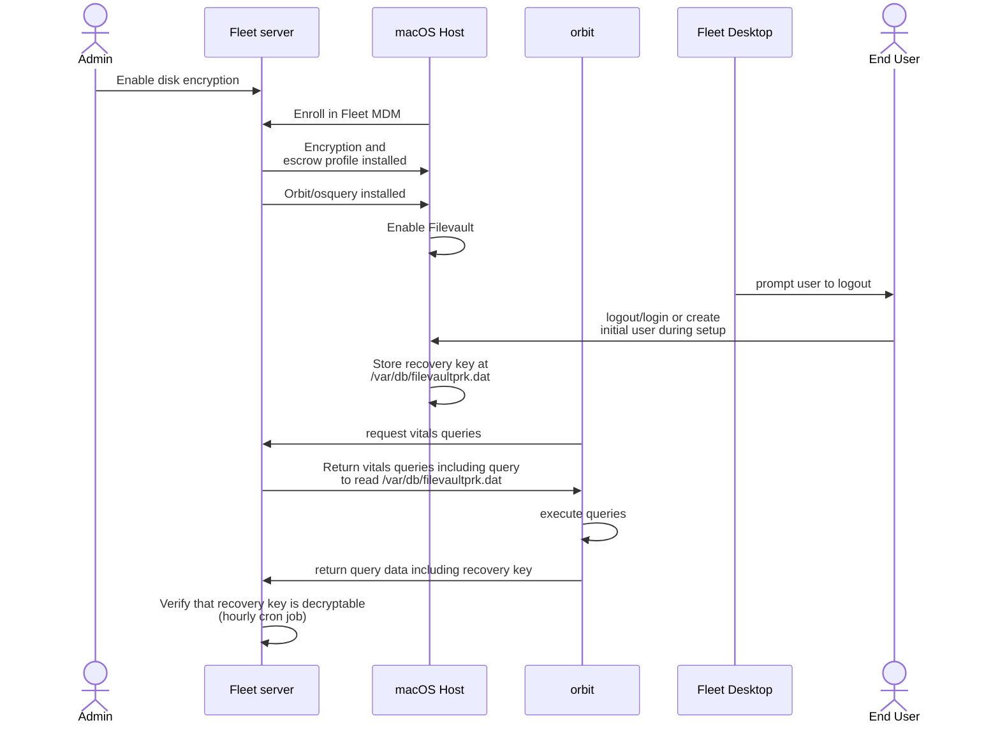
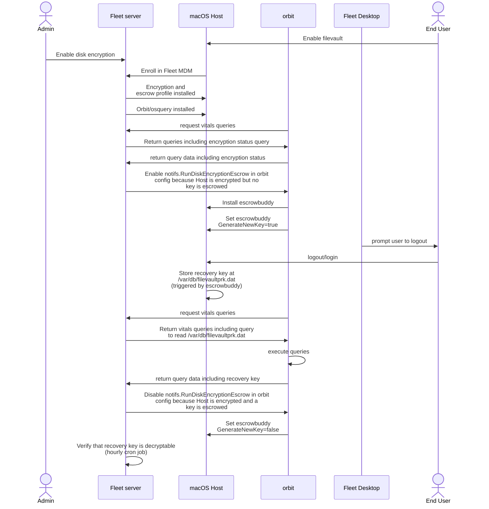
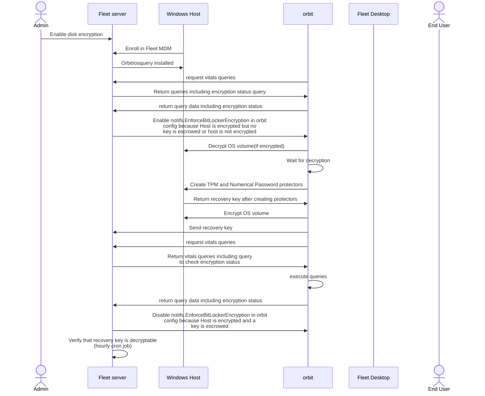
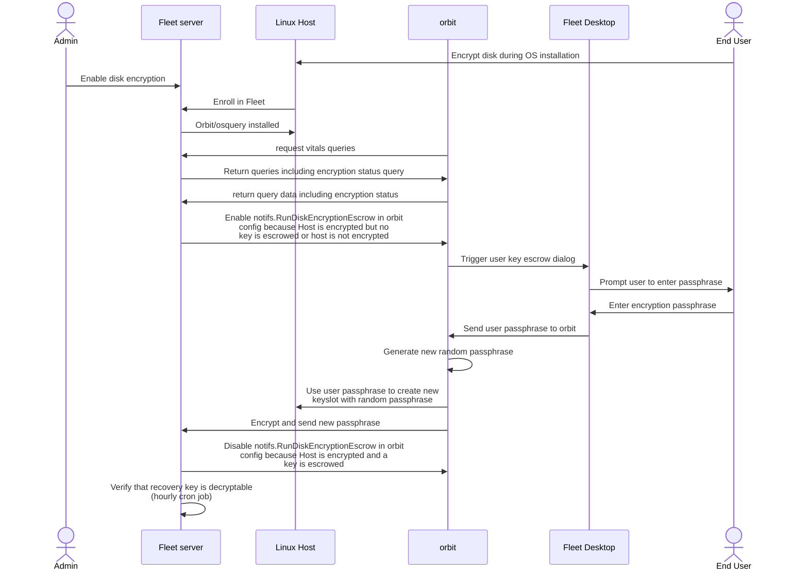

# Disk encryption architecture

This document provides an overview of Fleet's Disk Encryption architecture for MDM.

## Introduction

Disk Encryption in Fleet's MDM allows for securing device data by encrypting the storage media. This document provides insights into the design decisions, system components, and interactions specific to the Disk Encryption functionality.

## Architecture overview

The Disk Encryption architecture leverages platform-specific encryption technologies (FileVault for macOS, BitLocker for Windows, LUKS via LVM for Linux) to encrypt device storage and securely manage recovery keys.

## Key components

- **Encryption Configuration**: Settings and policies for configuring disk encryption.
- **Key Management**: Secure storage and retrieval of encryption keys.
- **Verification**: Mechanisms to verify the encryption status of devices.
- **Recovery**: Processes for recovering access to encrypted devices.

## Architecture diagram

See platform-specific diagrams below

## Platform-specific implementation

### FileVault (macOS)

For macOS hosts without disk encryption enabled, encryption involves a two-step process:

1. Sending a profile with two payloads:
   - A Payload to configure how the disk is going to be encrypted
   - A Payload to configure the escrow of the encryption key

2. Retrieving the disk encryption key:
   - Via osquery, we grab the (encrypted) disk encryption key
   - In a cron job, we verify that we're able to decrypt the key



If we're not able to decrypt the key for a host, or there is no stored key for an already encrypted host, the key needs to be rotated. Rotation happens silently by:

1. The server sends a notification to orbit to rotate the disk encryption recovery key
2. orbit installs and enables an authorization plugin named [Escrow
   Buddy](https://github.com/macadmins/escrow-buddy) that performs the key rotation the next time
   the user logs in.
3. EscrowBuddy stores the encrypted key on disk after the next login
4. Fleet, via osquery, retrieves the (encrypted) recovery key
5. A cron job verifies that the retrieved key can be decrypted



#### Troubleshooting
The key stored in host_disk_encryption_keys for a given host will be deleted under the following circumstances:
- MDM re-enrollment or enrollment profile reinstallation, outside of Fleet-initiated MDM SCEP certificate renewal
- Disk encryption disabled for a host's team
- Host moved to a team with disk encryption disabled

If the host is still in an encrypted team after the MDM re-enrollment, or in the case of a team
change, once the host is moved to a team with encryption enabled, Fleet will initiate one of the processes
described above, depending on the host's actual disk encryption status, to escrow a new encryption
key. Until the process is complete no key will be listed in Fleet, however in the event of an
emergency the latest key can be retrieved from the archive using the steps described in [Key Storage
and Security](#key-storage-and-security).

### BitLocker (Windows)

Disk encryption in Windows is performed entirely by orbit. 

When disk encryption is enabled, the server sends a notification to orbit, which calls the
[Win32_EncryptableVolume class](https://learn.microsoft.com/en-us/windows/win32/secprov/getencryptionmethod-win32-encryptablevolume)
to encrypt the used space of the disk with TPM and Numerical Password protectors and generate an encryption key.

If the disk is already encrypted, it will first be decrypted and then re-encrypted.

After the disk is encrypted, orbit sends the key back to the server using an orbit-authenticated
endpoint (`POST /api/fleet/orbit/disk_encryption_key`).



#### Troubleshooting

A number of disk encryption related registry settings can interfere with Fleet's ability to encrypt the disk
and escrow the key in various ways such as disallowing encryption methods used by Fleet or requiring
a non-standard TPM Platform Validation Profile. These settings can also potentially disallow disk
encryption entirely either explicitly or implicitly via conflicting settings. Because of the number
of settings and their possible values it is not practical to cover them all however a good place to
begin investigating is the Full Volume Encryption policies key in the registry which can be viewed
using the following query. Pay careful attention to keys like FDVEncryptionType and OSEncryptionType
which have been observed on customer systems causing conflicts:

`SELECT * FROM registry WHERE path LIKE 'HKEY_LOCAL_MACHINE\SOFTWARE\Policies\Microsoft\FVE\%%';`

Additionally, Fleet's disk encryption implementation requires a working TPM on Windows hosts. Hosts
without a TPM or with the TPM disabled via BIOS or other means will fail to have their disks
encrypted.

Finally, in some error scenarios the disk may be left in a state where Fleet has initialized the
encryption process but is unable to complete it. If you believe the conflicting settings have been
removed or properly modified the following command will ensure the disk is decrypted and in a clean
slate for orbit to attempt to encrypt the disk again:

`manage-bde -off C:`

### LUKS (Linux)
Fleet can escrow disk encryption keys for Ubuntu, Kubuntu and Fedora Linux hosts that had LUKS2
encryption enabled during installation. Fleet will only initiate the escrow process on hosts running
eligible operating systems and for which encryption has already been enabled and will not prompt
users on ineligible hosts. Once the process is initiated, Fleet Desktop will prompt the user to
enter their encryption passphrase which is then used to create a new keyslot, the passphrase for
which orbit randomly generates and escrows on the server.



## Key storage and security

Encryption keys are stored in the `host_disk_encryption_keys` table. The value for the key is
encrypted using Fleet's CA certificate, and thus can only be decrypted if you have the CA private
key. Additionally, a backup copy of any key that gets escrowed is stored in the
`host_disk_encryption_keys_archive` table. In the event that a host's encryption key is unavailable
due to a rotation or other event, it is possible to restore the host's most recently archived key by
executing the following query against the Fleet server's MySQL database, replacing HOST_ID with the
ID of the host in question:

```sql
INSERT INTO host_disk_encryption_keys (host_id, base64_encrypted, base64_encrypted_salt, key_slot, decryptable, created_at)
SELECT host_id, base64_encrypted, base64_encrypted_salt, key_slot, 1 AS decryptable, created_at FROM host_disk_encryption_keys_archive
WHERE host_id = HOST_ID ORDER BY created_at DESC LIMIT 1;
```

Please note that this key is not guaranteed to work and restoration should be a last resort option.
In many cases Fleet triggers key rotation when the existing key may not work

## Related resources

- [MDM Product Group Documentation](../../product-groups/mdm/) - Documentation for the MDM product group
- [MDM Development Guides](../../guides/mdm/) - Guides for MDM development
- [Enforce disk encryption guide](https://fleetdm.com/guides/enforce-disk-encryption)
- [Bitlocker Policy Settings registry key guide by Geoff Chappell](https://www.geoffchappell.com/studies/windows/win32/fveapi/policy/index.htm)