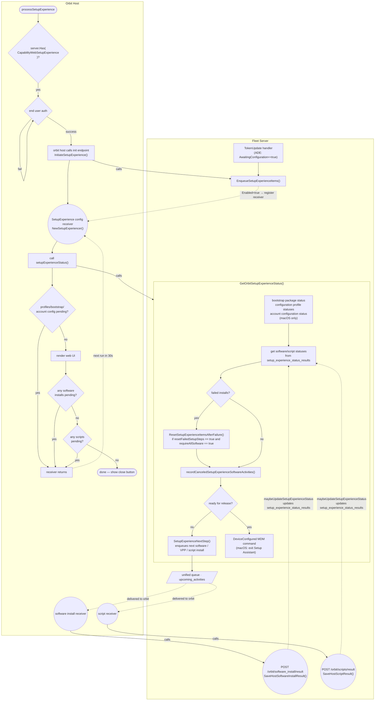

# Setup Experience Overview

Setup experience lets newly enrolled hosts be configured with all the MDM profiles, software, and scripts that they would need. And optionally block them from completing setup until requirements like all required software being installed are met.

## Summary

Setup experience has various triggers depending on the platform and MDM enrollment. After enrollment, orbit goes through end user authentication, then calls the `/api/fleet/orbit/setup_experience/init` endpoint which causes the Fleet server to queue up the relevant items in the `setup_experience_status_results` table with pending statuses. For ADE enrollments, Fleet enqueues the items when handling the `TokenUpdate` request. 

The orbit `SetupExperiencer` config receiver runs every 30s and requests the current setup experience status. This status lets orbit know if config profiles, software installers and scripts are still pending or finished while those happen asynchronously through MDM and unified queue activities. Once all items are completed, the end user can exit setup experience.

## Enqueuing items

Fleet enqueues relevant software installers, VPP apps, and scripts during ADE enrollment or after orbit calls `setup_experience/init`. This is what the end user sees on the web UI. When Fleet processes a `TokenUpdate` request with `AwaitingConfiguration==true` for ADE enrollments, it enqueues MDM items (profiles, bootstrap package, account configurations) as MDM commands in the nanomdm command queue.

## Setup experience status

Whenever `/api/fleet/orbit/setup_experience/status` is called, the Fleet server checks the current state of MDM profiles, software installs, and script runs. At the end of the function, it will call `SetupExperienceNextStep()` which queues up the next item (software install/VPP install/script run) for the host in the unified queue (see [upcoming activities](https://github.com/fleetdm/fleet/blob/main/docs/Contributing/guides/upcoming-activities.md)), and updates the status in `setup_experience_status_results` for that item. If there is nothing left to do, the device is released. On macOS, if everything is done and the device hasn't been released manually, the server sends a `DeviceConfigured` MDM command here to release the device from Setup Assistant.

These activities run in order, but they don't directly interact with the setup experience which is why the setup experience receiver polls for status. The results from software installs, script runs, or VPP installs are responsible for updating the setup experience status for that item. See [software installation](https://github.com/fleetdm/fleet/blob/main/docs/Contributing/architecture/software/software-installation.md) for how Fleet installs software on hosts while setup experience is running.

## Platform differences

### Windows

Windows enrollment goes through the Enrollment Status Page (ESP) rather than Apple's Setup Assistant, and Fleet does not push profiles, a bootstrap package, or account configuration as part of setup experience on Windows. Setup experience is driven by orbit, and the device is held in OOBE (Out Of Box Experience) until orbit calls `/api/fleet/orbit/setup_experience/init`. Only software installers are supported on Windows, scripts are macOS-only.

### Linux

Linux has no MDM, so there is no MDM command path at all. Setup experience starts when orbit calls `/api/fleet/orbit/setup_experience/init` on boot, and the same 30s polling loop drives software installs (no scripts).

### iOS/iPadOS

iOS and iPadOS don't run orbit, so there is no polling loop and no `init` endpoint. Fleet only enqueues VPP apps for setup experience items on the first `TokenUpdate`. The release worker on the Fleet server polls internally until every item is done before sending `DeviceConfigured` to exit Setup Assistant.

### Android

Setup experience is not supported on Android. Apps are delivered through the device policy at enrollment time, and there is no step-by-step flow for the end user.

## Flow diagram (orbit)

## Related resources

- [Upcoming activities](https://github.com/fleetdm/fleet/blob/main/docs/Contributing/guides/upcoming-activities.md) - How Fleet's unified activity queue works
- [Software installation architecture](https://github.com/fleetdm/fleet/blob/main/docs/Contributing/architecture/software/software-installation.md) - How Fleet installs software on hosts
- [Automated Device Enrollment](automated-device-enrollment.md) - Architecture for ADE
