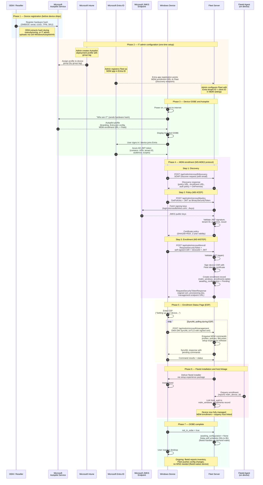

# Windows Autopilot enrollment with Fleet - sequence diagram

This diagram shows the end-to-end flow of a new Windows device going through Autopilot enrollment and becoming fully managed by Fleet.

## Phase summary

| Phase | What happens | Key actors |
|-------|-------------|------------|
| 1. Device registration | OEM registers hardware hash with Microsoft during manufacturing | OEM, Microsoft Autopilot |
| 2. IT admin config | One-time setup: Autopilot profile in Intune, Entra app registration pointing to Fleet, Fleet MDM settings | Intune, Entra, Fleet |
| 3. OOBE and Autopilot | Device powers on, identifies itself via hardware hash, gets Autopilot profile, user joins Entra | Device, Autopilot, Entra |
| 4. MDM enrollment | MS-MDE2 protocol: Discovery, Policy (MS-XCEP), Enrollment (MS-WSTEP) with JWT auth | Device, Fleet, Microsoft JWKS |
| 5. ESP | Device polls Fleet via SyncML for profiles, policies, and software during setup screen | Device, Fleet |
| 6. Fleetd install | Fleetd installed via setup experience, osquery enrolls, host linked to MDM enrollment | Fleetd, Fleet |
| 7. Steady state | OOBE complete, poll interval relaxed, fleetd handles on-demand sync | Device, Fleet |
