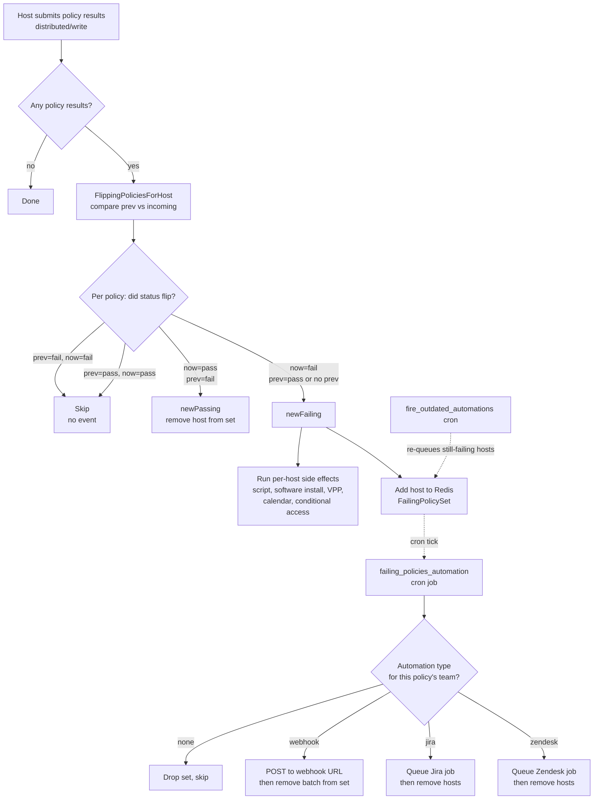
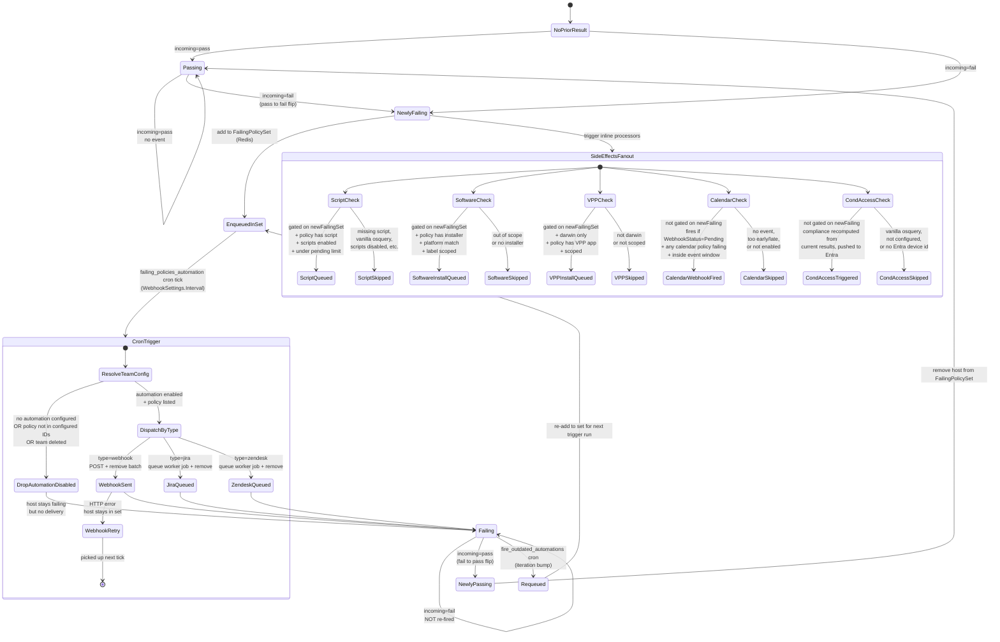

# Software automation architecture

This document provides an overview of Fleet's software automation architecture.

## Introduction

Software automation in Fleet enables organizations to automatically install
or update software based on a [policy](https://fleetdm.com/securing/what-are-fleet-policies).
It shares its decision logic with the rest of Fleet's policy automations
(webhook, Jira, Zendesk, script run, VPP install, calendar event, and
conditional access), so this document describes the whole pipeline and
calls out where the software-install branch fits in.

The core gating rule: automations fire on the **pass to fail flip**, not on
every fail. A host that has been failing the same policy for a week will not
retrigger the automation on every check-in. A separate
`fire_outdated_automations` cron is the only built-in mechanism to re-fire
for a host that is continuously failing.

## Architecture overview

The pipeline is split across four cooperating pieces:

1. **Flip detector.** When a host posts policy results via osquery
   `distributed/write`, `FlippingPoliciesForHost` compares the host's
   previous pass/fail state in `policy_membership` against the incoming
   results and returns `newFailing` and `newPassing` sets.
2. **Real-time fan-out.** Inside `SubmitDistributedQueryResults`, the
   `newFailing` set drives the per-host processors (script, software, VPP)
   and seeds a Redis-backed `FailingPolicySet`. Calendar and
   conditional-access processors also run here but with their own gating
   (see "Things worth knowing" below).
3. **Failing policy set.** Redis queue of (policy_id, host) pairs awaiting
   delivery. Drained by the delivery cron, refilled by the real-time
   fan-out and by the outdated automations cron.
4. **Delivery cron.** Every `WebhookSettings.Interval`,
   `triggerFailingPoliciesAutomation` walks the set, resolves each policy's
   team automation config, and dispatches a webhook POST or queues a
   Jira/Zendesk worker job.

A second cron, `fire_outdated_automations`, re-injects still-failing hosts
based on `policy_automation_iterations` so operators can bump an iteration
counter to force a re-fire.

## Key components

- `server/datastore/mysql/policies.go` - `FlippingPoliciesForHost`,
  `flipping`, `OutdatedAutomationBatch`. The previously-vs-now decision.
- `server/service/osquery.go` - `SubmitDistributedQueryResults`,
  `registerFlippedPolicies`, `processScriptsForNewlyFailingPolicies`,
  `processSoftwareForNewlyFailingPolicies`,
  `processVPPForNewlyFailingPolicies`,
  `processConditionalAccessForNewlyFailingPolicies`,
  `processCalendarPolicies`. The real-time fan-out per host.
- `server/policies/failing_policies.go` -
  `TriggerFailingPoliciesAutomation`, `buildFailingPolicyAutomationConfig`,
  `getActiveAutomation`. Per-team and global config resolution and
  dispatch.
- `cmd/fleet/cron.go` - `scheduleFailingPoliciesAutomation` (outdated
  re-queue) and `triggerFailingPoliciesAutomation` (delivery cron).
- `server/webhooks/failing_policies.go` - `SendFailingPoliciesBatchedPOSTs`.
  Batches hosts, POSTs the webhook, and removes the batch from Redis only
  on success.
- `server/service/redis_policy_set/redis_policy_set.go` - Redis-backed
  `FailingPolicySet` storage.

## Decision rule

The gate comes down to one function in `server/datastore/mysql/policies.go`:

```go
func flipping(prevResults map[uint]bool, incomingResults map[uint]bool) (newFailing, newPassing []uint) {
    for policyID, incomingPasses := range incomingResults {
        prevPasses, ok := prevResults[policyID]
        if !ok { // first run for this (host, policy)
            if !incomingPasses {
                newFailing = append(newFailing, policyID)
            }
        } else { // ran previously
            if !prevPasses && incomingPasses {
                newPassing = append(newPassing, policyID)
            } else if prevPasses && !incomingPasses {
                newFailing = append(newFailing, policyID)
            }
        }
    }
    return newFailing, newPassing
}
```

In English:

- no previous result + incoming fail -> `newFailing`
- previous pass     + incoming fail -> `newFailing`
- previous fail     + incoming pass -> `newPassing`
- previous fail     + incoming fail -> nothing (no event)
- previous pass     + incoming pass -> nothing

## Architecture diagram

### High-level



### Detailed state machine

Full lifecycle of a single (policy, host) pair, including retries and
re-queue paths.



## Things worth knowing

1. **Fail to fail is silent by design.** A host that has been failing for
   days will not retrigger the webhook or ticket flow unless
   `fire_outdated_automations` bumps the iteration. See
   [#42651](https://github.com/fleetdm/fleet/issues/42651) for the
   "continuous retries" feature request.
2. **Most per-host side effects gate on `newFailingSet`** (script run,
   software install, VPP install) so they only fire on the pass-to-fail
   flip. **Calendar and Conditional Access do not.** Despite their
   function names (`processCalendarPolicies`,
   `processConditionalAccessForNewlyFailingPolicies`), calendar fires
   whenever the host's calendar event is in `Pending` status and any
   calendar policy is currently failing, and conditional access recomputes
   overall compliance from the full incoming result set and pushes it to
   Entra.
3. **Webhook removal is post-success.** If the POST fails, the host stays
   in the Redis set and is retried on the next cron tick. Jira and Zendesk
   hosts are removed as soon as the worker job is queued, not when the
   ticket is actually created.
4. **Team automation must be enabled AND the policy must be in
   `PolicyIDs`.** If a policy is failing but not listed in the team's (or
   global) configured policy IDs, the cron drops the whole set for that
   policy via `failingPoliciesSet.RemoveSet`.
5. **Global vs per-team config.** Global policies use
   `appConfig.WebhookSettings.FailingPoliciesWebhook` and
   `appConfig.Integrations`. Team policies use the team's own webhook
   settings and integrations, with global integrations matched in via
   `MatchWithIntegrations`. "No Team" policies (`TeamID == 0`) use the
   default team config.

## Related resources

- [Software Product Group Documentation](../../product-groups/software/) - Documentation for the Software product group
- [Automations user guide](https://fleetdm.com/guides/automations) - user-facing configuration documentation
