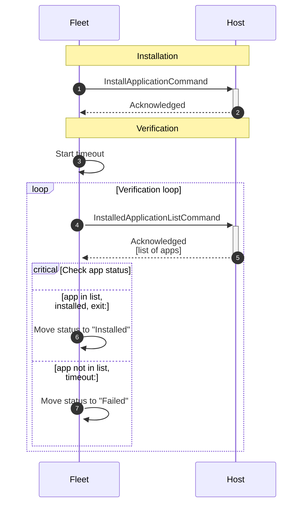
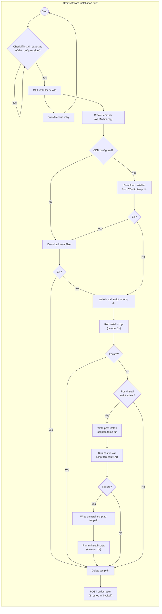

# Software installation architecture

This document provides an overview of Fleet's software installation architecture.

## Introduction

Software installation in Fleet enables the deployment and installation of software packages across
the device fleet. This document provides insights into the design decisions, system components, and
interactions specific to the Software Installation functionality.

## Important concepts

### Software types

Fleet supports 3 different types of installable software: custom packages, Fleet-maintained apps,
and app store apps.

#### Custom packages

Custom packages are software packages whose installer is uploaded directly to Fleet by an admin.

Fleet supports the following installer files as custom packages

| Installer file extension      | Supported platform(s) |
| ----------- | ----------- |
| .pkg   | macOS                  |
| .ipa   | iOS, iPadOS            |
| .msi   | Windows                |
| .exe   | Windows                |
| .deb   | Debian-based Linux     |
| .rpm   | RHEL-based Linux       |

#### Fleet-maintained apps

Fleet-maintained apps are software that Fleet curates. Fleet sources installers and generates
install and uninstall scripts for Fleet-maintained apps, so that admins can add them to their
software library with just a few clicks.

#### App store apps

App store apps are software that is installed directly from an external app store. Fleet currently supports
the Apple App Store (via [VPP](https://developer.apple.com/documentation/devicemanagement/managing-apps-and-books-through-web-services-legacy) apps (for macOS, iOS, and iPadOS hosts)) 
and the Google Play Store (for Android hosts).

## Architecture diagrams

### VPP app install and verification

VPP apps are installed using the Apple MDM protocol. When an install is triggered, Fleet sends an `InstallApplication` command
to the host.

To verify that the install was successful, Fleet sends a series of `InstalledApplicationList` MDM commands after
the acknowledgment of the `InstallApplication` command. Fleet attempts to verify until either
- the app shows up in the `InstalledApplicationList` response as installed, or
- the verification timeout (defaults to 10m, configurable via the `FLEET_SERVER_VPP_VERIFY_TIMEOUT`
  env var).

## Installation flow

### Orbit implementation of installer-based (custom packages, FMA) software install

## Related resources

- [Software product group documentation](../../product-groups/software/) - Documentation for the Software product group
