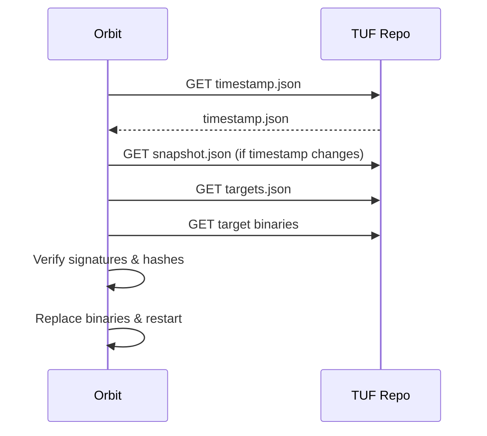
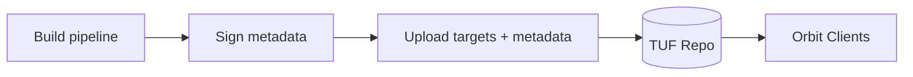

[Back to top](./README.md)
# TUF

## The Update Framework

### How hosts auto-update
Orbit embeds TUF root metadata at package build. Periodically (default hourly or at startup) it performs an update cycle:
1. Download `timestamp.json`
2. If changed, fetch `snapshot.json` and then required target metadata
3. Compare target versions/hashes; download new binaries (orbit, osquery, desktop) if needed
4. Verify signatures (all required roles) and file hashes
5. Swap binaries atomically; schedule restart (graceful) of affected processes

Security properties:
* Multi-role signature verification (root, targets)
* Rollback protection via consistent snapshots
* Compromise recovery by rotating keys and publishing new root

Failure handling: if update verification fails, Orbit logs error and retains current version; exponential backoff retry.

### How we push releases
Internal build pipeline produces new binaries; signs them; uploads targets + updated metadata set to TUF repository (S3/GCS + CDN). Steps:
1. Build artifacts (multi-platform)
2. Compute hashes/lengths
3. Sign target metadata (delegations if used)
4. Update snapshot & timestamp
5. Publish (atomic replace) – clients see new timestamp triggering chain

Key rotation procedure documented (TODO link) – requires shipping new root.json (root role signed by threshold of old + new keys) before revoking old keys.

