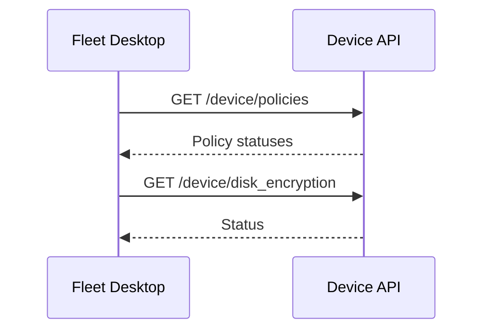
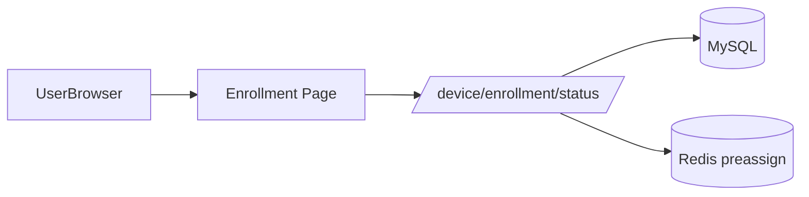

[Back to top](./README.md)
# Fleet UI's

## Fleet Server
Single-page web app (React / Typescript in `frontend/`) served by server under `/` path. Auth flows:
* Session cookie after login/SSO
* CSRF protection via cookie+header (if applicable)
* Real-time refresh: polling; optionally websockets for live query results

Key sections -> API domains:
| UI Page | Backend Endpoints |
|---------|-------------------|
| Hosts table | `/api/latest/fleet/hosts` (filters, pagination) |
| Host details | `/api/latest/fleet/hosts/{id}` (software, MDM, policies) |
| Queries | `/queries`, `/queries/run` (campaign start) |
| Policies | `/policies`, host policy status endpoints |
| Software | `/software/titles`, `/software/{id}` |
| MDM Profiles | `/mdm/apple/profiles`, `/mdm/windows/configurations` |
| Scripts | `/scripts`, `/scripts/run` |

```mermaid
flowchart LR
	Browser -->|HTTPS JSON| API[REST API]
	Browser -->|Websocket (optional)| WS[Live Query Stream]
	API --> DB[(MySQL)]
	API --> Cache[(Redis)]
```

## Fleet Desktop
Electron / native (platform-specific) UI bundled with Orbit. Communicates directly with Fleet Device API endpoints (`/api/latest/fleet/device/*`) using per-host device auth token (scoped). Offers end-user messages / policy statuses.



## BYOD Enroll pages
Lightweight pages served under `/device/<token>` providing:
* Enrollment instructions
* Download links (profile, installers)
* Status polling (long-poll/interval) for when device has successfully enrolled and received baseline profiles



Accessibility & performance: code-split bundles, lazy data fetch, server sets caching headers for static assets (fingerprinted). Internationalization limited (English primary) – future doc TBD.
