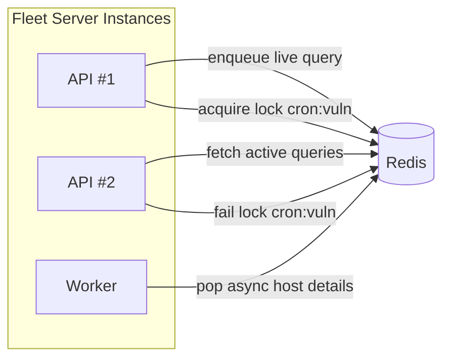

[Back to top](./README.md)
# Cache

Fleet uses Redis (standalone or cluster) as an ephemeral coordination and acceleration layer. No authoritative data stored here—safe to flush with minor transient impact.

## Use cases
* Live query campaigns (active query set + host completion tracking)
* Distributed locks for cron / async tasks (`redis_lock` namespace)
* Async host detail queue (when async processing enabled) – hosts push detail payload keys, workers pop
* Software installer token metadata (short-lived) – speed validation before DB write
* MDM profile preassignment (Apple) – temporarily associate serials / external ids to team profiles during enrollment handshake
* Rate limiting / throttling counters (selected endpoints)
* Caching AppConfig/Teams (optional small TTL to shield bursts)

## Key patterns
| Purpose | Pattern | Expiration |
|---------|---------|------------|
| Live query SQL | `live_query:campaign:<id>:sql` | campaign end / manual cleanup |
| Active queries set | `live_query:active` (SET) | continuous (cleanup cron) |
| Host completion | `live_query:campaign:<id>:hosts_completed` (SET) | cleanup on finish |
| Async host queue | `async_host:detail` (LIST / STREAM) | length limited by workers |
| Lock | `lock:<name>` (string w/ token) | TTL = lock timeout |
| MDM preassign | `mdm:apple:preassign:<serial>` | minutes (enrollment window) |
| Installer token | `sw:installer:token:<uuid>` | short (<=1h) |

## Modes
Supports standalone and cluster. Cluster mode: code uses a pool abstraction; can prefer replica reads for non-critical fetches if `cluster_read_from_replica` enabled.

## Sizing
Memory footprint driven by concurrent live queries and async queue backlog. Rule of thumb:
* ~1 KB per active query (metadata + SQL)
* ~0.5 KB per host queued detail payload pointer
* Locks negligible

Start 256–512 MB for <50k hosts; scale to >2 GB if many simultaneous campaigns + large async backlogs.

## Management (cloud)
* Metrics: keyspace hits/misses, memory used, evicted keys
* Alerts: memory >80%, connected clients saturating, replication lag (cluster)
* Eviction policy: allkeys-lru acceptable (non-authoritative); prefer tune TTLs to avoid stale buildup

## Failure characteristics
If Redis unavailable:
* Live queries paused (no distribution)
* Async host updates revert to synchronous (if feature toggled fallback) or delay
* Locks fail -> some cron jobs may concurrently execute (guard with DB-level idempotency where critical)

Recovery: restart safe; no restore needed.

## Future improvements
* Consider Redis Streams for async host detail ordering & replay
* Wrap lock acquisitions with jittered renewal for long-running tasks
* Central metrics dashboard doc reference