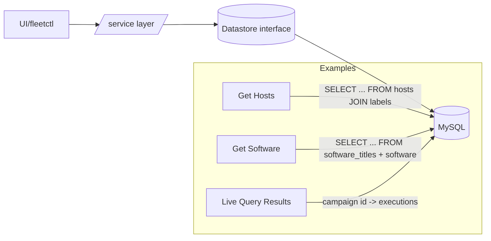
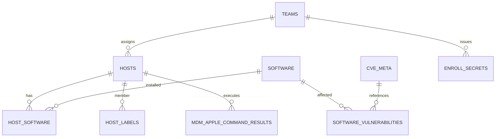

[Back to top](./README.md)
# Database

## MySQL

Primary system of record. Schema evolved via Go migration files in `server/datastore/mysql/migrations/*` (tables + data). Access via datastore layer (`server/datastore/mysql/*.go`) implementing interface methods in `server/fleet` (e.g., `ListHosts`, `NewMDMAppleDeclaration`). SQL composed using `sqlx`, named queries, and small hand-written statements for performance-critical paths.

### Setup / configuration
Dev: docker-compose spins MySQL 8 with defaults. Test suites set `MYSQL_TEST=1` for integration tests; migrations auto-run on `New` datastore creation. Prod: configure pool sizes (`mysql.max_open_conns`, `max_idle_conns`, `conn_max_lifetime`), optional read replica (`replica` section) used for heavy read endpoints (software listings, vulnerability queries) – selected via `reader` context in datastore.

### Connection lifetimes
`config.MysqlConfig` holds DSN components; TLS optional (custom CA, certs). Long-running cron tasks keep short transactions; expensive bulk inserts (async host processing) use batches sized by config.

### Host scale expectations
| Hosts | Pattern | Notes |
|-------|---------|-------|
| <5k | synchronous host detail writes | OK to keep immediate updates |
| 5k–50k | enable async host processing | Redis queue reduces write amplification |
| 50k–200k | partition heavy tables logically via pruning queries (time windows) | Consider read replica |
| 200k+ | archive / prune historical tables (software inventory history, activities) | Increase InnoDB buffer pool |

### High-level entity groups
* Inventory: `hosts`, `host_software`, `host_hardware`, `host_mdm_*`, `labels`, join tables for membership
* Configuration: `app_config_json`, `teams`, `enroll_secrets`, `mdm_*_profiles`, `mdm_declarations`, `mdm_windows_configurations`
* MDM State: `nano_enrollments`, `mdm_apple_commands`, `mdm_windows_commands`, results tables
* Software / Vuln: `software`, `software_titles`, `software_cpe`, `cve_meta`, `software_vulnerabilities`
* Scripts / Installers: `software_installers`, `scripts`, `script_executions`
* Auth / Users: `users`, `api_tokens`, `sessions`, `invites`
* Activities / Audit: `activities`, `activities_details`
* Orchestration: `distributed_campaigns`, `distributed_query_executions` (live query tracking), `scheduled_queries`, `packs` (legacy)

### Common read paths

### Write patterns
1. Immediate transactional (user actions, enroll, MDM command enqueue)
2. Buffered async (host detail updates batched; vulnerability ingestion)
3. Idempotent upserts (software titles, policy status) using `INSERT ... ON DUPLICATE KEY UPDATE`

### Example schema subset (simplified)

### From interface to SQL
Service layer (`server/service/*.go`) performs authz and validation, then calls datastore (e.g. `ds.NewActivity`). Datastore method holds hand-optimized query; complex report endpoints may compose several queries + in-memory aggregation. For performance-sensitive lists (hosts, software) pagination uses `LIMIT/OFFSET` or keyset patterns (where feasible) plus selective column projection to reduce IO.

### Performance considerations
* Covering indexes for frequent filters (`team_id`, `seen_time`, `deleted_at IS NULL`)
* Periodic cleanup tables to control cardinality (activities retention, orphaned enrollments)
* Avoid N+1 with bulk host id IN clauses sized to connection parameter limits.

### Failure / recovery
If MySQL unreachable: API returns 500; Redis-backed queues accumulate transient state but most operations (enroll, query dispatch) require DB. Migrations are non-destructive additive (except explicit drops) – ensure backups before major version upgrades.

### Future improvements (candidates)
* Partition large time-series (host vitals) if growth warrants
* Materialized/report tables for heavy dashboard aggregations
* Replace some ON DUPLICATE with bulk load + rename swap for very large imports

