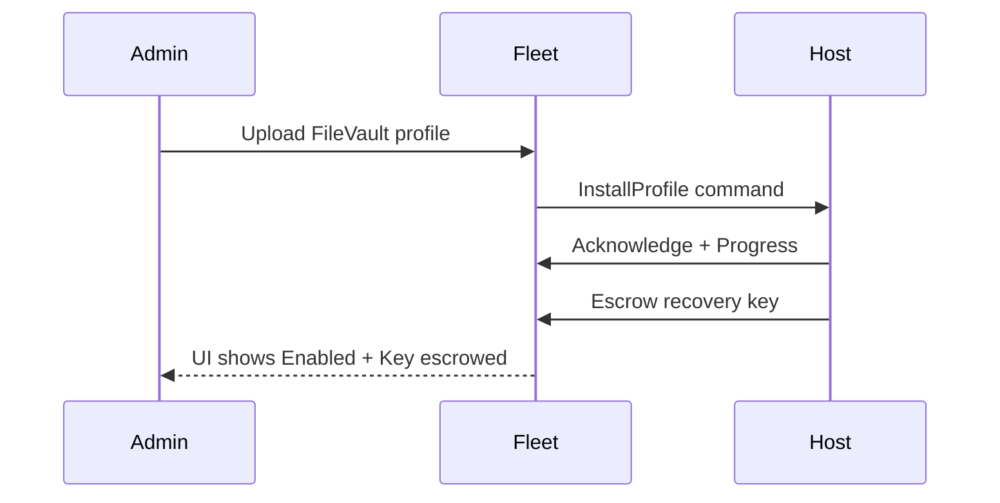
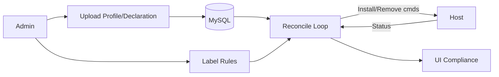

[Back to top](../README.md)

# Configuration Management

## Disk encryption

### MacOS
Managed via FileVault profile (traditional MDM) or declarative declaration set. Flow:
1. Admin uploads FileVault configuration (team/global)
2. Fleet stores profile/declaration in MySQL, associates labels (scope)
3. Reconciliation loop enqueues InstallProfile (or DDM sync) for out-of-compliance hosts
4. Host enables FileVault, generates escrowed recovery key (if configured)
5. Host reports status + key; Fleet stores encrypted key material

### Windows
BitLocker enforcement (in development): push CSP policy via Windows MDM; escrow recovery key. Similar lifecycle; placeholder until implementation completed.

### Linux
Central disk encryption management not yet implemented. Current visibility limited to osquery tables (e.g., `disk_encryption`) and policies; enforcement can be scripted.

## Custom Settings (profiles)

### MacOS
Mechanisms:
* Configuration Profiles (`.mobileconfig`) – classic MDM Install/RemoveProfile commands.
* Declarative Device Management (DDM) – JSON declarations (Configurations, Assets, Activations) enabling state sync.

Scoping via labels: include_all, include_any, exclude_any sets evaluated to host set. Profile matcher (Redis) accelerates initial enrollment mapping.

Conflict detection: (identifier, team_id, name) uniqueness. Update triggers token change -> reapply if host token mismatch.

Status model: host_profile / host_declaration rows track Status (Acknowledged, Error, NotNow) + detail. Reconciliation cron identifies drift (missing, outdated token) and re-enqueues.

### Windows
Configuration payloads (CSP OMA-URI) stored similarly; commands enqueued over Windows MDM channel. Status tracking analogous (Acknowledged/Error). (Doc will expand as implementation matures.)

### Linux
Custom settings managed indirectly:
* Policies (SQL) evaluating host state
* Scripts run via `fleetctl scripts run` for enforcement / remediation
* Potential future: declarative config via GitOps applying script bundles or agent options overrides.