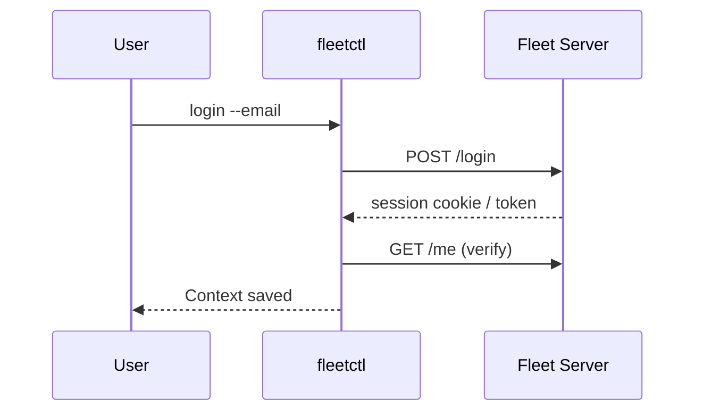

[Back to top](./README.md)
# Fleetctl

CLI interface to using the API

Distributed via NPM and Docker

## Architecture
Stateless client; configuration contexts stored in `$HOME/.fleet/fleetctl.yml` (multiple server URLs, tokens). Wraps REST endpoints; some commands perform local packaging/build (e.g., `fleetctl package`). For large payload operations (profiles, declarations, scripts) reads files from disk and posts multipart or JSON as required.

Auth handshake:
1. `fleetctl login <url>` -> prompts for email + password OR opens browser for SSO
2. Stores session/token; refresh handled implicitly by re-login when expired
3. `fleetctl config set-context` for additional servers



Error handling: prints JSON error body if `--json` flag; otherwise human-friendly message. Exit codes: non-zero on validation/network failures.

## Commands

### api

This is the swiss army knife of fleetctl and let's you use the fleet api raw from the command line
with your already logged in contexts. Largely modeled after `gh api` this allows you to test new
api's you are developing or create scripts around api functionality that might not have full
fleetctl support yet.

Example usage

```
fleetctl api /scripts
{
  "meta": {
    "has_next_results": false,
    "has_previous_results": false
  },
  "scripts": [
    {
      "id": 1,
      "team_id": null,
      "name": "check_boot.sh",
      "created_at": "2024-09-05T01:41:48Z",
      "updated_at": "2024-09-05T01:41:48Z"
    },
    {
      "id": 2,
      "team_id": null,
      "name": "hello_world.ps1",
      "created_at": "2024-09-05T01:41:55Z",
      "updated_at": "2024-09-05T01:41:55Z"
    }
  ]
}
```

By default it will do http GET but you can modify the method, and set headers and parameters

```
   -F value, --field value [ -F value, --field value ]    Add a typed parameter in key=value format
   -H value, --header value [ -H value, --header value ]  Add a HTTP request header in key:value format
   -X value                                               The HTTP method for the request (default: "GET")
```

### apply
Declaratively apply resources from YAML (teams, labels, policies, queries, profiles, scripts). Performs diff, create/update as needed. Supports `--dry-run` and partial failure reporting.
### config
Manage local contexts (list, rename, set active) and output current server info.
### convert
Transforms artifacts (e.g., profile formats) – placeholder for future converters.
### debug
Diagnostics (generate debug bundle, print config, test connectivity). May hit `/healthz`, list Redis/DB stats if authorized.
### delete
Remove resources (queries, policies, teams) – prompts unless `--force`.
### flags
Outputs environment variable and flag reference with defaults; useful for server deployment automation.
### generate
Produce artifacts (mdm profiles templates, osquery flagfile examples, installer scripts). Used in packaging pipelines.
### get
Fetch and list resources (tables, queries, policies, activities). Supports `--json`.
### gitops
Run reconciliation loop once (pull repo, apply). Exits with non-zero if drift unresolved.
### goquery
Local helper to run osquery SQL against test data (developer tooling).
### hosts
Host management (details, refetch, transfer teams, lock/unlock (MDM), wipe).
### kill_process
Issue remote process kill (script-based) if enabled – auditable activity generated.
### login
Authenticate to server (password or SSO). Stores context.
### logout
Remove stored credentials for current context.
### mdm
Subcommands: profiles, declarations, commands, setup assistants, windows config. Provides introspection into MDM state.
### package
Build platform-specific installer packages embedding enrollment secret, URL, TUF roots. Options: `--type=msi|pkg|deb|rpm`, `--fleet-url`, `--enroll-secret`, `--orbit-channel`.
### preview
Render templates (e.g., MDM profile variables) to see resolved output before apply.
### query
Create/run saved queries; `query run` starts live campaign printing streamed results.
### scripts
Upload/list/remove scripts. `scripts run` executes on target hosts via secure channel (osquery extension + orbit pipeline) reporting stdout/stderr.
### setup
Bootstrap new server (apply app config, create first admin, generate enroll secret).
### trigger
Manual trigger of cron-like tasks (vuln processing, sync) for testing.
### user
User management (create, delete, modify roles, invite resend).
### vulnerability-data-stream
Manage continuous vulnerability ingestion (enable/disable, status) – interacts with external CVE repo.