[Back to top](./README.md)
# Fleetd

Previously held many different names

```mermaid
graph TD
 O[Orbit]
 F[Fleet Desktop]
 Q[osquery]
	O --> Q
	O --> F
	O -->|Enroll / Check-in| Server[(Fleet Server)]
	Q -->|Distributed Queries| Server
	F -->|Device API| Server
	F -->|User transparency| User
	O -->|Secure Updates (TUF)| O
```

## Components
### Orbit
#### Responsibilities
* Manage lifecycle of bundled osquery (start, restart, supervised health)
* Secure self-updates using TUF metadata/targets
* Execute software installer scripts (pre/post) and report results
* Persist and rotate node key; enroll using secret or MDM-provided token
* Provide limited local service endpoints to Desktop (planned/partial)
* Collect supplemental host details (platform-specific) not directly from osquery tables

Update flow:
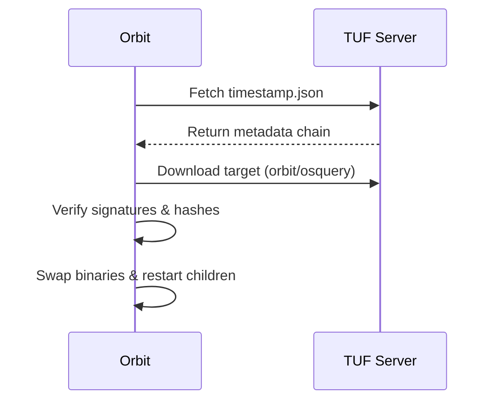
### Osquery
#### Responsibilities
* Execute scheduled (policy) and distributed queries
* Produce result/status logs to Fleet
* Surface host inventory data (hardware, OS, software) consumed by server
* Enforce decorators and differential result logic
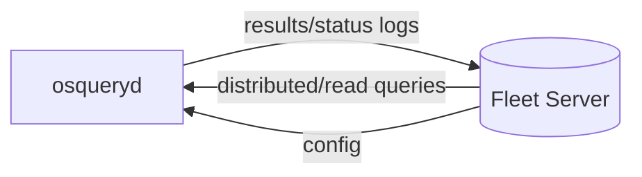
### Fleet Desktop
#### Responsibilities
* Display compliance (policies), disk encryption, MDM status to end user
* Provide transparency (what data is collected, last sync time)
* Request on-demand script execution (future) via device-scoped API
* Show pending software install progress (reported from Orbit)

Security boundary: Desktop runs user context; Orbit service context; minimal IPC.

## Workflows

### Package install

#### Package build

##### macOS
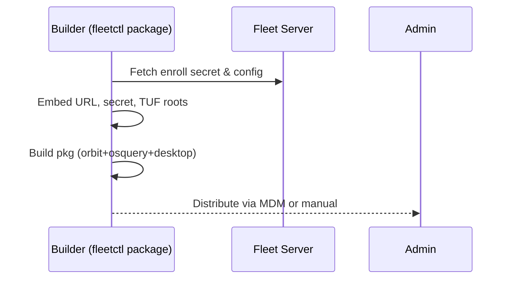

##### windows
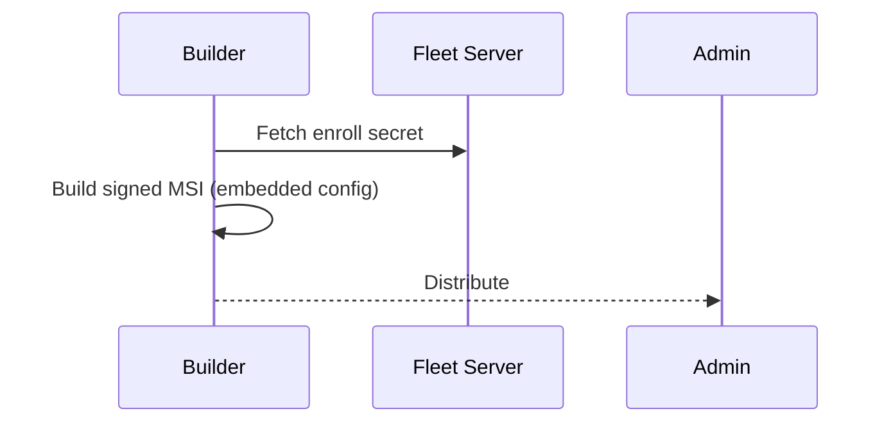

##### linux
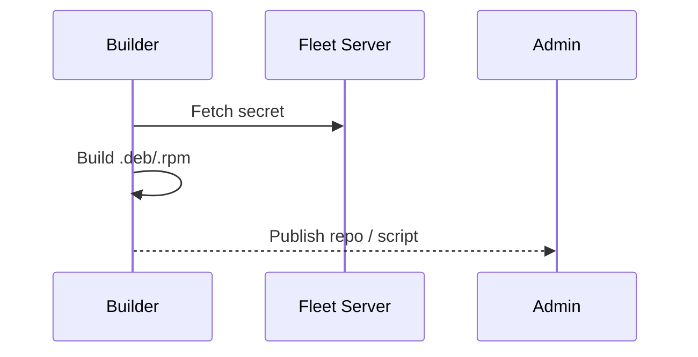

#### Package Install

##### macOS
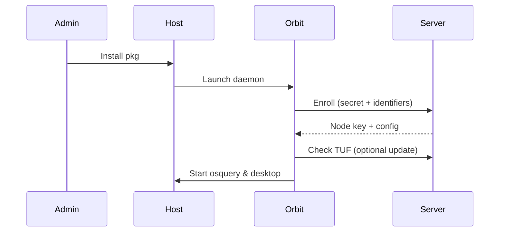

##### windows
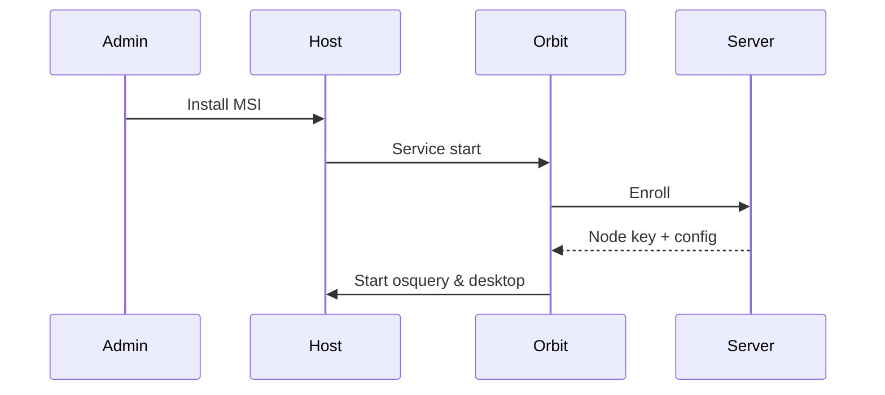

##### linux
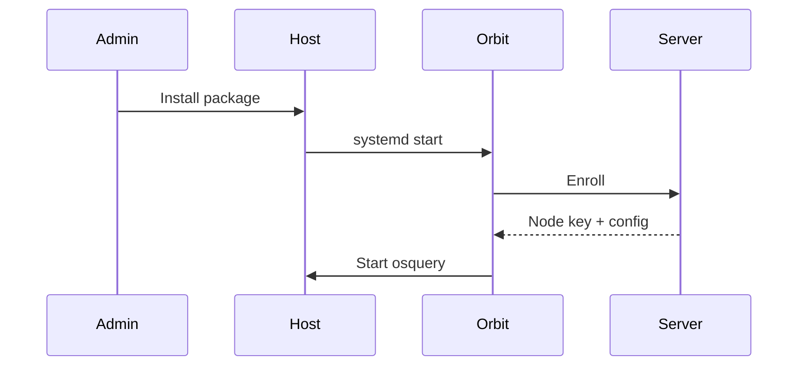

#### Automatic Enrollment

##### macOS
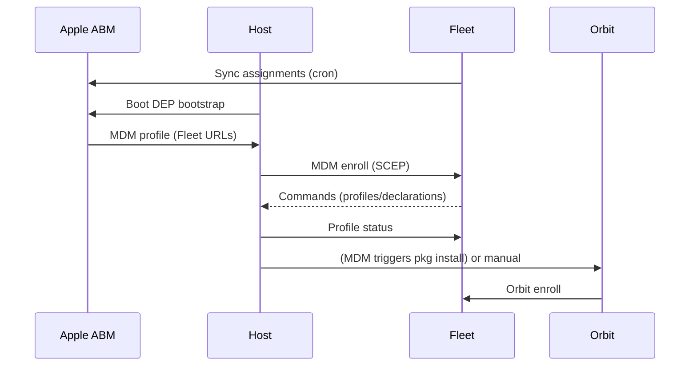

##### windows
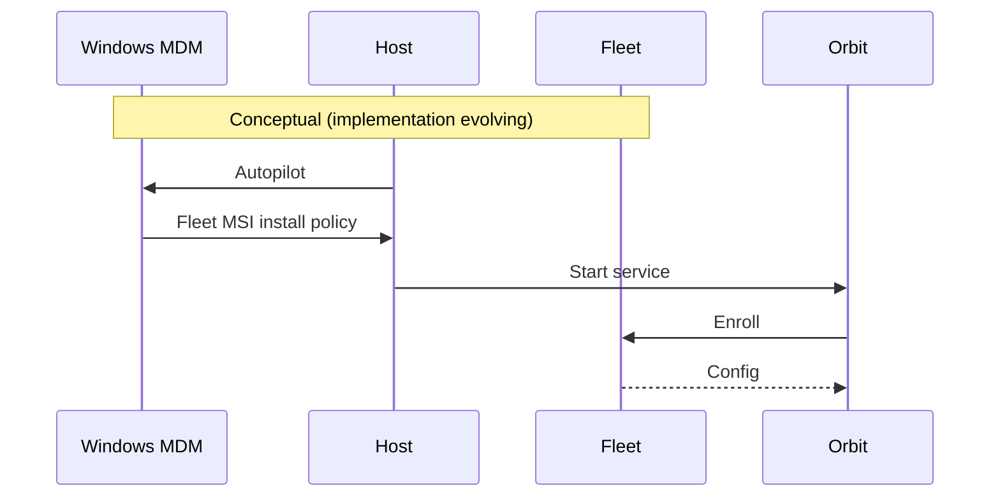

Linux is not supported

#### BYOD Enrollment

##### macOS
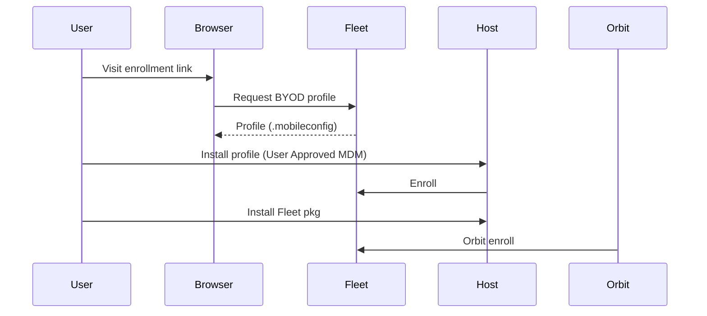

##### windows
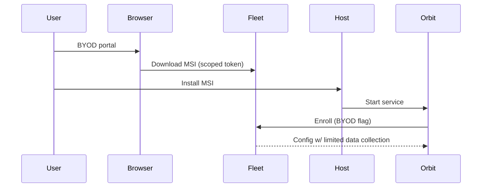

Linux is not supported