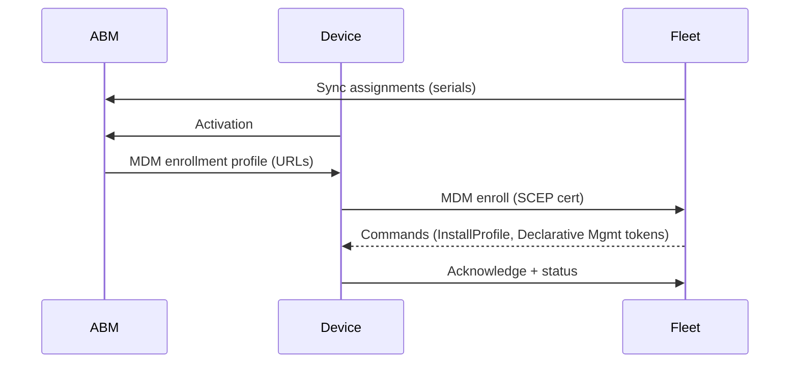

[Back to top](./README.md)
# Mobile Hosts

## iOS ipadOS

### Automatic Enrollment
Supervised devices via Apple Business Manager (ABM) assigned to Fleet MDM server. Flow overlaps macOS DEP but mobile-specific skip items and supervision flags.

### BYOD Enrollment
User-initiated profile install (User Approved MDM). Reduced configuration set; privacy preserving (no activation lock bypass, limited inventory). Portal provides profile + optional instructions.
```mermaid
flowchart LR
	User --> Portal[BYOD Portal]
	Portal -->|Download profile| User
	User --> Device
	Device -->|Enroll MDM| S[(Fleet)]
	S --> Device: Limited profiles/declarations
```
### Capabilites
| Area | Supervised (ABM) | BYOD |
|------|------------------|------|
| Configuration Profiles | Yes | Limited (no enforced restrictions requiring supervision) |
| Declarative Management | Yes | Subset |
| App Install (VPP) | Yes (if token configured) | No |
| Disk Encryption Status | n/a (File-Based) | n/a |
| Device Wipe / Lock | Yes | User Approved dependent / limited |
| Inventory (hardware, OS, installed apps) | Full | Partial (no managed apps list if not granted) |

Data collected respects Apple MDM protocol responses; no custom intrusive collection beyond standard MDM queries.

## Android
### BYOD Enrollment
Planned / limited early implementation (placeholder): enrollment via managed Google Play / Enterprise Mobility Management linking. For now, focus is iOS/iPadOS + desktop OS.
### Capabilites
Target: application inventory (managed work profile), security posture (encryption, patch level), remote wipe of work profile. (Documentation to be updated as implementation lands.)