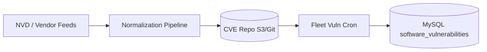
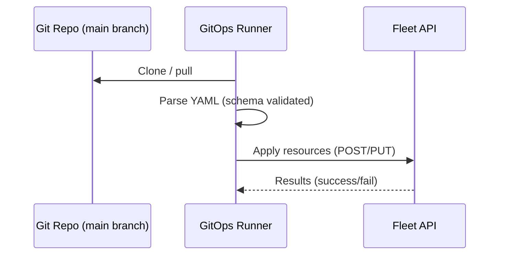

[Back to top](./README.md)

# Repos
There are various repositories that run and aggregate some amount of data that then fleet servers
will pull updates from periodically

## CVE
External vulnerability feed ingestion (NVD JSON, vendor advisories, community curation) consolidated into an internal processed repository / object storage location from which Fleet cron jobs pull delta updates. Normalization step maps software CPE -> CVE list.

Process:

Data stored: CPE -> CVE ids, metadata (CVSS scores), published/modified dates.

## Gitops
Repository (user-owned) containing declarative definitions: teams, labels, queries, policies, MDM profiles, scripts, software installer manifests. Fleet `fleetctl gitops` (or server side polling) fetches repo at interval / webhook trigger, computes diff, applies via API. Validation ensures idempotency and partial failure reporting.

Secrets referenced via indirection (env or separate secret store) rather than committed plaintext.

## FMA
Fleet Managed Apps (hypothetical / planned) repository indexing curated, verified software installers (hashes, silent install metadata). Server or `fleetctl package` consults this to produce installer manifests. Orbit may leverage for trusted downloads beyond org-specific packages.

Structure (proposed):
```
apps/
	<slug>/
		manifest.yml (version, hash, pre/post scripts)
		metadata.json (vendor, licensing)
```

```mermaid
flowchart LR
	Curators --> FMARepo[(FMA Git)]
	FleetServer -->|cron pull| FMARepo
	FleetServer --> DB[(software_installers)]
	Host --> FleetServer: Request installer
```

Security: signed manifests (sigstore/cosign) to ensure integrity; future work.