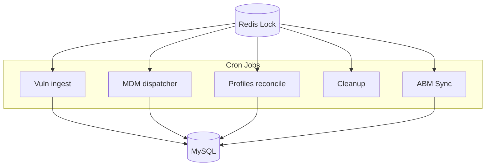
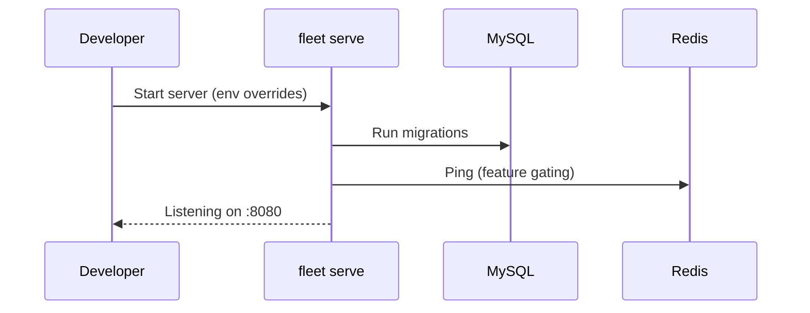

[Back to top](./README.md)
# Server

## Roles of the server

### Configuration
Fleet's server process (binary `fleet serve`) exposes REST+JSON APIs, device MDM endpoints, software distribution endpoints, websockets for live query results (via osquery distributed queries), and background cron / async processing. Configuration is layered (defaults -> environment / flags -> database AppConfig -> team overrides). 

#### AppConfig
App-wide settings persisted in MySQL `app_config_json` table (single-row) and cached in-process. Loaded at startup then periodically / on write-through update. Influences:
* Organization info (name, logo) -> UI rendering
* Global agent options (merged with team options) -> what `fleetd`/osquery receives
* Features flags (MDM, software, SSO) -> API auth gating
* Logging & vulnerability processing toggles -> cron scheduling decisions

#### Team configuration
Teams override subsets of global config: agent options, MDM profiles/declarations, software titles scope, scripts, policies. Stored in `teams` (+ related linking tables) with JSON fields for agent options. Selection precedence when building the host configuration bundle:
1. Team overrides
2. Global defaults

Result cached (Redis / in-memory) keyed by (team_id, options_version) for fast enroll / config fetch.

### API
The public API surface (documented in `docs/Using-Fleet/*` and surfaced by `fleetctl api`) groups into:
* Session / SSO (`/api/latest/fleet/login`, `/sso`) – sets HTTP-only cookie
* Token auth (Authorization: Bearer <api_token>) – personal or team-scoped
* Device MDM endpoints (`/mdm/apple/*`, `/mdm/windows/*`) – certificate-based (SCEP issued) or token signatures
* Agent endpoints (`/api/osquery/enroll`, `/api/osquery/distributed/read`, `/api/osquery/distributed/write`) – node key after enroll
* Device UI endpoints (`/api/latest/fleet/device/*`) – limited host-scoped capabilities

Websocket: live query results fan-out (optional); when used, server pushes incremental rows to subscribed UI sessions keyed by campaign id.

#### Authentication
Mechanisms:
* User password (bcrypt) -> session
* SSO (SAML/OIDC) -> session, enforced by org setting
* API tokens (per user, rotated) -> headless automation
* MDM device identity: mutual TLS (Apple), MDM signature headers (Windows), plus enrollment tokens
* Orbit/fleetd: node key derived on enroll, rotated on re-enroll cooldown

Authorization model: RBAC via global roles (admin, maintainer, observer, gitops) AND team roles (maintainer, observer, etc). Checked in service layer methods via `authz` package before datastore calls.

### Cron
Scheduled background jobs (Go `cron` package) – primary categories:
* Vulnerability processing: ingest feeds (CVE repo), enrich software
* MDM command dispatcher & status collectors (Apple, Windows)
* Profile/declaration reconciliation (compare desired vs reported host state)
* Cleanup (expired sessions, old activities, orphaned enroll secrets, inactive live queries via Redis cleanup)
* Inventory intervals (async host processing when enabled) – label/policy membership, host last seen rollups
* ABM (Apple) serial sync hourly (see automatic enrollment workflow)

Distributed coordination:
* Redis locks (e.g. `cron:calendar_events`, async host workers) – ensures only one instance runs a critical section in multi-server deployments.

## Server setups

### Self-hosted
Single binary behind reverse proxy (optional). External deps:
* MySQL 8.x (primary + optional read replica)
* Redis (standalone or cluster) – queues, locks, ephemeral state
* Object storage (S3/GCS/MinIO) – installer packages, carve artifacts
* Optional: TUF repository (served separately) for Orbit updates

Scaling guidance (approx):
* <5k hosts: 1 app instance (2 vCPU), MySQL single primary, Redis standalone
* 5k–50k hosts: 2–4 app instances behind LB; tune MySQL pool (max open conns ~50 per app); Redis cluster or bigger standalone; enable async host processing
* >50k hosts: dedicated background workers (same binary with role flag) to separate API latency from cron + async tasks; MySQL read replica for reporting endpoints

### Cloud customers
Fleet-managed SaaS isolates per-customer DB + cache logical namespace; multi-tenant control plane may manage TUF + vulnerability feeds centrally. Per-customer: dedicated MySQL schema, logical Redis db/cluster hash tag, object storage bucket prefix. Secrets managed via cloud KMS.

### Development server
`make generate-dev && ./build/fleet serve` uses docker-compose MySQL + Redis. Env vars override config; sample enrollment secrets auto-generated. Hot reload of AppConfig on writes. For local Apple MDM testing, mock endpoints / test certificates; real ABM interactions require valid token (not in repo).

