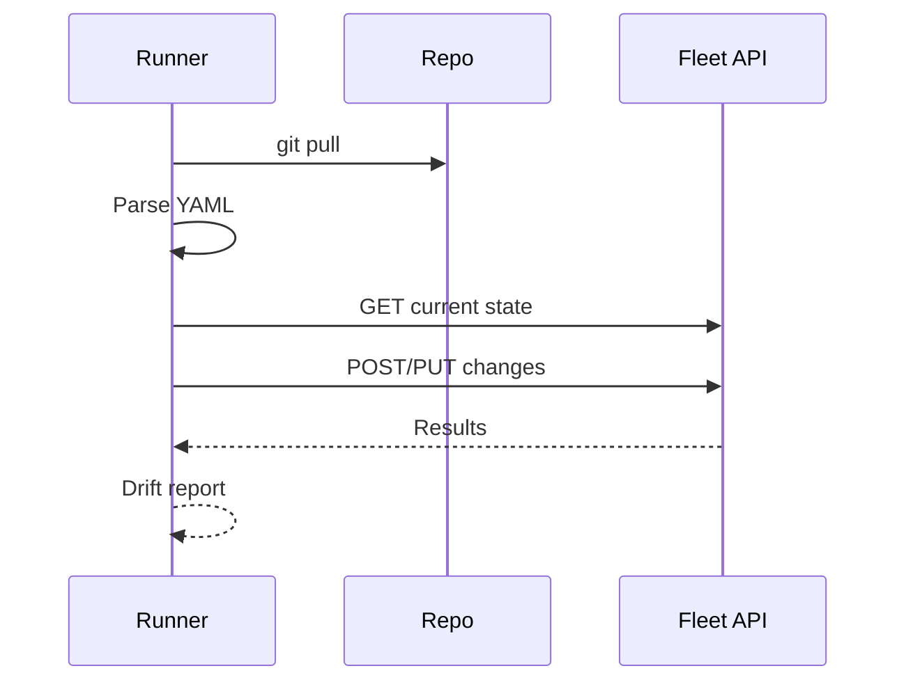

[Back to top](../README.md)
# Configuring the Server

## ENV VAR

Used for local development and cloud deployments alike.

### Local development

You can either source env var changes into your current terminal or set them during a specific build
to override like so.

```
MYSQL_ADDRESS=somethingelse.com ./build/fleet serve
```

### Helm deployment

helm values.yaml -> templates -> server container ...

## UI / API
Administrators modify organization settings, agent options, MDM integrations, SSO, vulnerability feed settings via UI forms (backed by `/api/latest/fleet/config` GET/POST). Validation layer ensures partial updates merge with existing JSON. Changes:
* Persist to `app_config_json`
* Invalidate in-process cache (broadcast in multi-instance via lightweight Redis pubsub or periodic refresh)
* Trigger side effects: e.g., enabling vuln feed schedules cron immediately; changing agent options increments options version so hosts refetch.

Scriptable via `fleetctl config get/set` and raw `fleetctl api` calls for CI pipelines.

## Gitops
Declarative approach: a repository with YAML manifest (see `system_design/yaml-file-schema.yaml`). Pipeline (cron or external runner) executes `fleetctl gitops`:
1. Clone repo (auth via deploy key / token)
2. Parse manifests (strict schema validation)
3. Diff against current server state (list resources)
4. Apply creates/updates; delete resources not marked `managed: false`
5. Report summary (stderr + exit code) – integrate with PR checks

Idempotent: repeating run with no drift yields no changes. Partial failures (one profile invalid) do not block others; aggregated exit non-zero for attention.

