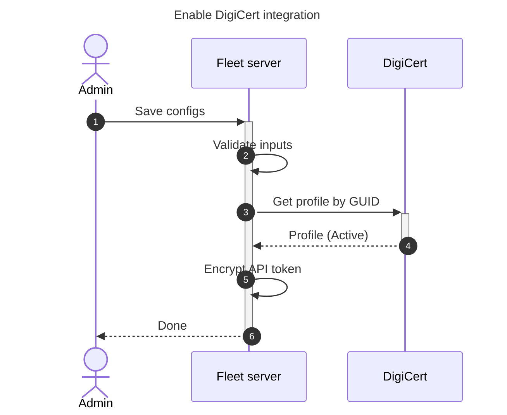
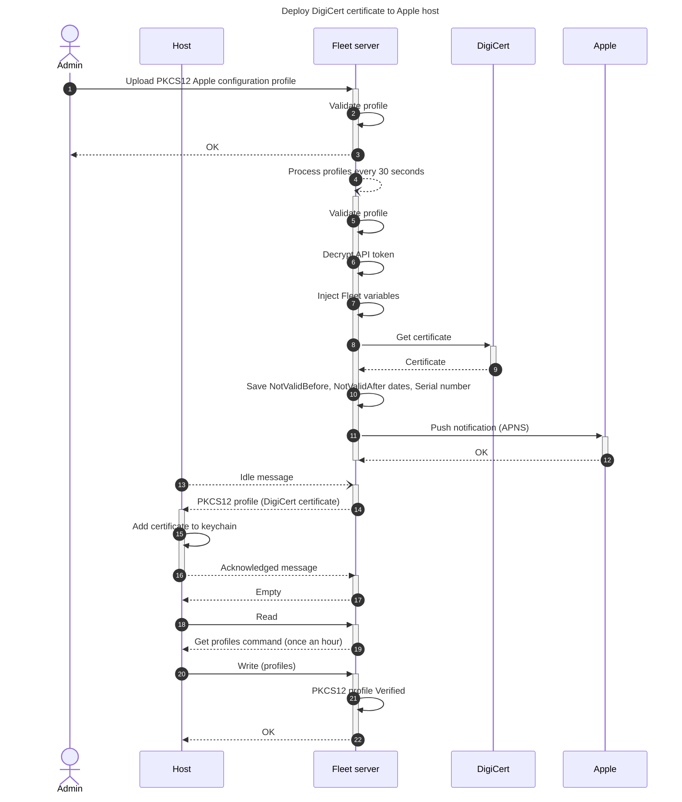
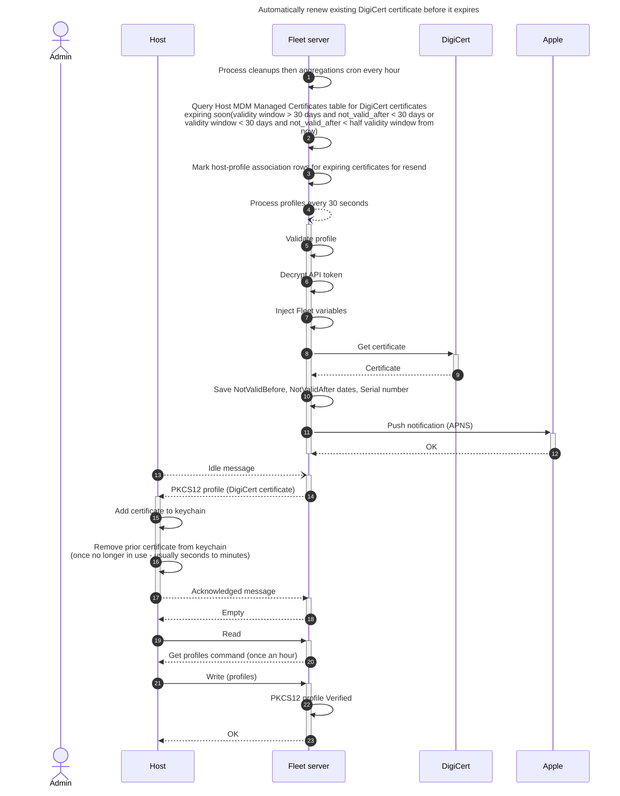

# DigiCert integration

## Set up dev environment

- Go to https://demo.one.digicert.com/.
- In Account > Access > Users > `<User name>` > API Tokens, create/retrieve the API token.
- In Trust Lifecycle > Policies > Certificate profiles, create/retrieve the GUID of the profile.

_Notes:_
- Profile enrollment method must be `REST API` and Authentication method must be `3rd Party App`
- To add User Principal Name to the issued certificate, the `Seat type` must be `User`, and `Subject Alternative Name (SAN) > Other name (UPN)` must be set to `REST request` as the source.

## Issues and limitations

- CA name should be treated as a unique identifier and never changed once set. The profiles (and potential renewals) are tied to the CA name. To cleanly change the CA name, remove any profiles using the old CA name (which will remove the associated certificates from devices), change the CA name, upload new profiles using the new CA name.
- Although you can have multiple PKCS12 payloads in a profile, each CA can only be used once per profile.
- Certificates created prior to the renewal feature being added will not be automatically renewed. To make them eligible for automatic renewal, manually resend the DigiCert profile to the host
- Sometimes macOS keychain takes a bit to drop the prior certificate especially if you leave
  Keychain Access open. If the prior certificate is being returned by OSQuery or you see it in
  Keychain Access, most likely quitting Keychain Access and reopening it will fix this

## Architecture diagrams







## Sample PKCS12 profile

```xml
<?xml version="1.0" encoding="UTF-8"?>
<!DOCTYPE plist PUBLIC "-//Apple//DTD PLIST 1.0//EN" "http://www.apple.com/DTDs/PropertyList-1.0.dtd">
<plist version="1.0">
    <dict>
        <key>PayloadContent</key>
        <array>
            <dict>
                <key>Password</key>
                <string>$FLEET_VAR_DIGICERT_PASSWORD_Test_CA</string>
                <key>PayloadContent</key>
                <data>${FLEET_VAR_DIGICERT_DATA_Test_CA}</data>
                <key>PayloadDisplayName</key>
                <string>CertificatePKCS12</string>
                <key>PayloadIdentifier</key>
                <string>com.fleetdm.pkcs12</string>
                <key>PayloadType</key>
                <string>com.apple.security.pkcs12</string>
                <key>PayloadUUID</key>
                <string>ee86cfcb-2409-42c2-9394-1f8113412e04</string>
                <key>PayloadVersion</key>
                <integer>1</integer>
            </dict>
        </array>
        <key>PayloadDisplayName</key>
        <string>DigiCert profile</string>
        <key>PayloadIdentifier</key>
        <string>TopPayloadIdentifier</string>
        <key>PayloadType</key>
        <string>Configuration</string>
        <key>PayloadUUID</key>
        <string>TopPayloadUUID</string>
        <key>PayloadVersion</key>
        <integer>1</integer>
    </dict>
</plist>
```
