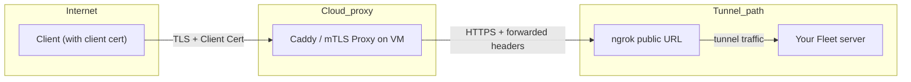

# Create a public mTLS reverse proxy for testing mTLS



## Assumptions & prerequisites

* You own a domain, e.g. `example.site`, or some domain.
* You will use a subdomain, e.g. `mtls.example.site` or whatever you choose.
* You have a **client CA certificate** (root or intermediate) that signs all valid client certificates (e.g. `client-ca.crt`).
* You have a backend (ngrok URL) that you want to forward to (i.e. `https://my-fleet-server.ngrok.io`).
* You have access to the DigitalOcean or another cloud provider.
* Replace `example.site` and `my-fleet-server.ngrok.io` in this guide with your own values.

---

## Step 1: Create a Droplet (VM) on DigitalOcean (or other cloud provider)

1. Log in to your DigitalOcean account.
2. In the dashboard, click **Create → Droplet**.
3. Choose an OS image (e.g. Ubuntu 24.04 LTS is a good default).
4. Choose a plan (for testing, the cheapest is fine, e.g. “Basic” with 1 vCPU / 1 GB RAM).
5. Choose a datacenter region (ideally near your users or your dev location).
6. Add SSH keys (recommended) so you can SSH in securely. If you don’t have an SSH key, you can generate one (`ssh-keygen`) and paste the public key.
7. Finalize settings (hostname, backups, etc.), then click “Create Droplet”.

After some moments, you’ll have a Droplet with a public IP address (say `203.0.113.45` as an example).

---

## Step 2: Set up DNS so `mtls.yourdomain` points to the Droplet

You need to make your subdomain resolve to that Droplet’s IP.

1. In DigitalOcean dashboard → **Networking** → **Domains** (or **DNS**)

2. In your DNS records page, add a record:

    * Type: **A**
    * Hostname: `mtls` (so the full hostname is `mtls.example.site`) (or whatever you choose)
    * Value / Points to: your Droplet’s IP (e.g. `203.0.113.45`)
    * TTL: the default (or lower if you like)

3. Wait for DNS propagation (may take some minutes). You can test with `dig mtls.example.site` or `ping mtls.example.site` to see it resolve to your Droplet IP.

Once that is active, when clients connect to `mtls.example.site`, they reach your Droplet.

---

## Step 3: SSH into the droplet, install Caddy

1. SSH in:

```bash
ssh root@203.0.113.45
```

2. Update packages:

```bash
apt update
apt upgrade -y
```

3. Install Caddy (the recommended way is via their official install script or package). On Ubuntu, a reliable method:

```bash
# Install required packages
apt install -y debian-keyring debian-archive-keyring apt-transport-https

# Add Caddy repo
curl -1sLf 'https://dl.cloudsmith.io/public/caddy/stable/gpg.key' | apt-key add -
curl -1sLf 'https://dl.cloudsmith.io/public/caddy/stable/debian.deb.txt' | tee /etc/apt/sources.list.d/caddy-stable.list

apt update
apt install -y caddy
```

This gives you a system service `caddy` which can manage and auto-reload configuration.

---

## Step 4: Place your mTLS CA cert on the server

You need to put the CA certificate (the public certificate of the CA that signs client certs) where Caddy can read it.

1. On your local machine, copy your CA cert file (say `client-ca.crt`) over to the Droplet:

```bash
scp client-ca.crt root@203.0.113.45:/etc/caddy/client-ca.crt
```

2. On the Droplet, ensure it's readable by Caddy (e.g. permissions):

```bash
chmod 644 /etc/caddy/client-ca.crt
chown root:root /etc/caddy/client-ca.crt
```

---

## Step 5: Configure Caddy for TLS + mTLS + reverse proxy + header forwarding

You need a `Caddyfile` (or JSON config) that:

* Listens for `mtls.example.site`
* Uses TLS (Caddy will obtain a certificate automatically via Let’s Encrypt)
* Requires client certificate authentication, trusting your CA
* Proxies incoming requests to your backend URL (ngrok)
* Injects headers to your backend with the client’s leaf cert and serial

Here’s an example `Caddyfile` you can use (put at `/etc/caddy/Caddyfile`):

```caddyfile
mtls.example.site {
  # Enable TLS (Caddy does automatic HTTPS)
  tls {
    # mTLS (client auth) config
    client_auth {
      mode require_and_verify
      trusted_ca_cert_file /etc/caddy/client-ca.crt
    }
  }

  # Reverse proxy to your ngrok backend
  reverse_proxy https://my-fleet-server.ngrok.io {
    # Make ngrok happy:
    header_up Host my-fleet-server.ngrok.io

    # Forward headers for client certificate information
    # Use DER base64 encoding (PEM has newlines which break HTTP headers). Note: AWS ALB sends URL-encoded PEM format in X-Amzn-Mtls-Clientcert-Leaf.
    header_up X-Client-Cert {http.request.tls.client.certificate_der_base64}
    header_up X-Client-Cert-Serial {http.request.tls.client.serial}
    header_up X-Client-Cert-Subject {http.request.tls.client.subject}
    header_up X-Client-Cert-Issuer {http.request.tls.client.issuer}
  }
}
```

Save that `Caddyfile`.

---

## Step 6: Reload / restart Caddy

After updating `/etc/caddy/Caddyfile`, reload Caddy to pick up the new config:

```bash
systemctl reload caddy
```

Watch logs to check for TLS / client auth errors:

```bash
journalctl -u caddy -f
```

If things go well, Caddy should:

* Obtain a TLS certificate for `mtls.example.site` from Let’s Encrypt automatically
* Accept HTTPS connections at that hostname
* Require that connecting clients present a valid certificate signed by your CA
* If the client’s certificate is valid, proxy requests to `https://my-fleet-server.ngrok.io`
* Forward `X-Client-Cert` header with the PEM of the client’s certificate and `X-Client-Cert-Serial` header with the serial number to the backend

You can test with `curl` from a client that has a valid certificate:

```bash
curl --cert client-cert.pem --key client-key.pem https://mtls.example.site/healthz
```

You should see a response (the backend's response via ngrok), and your backend should receive headers:

```
X-Client-Cert: MIIDXTCCAkWgAwIBAgIJAK... (base64-encoded DER certificate)
X-Client-Cert-Serial: 542242443644849078027064623851697342324729218861
X-Client-Cert-Subject: CN=victor@dev
X-Client-Cert-Issuer: CN=My CA
```

If you use a certificate not signed by your CA (or no certificate), the handshake should fail (client is rejected).

---

## Step 7: Verify & troubleshoot

* Test DNS resolves
* Use `curl` with correct / incorrect cert
* Look at Caddy logs for TLS handshake errors
* If the backend (ngrok) rejects certain headers or sees unexpected hostnames, you may need to adjust `header_up Host` or other headers

---
