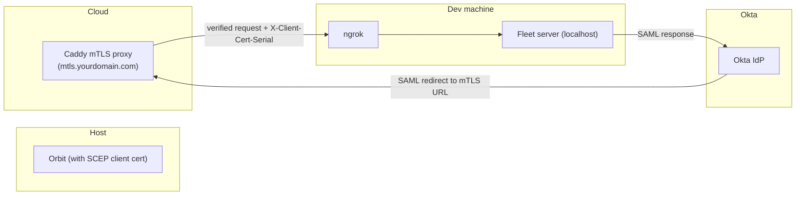

# Testing Okta conditional access

This guide walks through setting up the infrastructure needed to test the Okta conditional access feature end-to-end in a development environment.

For the customer-facing setup instructions (creating the IdP in Okta, configuring Fleet settings, adding authenticators, etc.), see the [Okta conditional access integration guide](https://fleetdm.com/guides/okta-conditional-access-integration).

## Architecture overview



When a user authenticates through Okta, Okta redirects the browser to the Fleet IdP SSO endpoint on the mTLS-enabled subdomain. The mTLS proxy verifies the client certificate (provisioned via SCEP) and forwards the request with the certificate serial number to Fleet. Fleet uses this to verify the host's identity and policy compliance.

## Prerequisites

- A running Fleet server (locally, via `fleet serve`)
- [ngrok](https://ngrok.com/) to expose your local Fleet server publicly
- A domain you control (for DNS records)
- Access to a cloud provider (e.g., DigitalOcean) for a VM
- An [Okta developer account](https://developer.okta.com/signup/) (free)
- A macOS host enrolled in your Fleet server (for end-to-end testing)

## Step 1: Expose your local Fleet server via ngrok

Start ngrok to get a public URL for your local Fleet server:

```bash
ngrok http https://localhost:8080
```

Note the forwarding URL (e.g., `https://abc123.ngrok.io`). You'll use this as the backend URL for the mTLS proxy.

> Make sure your Fleet server's `server_url` config matches the ngrok URL so that enrolled hosts can reach it.

## Step 2: Set up the mTLS reverse proxy

Follow the [mTLS reverse proxy setup guide](mtls-reverse-proxy-setup.md) to:

1. Create a VM (e.g., DigitalOcean Droplet)
2. Set up a DNS A record for your mTLS subdomain (e.g., `mtls.yourdomain.com`)
3. Install Caddy on the VM

Before configuring the Caddyfile, you'll need the SCEP CA certificate from your Fleet server (next step).

## Step 3: Get the SCEP CA certificate

Download the CA certificate that Fleet uses to sign client certificates:

```bash
curl -o fleet-scep-ca.cer 'https://abc123.ngrok.io/api/fleet/conditional_access/scep?operation=GetCACert'
```

The certificate is in DER format. Convert to PEM for Caddy:

```bash
openssl x509 -inform der -in fleet-scep-ca.cer -out fleet-scep-ca.pem
```

Copy the PEM file to your proxy VM:

```bash
scp fleet-scep-ca.pem root@<droplet-ip>:/etc/caddy/fleet-scep-ca.pem
```

## Step 4: Configure Caddy for Okta conditional access

On the proxy VM, edit `/etc/caddy/Caddyfile`:

```caddyfile
mtls.yourdomain.com {
  tls {
    client_auth {
      mode require_and_verify
      trusted_ca_cert_file /etc/caddy/fleet-scep-ca.pem
    }
  }

  reverse_proxy https://abc123.ngrok.io {
    header_up Host abc123.ngrok.io
    header_up X-Client-Cert-Serial {http.request.tls.client.serial}
  }
}
```

Replace `mtls.yourdomain.com` with your mTLS subdomain, and `abc123.ngrok.io` with your ngrok URL.

Reload Caddy:

```bash
systemctl reload caddy
```

## Step 5: Configure Fleet to use the mTLS proxy URL

Fleet normally derives the Okta SSO URL by prepending `okta.` to the server URL. In development, you can override this with the `FLEET_DEV_OKTA_SSO_SERVER_URL` environment variable:

```bash
FLEET_DEV_OKTA_SSO_SERVER_URL=https://mtls.yourdomain.com fleet serve ...
```

This tells Fleet to redirect Okta SAML authentication requests to your mTLS proxy instead of `okta.<server_url>`.

### Certificate serial format

Caddy sends the certificate serial number in decimal format, while AWS ALB sends hex. Since you're using Caddy for development, configure Fleet to expect decimal:

```yaml
conditional_access:
  cert_serial_format: decimal
```

Or via environment variable:

```bash
FLEET_CONDITIONAL_ACCESS_CERT_SERIAL_FORMAT=decimal
```

The default is `hex` (for AWS ALB in production).

## Step 6: Configure Okta and Fleet

Follow the [Okta conditional access integration guide](https://fleetdm.com/guides/okta-conditional-access-integration) starting from "Instructions" (Step 1 through Step 7). When following those steps, use your development URLs:

- **Fleet server URL**: your ngrok URL (e.g., `https://abc123.ngrok.io`)
- **IdP Single Sign-On URL** and **Destination**: your mTLS proxy URL (e.g., `https://mtls.yourdomain.com/api/fleet/conditional_access/idp/sso`)

## Step 7: Deploy the SCEP profile to a test host

The user scope profile from Step 1 of the public guide contains a SCEP payload that provisions client certificates on hosts. Deploy this profile to a macOS host enrolled in your Fleet server.

Once the profile is installed, the host will obtain a client certificate signed by Fleet's SCEP CA. This is the certificate that the mTLS proxy validates.

You can verify the certificate was installed by checking **System Settings > Profiles** on the macOS host.

## End-to-end testing

Once everything is configured:

1. Create a policy in Fleet and enable conditional access for it
2. Make the test host fail the policy
3. Attempt to log in to an Okta-protected app from the test host
4. Okta should redirect to the Fleet IdP SSO endpoint via the mTLS proxy
5. Fleet should detect the host is failing the policy and block the authentication
6. Fix the issue on the host and click **Refetch** on the **My device** page
7. Try logging in again, and it should succeed

## Troubleshooting

### mTLS handshake fails

- Verify the SCEP CA certificate on the proxy matches what Fleet is using: re-download from the SCEP endpoint and compare
- Check that the host has the SCEP profile installed and a valid client certificate
- Check Caddy logs: `journalctl -u caddy -f`

### Fleet doesn't recognize the host

- Verify the `X-Client-Cert-Serial` header is being forwarded by checking Caddy logs
- Ensure `cert_serial_format` is set to `decimal` when using Caddy
- Check that the serial number matches what Fleet has stored for the host's SCEP certificate

### ngrok URL changed

If ngrok restarts, the URL changes. You'll need to:
- Update the Caddyfile `reverse_proxy` and `header_up Host` values
- Update Fleet's `server_url` configuration
- Re-enroll hosts or update their server URL

### Okta SAML errors

- Verify the **IdP Single Sign-On URL** and **Destination** in Okta point to your mTLS proxy URL, not the Fleet server directly
- Check that the IdP signature certificate uploaded to Okta matches the one Fleet is serving
- Use browser developer tools to inspect the SAML request/response for mismatched URLs or audience URIs
