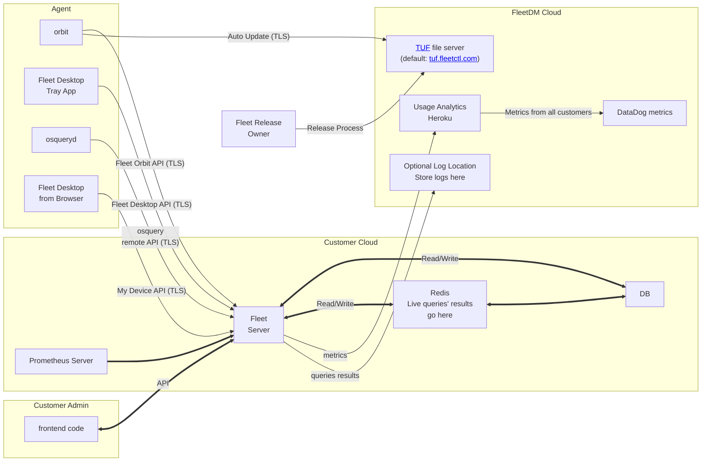
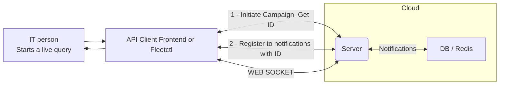
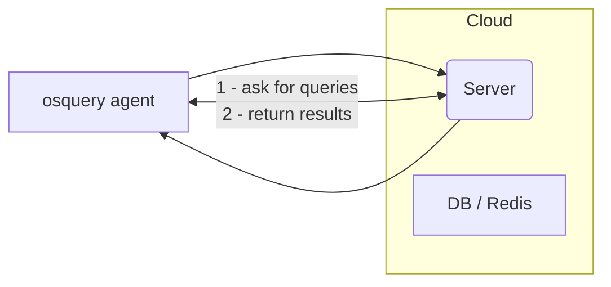

# High level architecture

- [Overview](#overview)
- [Main System Components](#main-system-components)

## Overview

Add text

## Main System Components

## The path of Live Query

### IT person initiates the query

### Agent returns results

