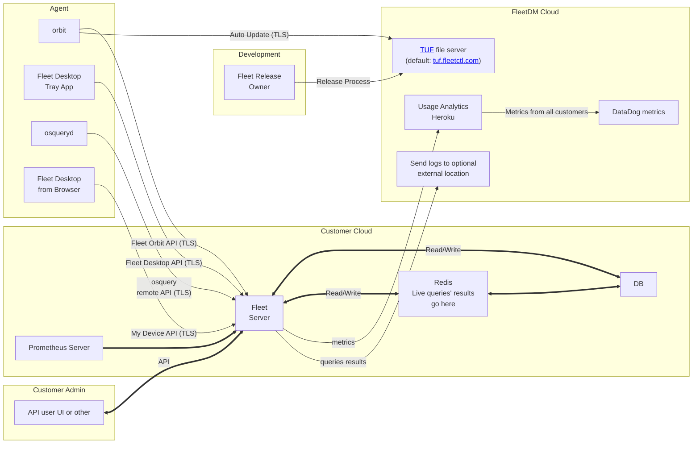
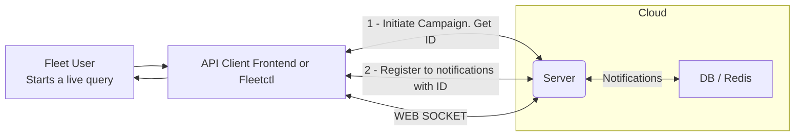
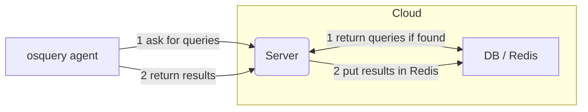
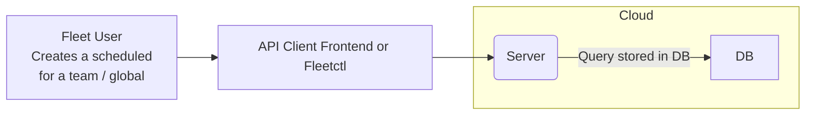
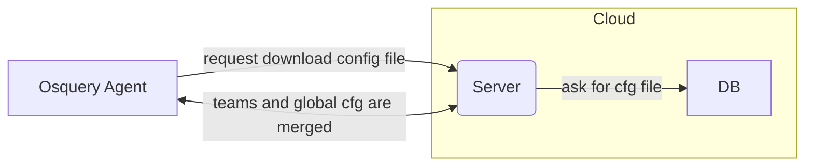
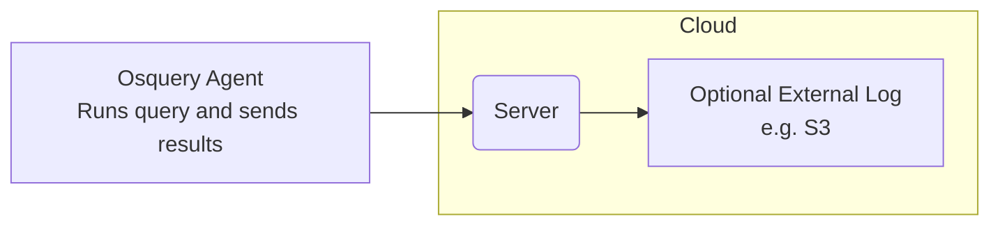
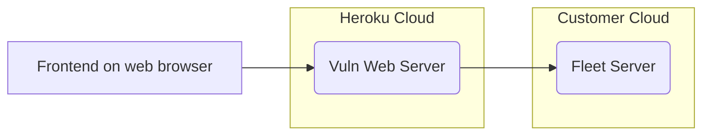

# High level architecture

- [Overview](#overview)
- [Main System Components](#main-system-components)

## Overview

Add text

## Main System Components

## The path of Live Query

### 1 - Fleet User initiates the query

### 2 - Agent returns results

## The path of a scheduled Query

### 1 - Fleet User initiates the query

### 2 - Agent gets config file (with the scheduled query)

### 3 - Agent returns results to be (optionally) logged

## Agent  config options
1 - Config TLS refresh 
(Typical period 10 secs) OSQuery pulls down a config file that includes instructions for Scheduled Queries. 
If both GLOBAL and TEAM is configured, there will be a config merge done on the Server side. 

2 - Logger TLS
(Typical period10 secs) Frequency of sending the results. (different than the frequency of running the queries)
To be improved: Currently the config file gets downloaded every time even if no change was done.

3 - Distributed (Typical interval 10 sec)
(Typical period10 secs) OSQuery asks for any Live query to run.

## Vulnerability dashboard
Typically hosted on our Heroku servers.
Could be hosted on customer servers.
Uses the Fleet server Token to access specific APIs that give information about vulnerability
status.

### Vuln dashboard hosted by FleetDM

<meta name="pageOrderInSection" value="1201">