# High level architecture

- [Overview](#overview)
- [Components](#components)

## Overview

Add text

## Components

```mermaid
graph LR;
    tuf["<a href=https://theupdateframework.io/>TUF</a> file server<br>(default: <a href=https://tuf.fleetctl.com>tuf.fleetctl.com</a>)"];
    fleet_server[Fleet<br>Server];

    subgraph Agent
        aaa[aaa];
        bbb[bbb];
        ccc[ccc];
        ddd[dd<br> dd];
    end

    subgraph Customer Cloud
        hhh[hhh];
        jjj[jjj];
        kkk[kkk];
        lll[ll<br> ll];
    end

    subgraph FleetDM Cloud
        qqq{qqq};
    end

    orbit -- "Fleet Orbit API (TLS)" --> fleet_server;
    desktop -- "Fleet Desktop API (TLS)" --> fleet_server;
    osqueryd -- "osquery<br>remote API (TLS)" --> fleet_server;
    desktop_browser -- "My Device API (TLS)" --> fleet_server;

    orbit -- "Auto Update (TLS)" --> tuf;
```

## Capabilities

| Capability                           | Status |
| ------------------------------------ | ------ |
