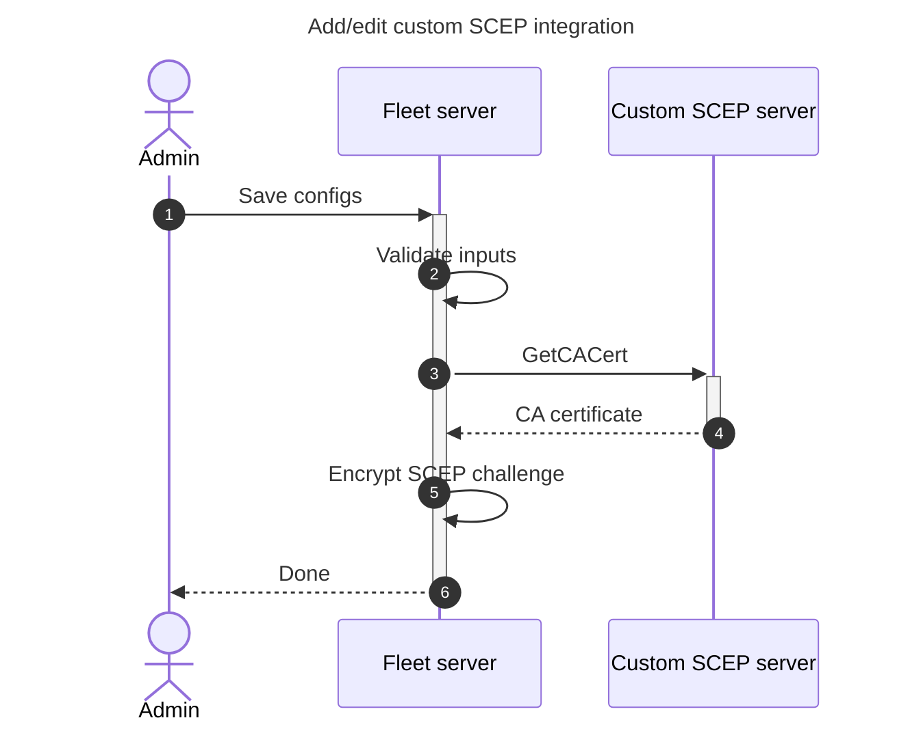
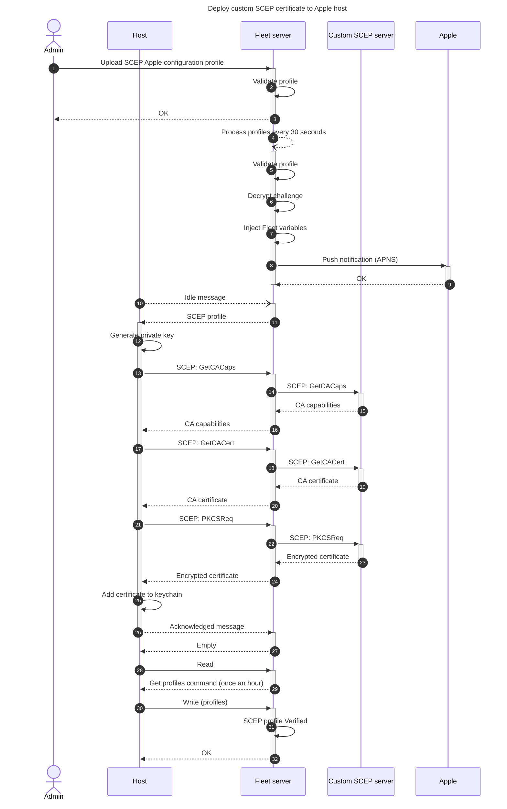

# Custom SCEP (Simple Certificate Enrollment Protocol) integration

## Set up dev environment

We will use a SCEP server from https://github.com/micromdm/scep (v2.3.0 as of this writing).

- Download the `scepserver` binary from Releases
- On macOS, remove it from quarantine: `xattr -d com.apple.quarantine ./scepserver-darwin-arm64`
- Initialize and launch the server per instructions on the GitHub page
- The SCEP URL will be like: http://localhost:2016/scep (with `/scep` suffix)

## Testing automatic renewal and manual resend of SCEP profiles

In order to facilitate testing manual resend and automatic renewal of SCEP profiles, 
use the `-allowrenew=0` flag with the micromdm server to always allow renewal. For example:
```bash
./scepserver-darwin-amd64 -depot depot -port 2016 -challenge=secret -allowrenew=0
```

Otherwise, you may encounter issues where the micromdm server rejects certain requests where there are
previously issued certificates (by default the server limits reissuance to 14 days before expiration.
This issue manifests as a failure to install the SCEP profile and an error in micromdm server logs similar to below:
```
ts=2025-06-12T16:52:27.40632Z caller=service.go:87 msg="failed to sign CSR" err="DN /OU=FLEET DEVICE MANAGEMENT/CN=C02ABC123XYZ WIFI fleet-af18e381e-f5db-47fd-8026-1a91599f18e6 already exists"
```

Note also that automatic renewal of certificates in Fleet depends on the host vitals record in the
`hosts_mdm_managed_certificates` table. To test automatic renewal, you can manipulate the
`not_valid_before` and `not_valid_after` columns in that table to simulate an expiring certificate.
For example, set `not_valid_after` to a date 30 days after today, and `not_valid_before` to a date
30 days prior to today. Then use `fleetctl trigger -name=cleanups_then_aggregation` to trigger the
cron job that checks for expiring certificates and renews them.

## Implementation details

The Proxy URL inserted into the SCEP profile follows the following format: `<server URL>/mdm/scep/proxy/<hostUUID>%2C<profileUUID>%2C<caName>`

## Issues and limitations

- CA name should be treated as a unique identifier and never changed once set. The profiles (and potential renewals) are tied to the CA name. To cleanly change the CA name, remove any profiles using the old CA name (which will remove the associated certificates from devices), change the CA name, upload new profiles using the new CA name.
- You can only have one SCEP payload in a profile. This is an Apple limitation.

## Architecture diagrams





## Sample SCEP profile

```xml
<?xml version="1.0" encoding="UTF-8"?>
<!DOCTYPE plist PUBLIC "-//Apple//DTD PLIST 1.0//EN" "http://www.apple.com/DTDs/PropertyList-1.0.dtd">
<plist version="1.0">
<dict>
    <key>PayloadContent</key>
    <array>
       <dict>
          <key>PayloadContent</key>
          <dict>
             <key>Challenge</key>
             <string>$FLEET_VAR_CUSTOM_SCEP_CHALLENGE_CA_NAME</string>
             <key>Key Type</key>
             <string>RSA</string>
             <key>Key Usage</key>
             <integer>5</integer>
             <key>Keysize</key>
             <integer>2048</integer>
             <key>Subject</key>
                    <array>
                        <array>
                          <array>
                            <string>CN</string>
                            <string>%SerialNumber% WIFI $FLEET_VAR_SCEP_RENEWAL_ID</string>
                          </array>
                        </array>
                        <array>
                          <array>
                            <string>OU</string>
                            <string>FLEET DEVICE MANAGEMENT</string>
                          </array>
                        </array>
                    </array>
             <key>URL</key>
             <string>$FLEET_VAR_CUSTOM_SCEP_PROXY_URL_CA_NAME</string>
          </dict>
          <key>PayloadDisplayName</key>
          <string>WIFI SCEP</string>
          <key>PayloadIdentifier</key>
          <string>com.apple.security.scep.9DCC35A5-72F9-42B7-9A98-7AD9A9CCA3AC</string>
          <key>PayloadType</key>
          <string>com.apple.security.scep</string>
          <key>PayloadUUID</key>
          <string>9DCC35A5-72F9-42B7-9A98-7AD9A9CCA3AC</string>
          <key>PayloadVersion</key>
          <integer>1</integer>
       </dict>
    </array>
    <key>PayloadDisplayName</key>
    <string>SCEP proxy cert</string>
    <key>PayloadIdentifier</key>
    <string>Fleet.WiFi</string>
    <key>PayloadType</key>
    <string>Configuration</string>
    <key>PayloadUUID</key>
    <string>4CD1BD65-1D2C-4E9E-9E18-9BCD400CDEDC</string>
    <key>PayloadVersion</key>
    <integer>1</integer>
</dict>
</plist>
```
