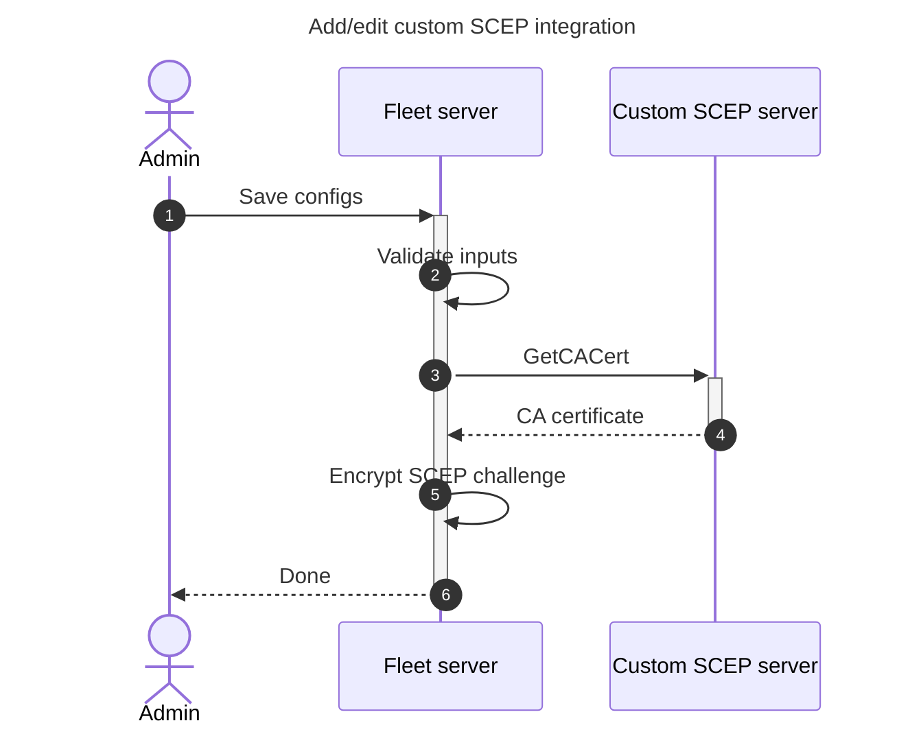
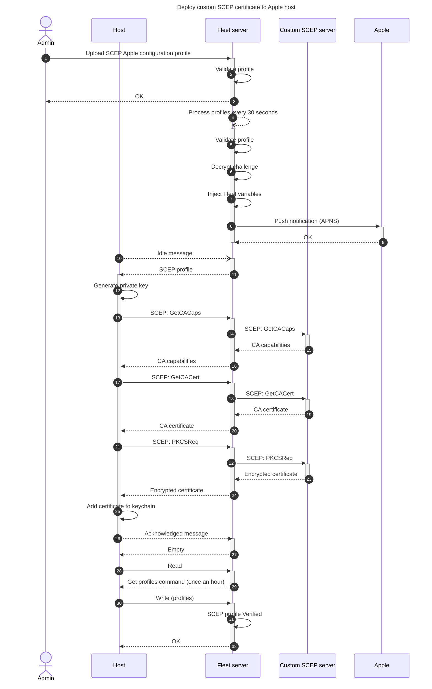

# Custom SCEP (Simple Certificate Enrollment Protocol) integration

## Set up dev environment

We will use a SCEP server from https://github.com/micromdm/scep (v2.3.0 as of this writing).

- Download the `scepserver` binary from Releases
- On macOS, remove it from quarantine: `xattr -d com.apple.quarantine ./scepserver-darwin-arm64`
- Initialize and launch the server per instructions on the GitHub page
- The SCEP URL will be like: http://localhost:2016/scep (with `/scep` suffix)

## Implementation details

The Proxy URL inserted into the SCEP profile follows the following format: `<server URL>/mdm/scep/proxy/<hostUUID>%2C<profileUUID>%2C<caName>`

## Issues and limitations

- CA name should be treated as a unique identifier and never changed once set. The profiles (and potential renewals) are tied to the CA name. To cleanly change the CA name, remove any profiles using the old CA name (which will remove the associated certificates from devices), change the CA name, upload new profiles using the new CA name.
- You can only have one SCEP payload in a profile. This is an Apple limitation.

## Architecture diagrams





## Sample SCEP profile

```xml
<?xml version="1.0" encoding="UTF-8"?>
<!DOCTYPE plist PUBLIC "-//Apple//DTD PLIST 1.0//EN" "http://www.apple.com/DTDs/PropertyList-1.0.dtd">
<plist version="1.0">
<dict>
    <key>PayloadContent</key>
    <array>
       <dict>
          <key>PayloadContent</key>
          <dict>
             <key>Challenge</key>
             <string>$FLEET_VAR_CUSTOM_SCEP_CHALLENGE_Test_SCEP</string>
             <key>Key Type</key>
             <string>RSA</string>
             <key>Key Usage</key>
             <integer>5</integer>
             <key>Keysize</key>
             <integer>2048</integer>
             <key>Subject</key>
                    <array>
                        <array>
                          <array>
                            <string>CN</string>
                            <string>%SerialNumber% WIFI</string>
                          </array>
                        </array>
                        <array>
                          <array>
                            <string>OU</string>
                            <string>FLEET DEVICE MANAGEMENT</string>
                          </array>
                        </array>
                    </array>
             <key>URL</key>
             <string>${FLEET_VAR_CUSTOM_SCEP_PROXY_URL_Test_SCEP}</string>
          </dict>
          <key>PayloadDisplayName</key>
          <string>SCEP #1</string>
          <key>PayloadIdentifier</key>
          <string>com.fleetdm.custom.scep</string>
          <key>PayloadType</key>
          <string>com.apple.security.scep</string>
          <key>PayloadUUID</key>
          <string>9DCC35A5-72F9-42B7-9A98-7AD9A9CCA3AC</string>
          <key>PayloadVersion</key>
          <integer>1</integer>
       </dict>
    </array>
    <key>PayloadDisplayName</key>
    <string>SCEP proxy cert</string>
    <key>PayloadIdentifier</key>
    <string>Fleet.custom.SCEP</string>
    <key>PayloadType</key>
    <string>Configuration</string>
    <key>PayloadUUID</key>
    <string>4CD1BD65-1D2C-4E9E-9E18-9BCD400CDEDC</string>
    <key>PayloadVersion</key>
    <integer>1</integer>
</dict>
</plist>
```
