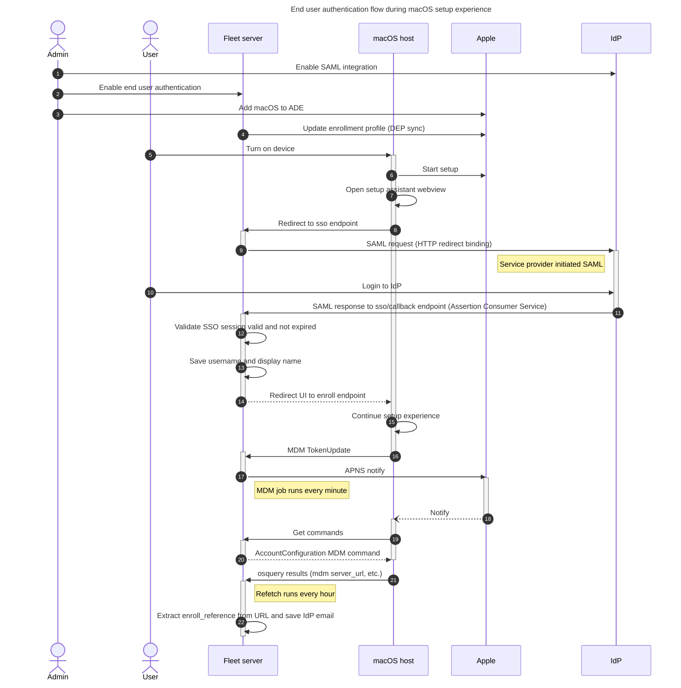

# End user authentication

- [Fleet's guide for setting up end user authentication during macOS setup experience](https://fleetdm.com/guides/macos-setup-experience#end-user-authentication-and-end-user-license-agreement-eula)
- On Fleet's [pricing page](https://fleetdm.com/pricing), this feature is called `User account sync` (as of 2025/03/31)
- Also known as: IdP integration

## Set up dev environment

Create a SAML app in an IdP.

### Instructions for Okta

- Create a SAML app in your Okta developer account following this guide: https://fleetdm.com/docs/deploy/single-sign-on-sso#okta
  - We found that Audience URI needed to be the Fleet app URL
- Create user(s) at `Directory > People`
- Assign user(s) to your app at `Applications > Applications > Assign Users to App`
- (Optional) Remove 2FA requirement for you app in `Security > Authentication Policies > Any two factors > Applications > Switch policy`

## Description

If the IT admin configured end user authentication, we change the `configuration_web_url` value in the [enrollment JSON profile](https://developer.apple.com/documentation/devicemanagement/profile) to be `{server_url}/mdm/sso`. This page gets the SAML Request from `{server_url}/api/v1/fleet/mdm/sso` and initiates the SSO flow in the setup assistant web view.

`end_user_authentication` setting is global, but `enable_end_user_authentication` is a team setting.

Key points about the flow:

1. The SSO flow ends with a callback to the Fleet server which contains information about the user that just logged in. We store this information in the `mdm_idp_accounts` table. Because at this point we don't know from which host UUID the request is coming in, we generate a random UUID as the key to look up this information (stored as `mdm_idp_accounts.uuid`). It is called `enrollment_reference` on the `/mdm/apple/enroll` endpoint.
2. The Fleet server responds with an enrollment profile, that contains a special `ServerURL` with a query parameter `enroll_reference` (note the name difference). This parameter has the random UUID generated in step 1. This value is also called `EnrollmentRef` or `EnrollmentReference` in the codebase.
3. During MDM enrollment, we grab the `enroll_reference` parameter, if present, and we try to match it to a host. This allows us to link end user IdP accounts used during enrollment with a host.
4. Before releasing the device from awaiting configuration, we send an [AccountConfiguration command](https://developer.apple.com/documentation/devicemanagement/accountconfigurationcommand/command-data.dictionary) to the host, to pre-set the macOS local account username to the value we got stored in `mdm_idp_accounts`. The command sets the following properties:
  - LockPrimaryAccountInfo=true
  - PrimaryAccountUserName
  - PrimaryAccountFullName
5. During a subsequent osquery device refresh, we lookup the `email` from `mdm_idp_accounts` and save it in `host_emails` table. This email shows up in host details.

## Diagrams

The following diagram focuses on the end user authentication part of the setup experience and skips some of the other details (fleetd download, EULA, etc.).

## Issues and limitations

- Fleet does not support OpenID Connect (OIDC) integration. Fleet only supports SAML.
- Fleet expects the SAML username to be an email. (2025/04/02: we plan to remove this restriction)
- After initial enrollment, Fleet does not sync local macOS account with IdP: [#27695](https://github.com/fleetdm/fleet/issues/27695).
