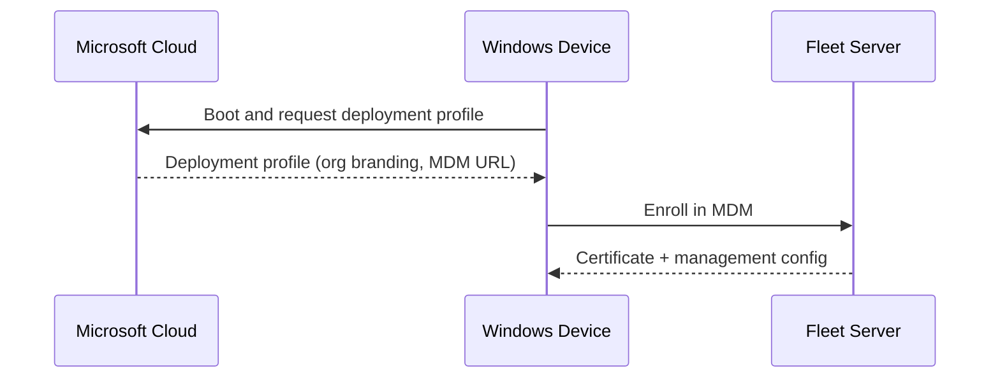
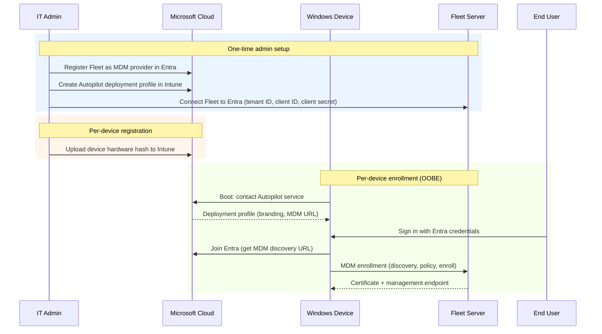
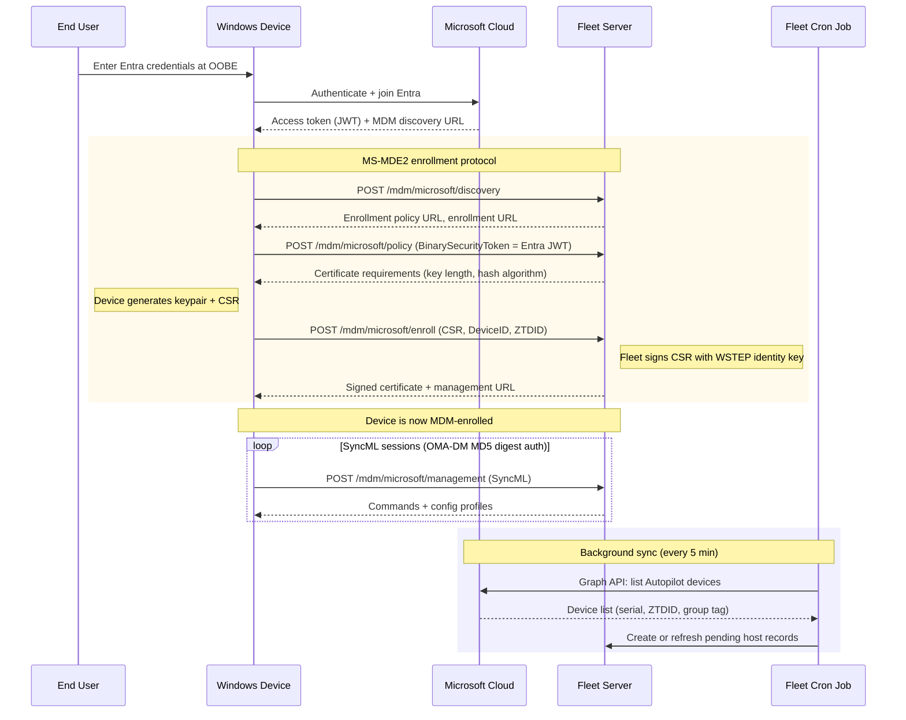
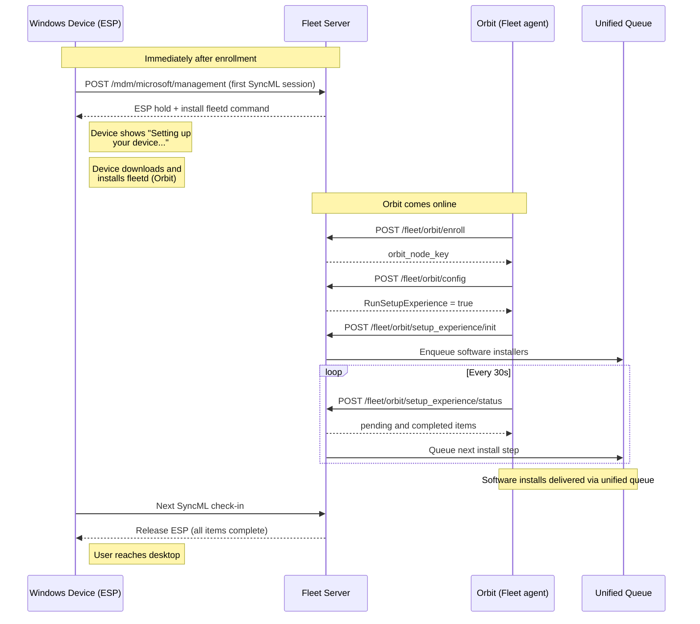

# Windows Autopilot for Beginners

This document teaches how Windows Autopilot enrollment works with Fleet, starting from the simplest overview and progressively adding detail. Each level builds on the previous one.

## Level 1: The big picture

Autopilot lets a new Windows device enroll in Fleet automatically the first time it boots. Three parties are involved.

- The deployment profile tells the device which MDM server to enroll in (Fleet) and what the first-boot wizard should look like.
- "Enroll in MDM" is a multi-step exchange (expanded in Level 3).
- An IT admin configures the Microsoft-to-Fleet link once before any device boots. That setup is shown next.

## Level 2: Two phases, two humans

Autopilot has a one-time admin setup phase and a per-device enrollment phase. The end user only participates during the first-boot sign-in.

- **Hardware hash** is a device fingerprint (TPM + SMBIOS data) that lets Microsoft's Autopilot service recognize the device before anyone signs in. It must be registered per device -- either manually by the admin (CSV upload) or by the OEM before shipping (e.g. a company orders laptops from Dell and provides their Entra tenant ID; Dell registers all the hashes into the company's Autopilot before the devices ship).
- **Entra join** means the device registers itself as an object in Entra ID. Entra's Mobility settings tell the device which MDM to enroll in.
- The **MDM discovery URL** points to Fleet (e.g. `https://fleet.example.com/api/mdm/microsoft/discovery`).

## Level 3: The enrollment protocol

The "enroll in MDM" box from Level 2 is actually three SOAP requests (the MS-MDE2 protocol). After enrollment, two background processes kick in: Fleet's Autopilot cron sync and SyncML management sessions.

- **BinarySecurityToken:** For Autopilot/Entra-joined devices, this is the Entra JWT. Fleet validates it before issuing a certificate.
- **ZTDID (Zero Touch Device ID):** A GUID Microsoft assigns to each Autopilot-registered device. The device sends it during enrollment. Fleet stores it and uses it to link the MDM enrollment to the Autopilot record.
- **WSTEP:** The certificate enrollment protocol. Fleet's WSTEP identity key signs the device's CSR and returns the client certificate in the provisioning doc. Fleet does not use this certificate to authenticate management sessions: SyncML sessions use OMA-DM MD5 digest credentials that Fleet provisions at enrollment and rekeys on the first check-in. Certificate renewal is advertised but not implemented yet ([#52492](https://github.com/fleetdm/fleet/issues/52492)), and signed SyncML messages are not verified yet ([#48771](https://github.com/fleetdm/fleet/issues/48771)).
- **Why the cron sync?** Fleet already knows about devices that enroll in its MDM server, but the sync serves three purposes that MDM enrollment alone cannot: **(1)** it creates pending host records for devices registered in Autopilot that haven't been unboxed yet, so admins see their full inventory in Fleet before a single device boots; **(2)** it stores the Autopilot group tag on the host for display (group tags don't drive fleet assignment yet; pending hosts land in the Windows enrollment default fleet); **(3)** it detects when a device is removed from Autopilot in Intune and cleans up the Fleet record.
- **Cron sync:** Runs every 5 minutes, calls the Microsoft Graph API, and diffs against Fleet's stored Autopilot records.
- **Linking:** During the first SyncML session, Fleet links the enrollment to its pending host first by ZTDID (fast, authoritative), then by serial number as a fallback.

## Level 4: Setup experience (ESP)

After enrollment, Windows displays the Enrollment Status Page (ESP) while Fleet configures the device. Fleet holds the device at the ESP until required software is installed, then releases it to the desktop.

- **ESP hold:** Fleet sends DMClient CSP and EnrollmentStatusTracking CSP commands via SyncML to block OOBE progress. These are sent before Orbit has enrolled.
- **How Orbit gets installed:** In the first SyncML session, Fleet sends an MDM command telling the device to download and install the fleetd MSI package. Windows executes this while the ESP is displayed. Once installed, Orbit starts as a service and enrolls with Fleet's API.
- **Orbit** is Fleet's agent. Once installed on the device, it drives the setup experience by polling the server every 30 seconds.
- **Unified queue:** Fleet's internal job queue that delivers software installs to Orbit in sequence.
- **3-hour timeout:** If setup hasn't completed after 3 hours, Fleet fails the ESP with an error screen instead of releasing. The device offers Reset, plus Continue anyway unless the fleet requires all software.
- **User-scoped profiles** are held until the device reports a signed-in Entra user via the `LoginStatus` alert, because Windows rejects user-scope writes until a user MDM context exists.

## Glossary

| Term | What it is |
|------|-----------|
| Entra ID | Microsoft's identity service (formerly Azure AD) |
| Intune | Microsoft's device management console; hosts Autopilot deployment profiles |
| OOBE | Out-of-Box Experience: the first-boot setup wizard |
| ESP | Enrollment Status Page: blocks OOBE until configuration is done |
| ZTDID | Zero Touch Device ID: Autopilot device GUID assigned by Microsoft |
| WSTEP | Certificate enrollment protocol (Fleet signs the device's CSR) |
| SyncML | XML protocol for MDM command exchange between device and server |
| MD5 digest auth | OMA-DM application-level authentication (username, password, nonce) that Fleet uses for SyncML sessions |
| Graph API | Microsoft's REST API; Fleet uses it to list Autopilot devices |
| Hardware hash | TPM + SMBIOS fingerprint that uniquely identifies a device to Autopilot |
| CSP | Configuration Service Provider: Windows interface for reading/writing device settings |
| MS-MDE2 | Microsoft's MDM enrollment protocol (discovery, policy, enroll) |

## How this compares to Apple ADE

For team members familiar with Apple's Automated Device Enrollment:

- **Registration portal:** ADE uses Apple Business Manager; Autopilot uses Intune + Entra.
- **Enrollment trigger:** ADE pushes an enrollment profile via APNs; Autopilot uses Entra's Mobility MDM discovery URL.
- **Certificate protocol:** ADE uses SCEP; Autopilot uses WSTEP.
- **Hold during setup:** Both have one. ADE uses `AwaitingConfiguration` + `DeviceConfigured` MDM commands; Autopilot uses ESP hold/release via DMClient CSP.
- **Background sync:** Fleet's Autopilot cron (5 min) mirrors the DEP sync cron that pulls device lists from Apple.
- **Management protocol:** ADE uses Apple's MDM protocol over APNs; Autopilot uses OMA-DM SyncML over HTTPS.

## Related resources

- [Windows Autopilot dev testing guide](windows-autopilot.md): Proxmox VMs, sysprep, troubleshooting
- [Windows MDM glossary and protocol](windows-mdm-glossary-and-protocol.md): Protocol details, registry keys, SyncML structure
- [Windows MDM architecture](../../architecture/mdm/windows-mdm-architecture.md): SyncML, CSPs, poll schedules
- [Setup experience overview](../../architecture/mdm/setup-experience-overview.md): Setup experience flow across all platforms
- [Windows MDM setup guide](https://fleetdm.com/guides/windows-mdm-setup): User-facing setup instructions
- [MS-MDE2 enrollment spec](https://learn.microsoft.com/en-us/openspecs/windows_protocols/ms-mde2/): Microsoft's enrollment protocol reference
- [Autopilot overview](https://learn.microsoft.com/en-us/autopilot/windows-autopilot): Microsoft's Autopilot documentation
