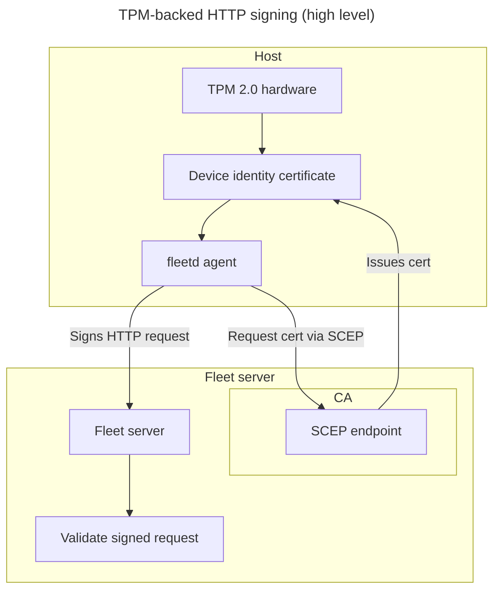
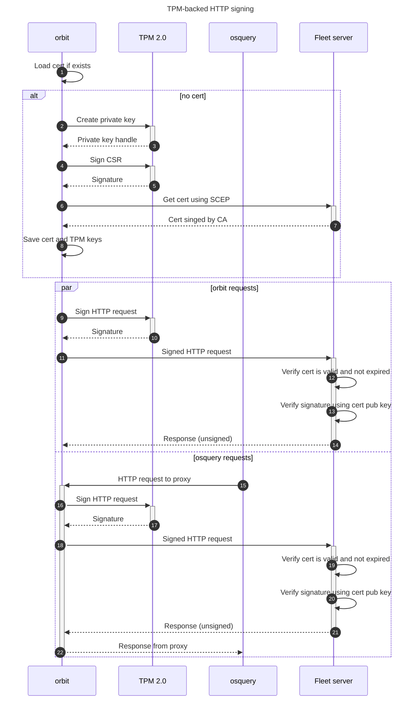

# TPM-backed HTTP signing for fleetd requests

## Overview

TPM-backed HTTP signing is a security feature that uses the device’s TPM 2.0 (Trusted Platform Module) hardware to securely generate and store cryptographic keys for signing HTTP requests. By ensuring that private keys never leave the TPM's secure boundary, this feature provides hardware-backed assurance that requests to the Fleet server originate from the same physical device that initially enrolled.

A **device identity certificate** is an X.509 certificate whose private key is bound to the TPM, enabling cryptographic proof of device identity.

This feature includes:

* **Device identity certificate enrollment** via SCEP (Simple Certificate Enrollment Protocol)
* **HTTP request signing** using TPM-protected keys

Together, these mechanisms establish a strong trust foundation for authenticated communication between `fleetd` and the Fleet server.

**Also known as:**

* Fleet host identity
* Hardware-backed device identity
* TPM-based request signing
* Secure request signing with TPM
* Trusted device authentication

> **Note**: This is currently a Proof of Concept (POC) implementation, in victor/29935-tpm-agent branch. Additional features and refinements will be added soon.

## Architecture

### Reference links

- [TPM 2.0 Library specification](https://trustedcomputinggroup.org/resource/tpm-library-specification/)
- [TPM 2.0 Key Files](https://www.hansenpartnership.com/draft-bottomley-tpm2-keys.html) - de facto standard used by OpenConnect VPN and other tools
- [RFC 9421 - HTTP Message Signatures](https://datatracker.ietf.org/doc/html/rfc9421)
- [RFC 8894 - Siimple Certificate Enrolment Protocol](https://datatracker.ietf.org/doc/html/rfc8894) (SCEP)

### Components

The TPM-backed HTTP signing feature consists of several key components:

#### orbit components

fleetd is the Fleet agent that includes orbit (the main agent process), osquery, and Fleet Desktop.

1. **Secure hardware interface** - Hardware-agnostic Go abstraction for TPM (and, in the future, Apple's Secure Enclave)
2. **TPM 2.0 implementation** - Linux-specific TPM 2.0 integration with automatic ECC curve selection
3. **SCEP client** - Certificate enrollment client for obtaining device identity certificates
4. **HTTP signing proxy** - Proxy component that intercepts osquery traffic and adds HTTP signature headers
5. **HTTP signing integration** - Direct HTTP signature support for orbit's own communications

#### Server components
1. **SCEP server interface** - Certificate Authority (CA) with dedicated keys for issuing device identity certificates
2. **HTTP signature verification** - Server-side verification of TPM-signed HTTP requests and associated certificates

### Architecture diagrams





## TPM 2.0 implementation

### Hardware requirements

- **Linux Platform**: TPM 2.0 support is currently Linux-only
- **TPM Device**: Requires `/dev/tpmrm0` (resource manager), which was added in Linux kernel 4.12 (July 2, 2017) and adopted in enterprise around 2018-2019. Compatible with TPM 2.0 hardware, firmware, or virtual implementations (vTPM).

### Key generation

The TPM implementation creates a transient parent key, which must use the same template when the key is loaded.

The TPM implementation automatically selects the best available ECC curve for the child key:

1. **Preferred**: ECC P-384 (NIST P-384) with SHA-384 - modern, fast, and stronger than Apple MDM's RSA 2048
2. **Fallback**: ECC P-256 (NIST P-256) with SHA-256 - still stronger than RSA 2048

The implementation determines TPM's P-384 support by attempting to create a test key, and falling back to P-256 if unsupported.

### Key storage

Keys are saved as to the filesystem using [TPM 2.0 Key Files](https://www.hansenpartnership.com/draft-bottomley-tpm2-keys.html) format, which includes:
- Private key blob
- Public key blob
- Parent key template

Filename used is `host_identity_tpm.pem`

## SCEP certificate enrollment

### Overview

The SCEP (Simple Certificate Enrollment Protocol) client enables fleetd to obtain device identity certificates from a Certificate Authority. The certificates are used to establish device identity and can be used in conjunction with HTTP signing for enhanced authentication.

### Certificate enrollment process

The SCEP enrollment process follows these steps:

1. **CA Certificate Retrieval**: Fetch the CA certificate from the SCEP server
2. **Key Generation**: Create an ECC key pair in the TPM (P-384 preferred, P-256 fallback)
3. **CSR Creation**: Generate a Certificate Signing Request using the TPM key
4. **Temporary RSA Key**: Create a temporary RSA key for SCEP protocol encryption/decryption
5. **SCEP Request**: Send the CSR to the SCEP server with challenge authentication
  * challenge is the enrollment secret
6. **Certificate Retrieval**: Decrypt and parse the issued certificate
7. **Certificate Storage**: Save the certificate as `host_identity.crt` in the specified directory

#### Key usage separation

The SCEP implementation uses a hybrid approach for cryptographic operations:

- **ECC Key (TPM)**: Used for signing the Certificate Signing Request (CSR)
- **RSA Key (Temporary)**: Used for SCEP protocol encryption and decryption
- **Final Certificate**: Contains the ECC public key but is signed by the CA

This separation is necessary because:
- ECC keys cannot perform encryption/decryption operations required by SCEP
- The TPM-generated ECC key provides the actual device identity
- The temporary RSA key is only used for SCEP protocol compliance

## HTTP signature

### Architecture overview

The TPM-backed HTTP signing operates at two levels within fleetd:

1. **Direct Integration**: orbit's own HTTP communications are signed directly using TPM keys
2. **Proxy Integration**: A proxy component intercepts osquery traffic and adds HTTP signature headers

This proxy approach allows osquery (which doesn't natively support HTTP signatures or TPM) to benefit from TPM-backed authentication without requiring modifications to osquery itself.

The TPM implementation produces RFC 9421-compatible ECDSA signatures.

### HTTP signature fields

Both direct and proxy signing use the same HTTP signature fields:

- **`@method`**: HTTP method (i.e., GET, POST, etc.)
- **`@authority`**: Hostname (i.e., example.com)
- **`@path`**: URL path (i.e., /api/v1/resource)
- **`@query`**: Query params (i.e., foo=bar)
- **`content-digest`**: SHA-256 digest of request body

> **Note**: We did not include the scheme (e.g., http, https) as part of the signature to prevent potential hard-to-debug issues with proxies and HTTP forwarding. We did not include Content-Type header in the signature because not all requests have this header.

Additional metadata included:
- **`keyid`**: Identifier for the signing key, which maps to identity certificate's serial number
- **`created`**: Timestamp of signature creation
- **`nonce`**: Random value for replay protection

The `created` and `nonce` fields can be used in the future to prevent replay attacks. One way to use them would be:
- server checks that `created` is within 10 minutes of current server time (since these fields are included in the signature, we know they have not been tampered with)
- server checks that `nonce` value has not been used within the last 10 minutes

> **Note**: Apple MDM prevents most (but not all) replay attacks by using a unique CommandUUID.

### Traffic flow

```
┌─────────────┐    ┌──────────────┐    ┌─────────────┐
│   osquery   │───▶│ fleetd proxy │───▶│ Fleet Server│
└─────────────┘    └──────────────┘    └─────────────┘
                          │
                          ▼
                   ┌──────────────┐
                   │  TPM Signing │
                   └──────────────┘

┌─────────────┐    ┌──────────────┐    ┌─────────────┐
│    orbit    │───▶│ HTTP Client  │───▶│ Fleet Server│
└─────────────┘    └──────────────┘    └─────────────┘
                          │
                          ▼
                   ┌──────────────┐
                   │  TPM Signing │
                   └──────────────┘
```

- **osquery → fleetd proxy**: osquery sends unsigned requests to the local proxy
- **fleetd proxy → TPM**: Proxy uses TPM to sign the intercepted requests
- **fleetd proxy → Fleet Server**: Proxy forwards signed requests to the server

## Configuration

New configuration option for orbit and `fleetctl package`: `--fleet-managed-client-certificate`

Server configuration option: none. The SCEP endpoint is always available on the server with Premium license and configured server private key. The server verifies that:
- requests with HTTP message signatures match the certificate public key and the host node key
- requests without HTTP message signatures do not have associated host identity certificates

## Future enhancements

As this an initial implementation, future features may include:

1. **One-time enrollment secret**: This provides additional security to make sure an unauthorized device cannot get an identity certificate and enroll in Fleet.
2. **Key Rotation/Renewal**: Automatic key rotation policies and certificate renewal
3. **Rate limits**: Limit the rate/number of certificates issues for the same host. This guards against agent issues.
4. **Fleet server visibility**: Allow IT admin to see which hosts have host identity certificates. For example, we can add a field to `orbit_info` table and IT admin could set up a policy to make sure all hosts have certificates.
5. **Windows Support**: TPM support for Windows platforms using TBS (TPM Base Services)
6. **Apple Secure Enclave**: Integration with Apple's Secure Enclave for macOS devices
7. **Multiple Key Support**: Support for multiple signing keys and certificates, like a separate key for WiFi/VPN.
8. **Hardware Attestation**: TPM-based device attestation and platform integrity
9. **SCEP Extensions**: Support for additional SCEP features and external CA integrations
10. **ACME**: Use ACME protocol instead of SCEP to get a certificate.

## Troubleshooting

### Common issues

1. **TPM Device Not Found**
   - Verify TPM is enabled in BIOS/UEFI
   - Check kernel TPM driver is loaded
   - Ensure device files exist with proper permissions

2. **Permission Denied**
   - Add user to `tss` group for TPM access
   - Check device file permissions (`/dev/tpmrm0`)

3. **Key Creation Failures**
   - Verify TPM is not locked or in failure mode
   - Clear TPM if necessary (will lose existing keys)
   - Check available TPM resources

### Debug logging

Enable fleetd/server debug logging to troubleshoot issues.

### SCEP-specific troubleshooting

1. **SCEP Server Connection Issues**
   - Verify SCEP server URL is accessible (and your Fleet server has this feature)
   - Check network connectivity and firewall rules

2. **Challenge Password Authentication**
   - Confirm challenge password is correct (a valid enrollment key)

3. **Certificate Enrollment Failures**
   - Review SCEP server logs for rejection reasons
