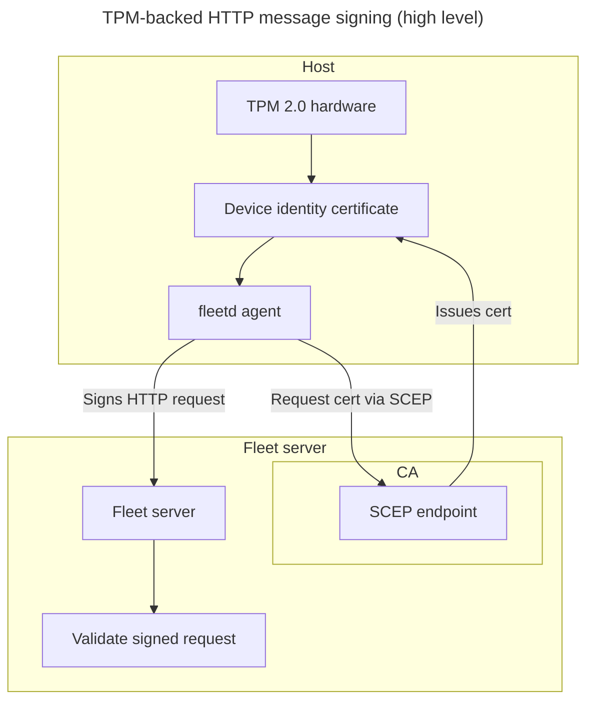
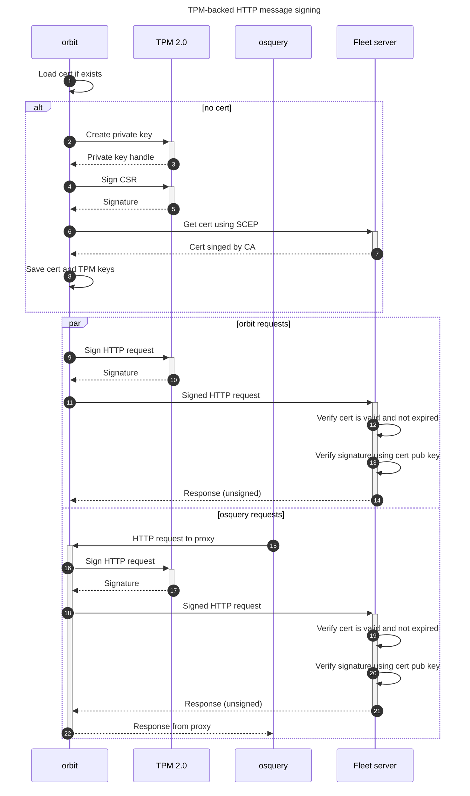

# TPM-backed HTTP message signing for fleetd requests

## Overview

TPM-backed HTTP message signing is a security feature that uses the device’s TPM 2.0 (Trusted Platform Module) hardware to securely generate and store cryptographic keys for signing HTTP requests. By ensuring that private keys never leave the TPM's secure boundary, this feature provides hardware-backed assurance that requests to the Fleet server originate from the same physical device that initially enrolled.

A **device identity certificate** is an X.509 certificate whose private key is bound to the TPM, enabling cryptographic proof of device identity.

This feature includes:

* **Device identity certificate enrollment** via SCEP (Simple Certificate Enrollment Protocol)
  * **Rate limiting** for certificate enrollment to prevent abuse
* **HTTP request signing** using TPM-protected keys
  * **Server-side signature verification** with certificate validation

Together, these mechanisms establish a strong trust foundation for authenticated communication between `fleetd` and the Fleet server.

**Also known as:**

* Fleet host identity
* Hardware-backed device identity
* TPM-based request signing
* Secure request signing with TPM
* Trusted device authentication

## Architecture

### Reference links

- [TPM 2.0 Library specification](https://trustedcomputinggroup.org/resource/tpm-library-specification/)
- [TPM 2.0 Key Files](https://www.hansenpartnership.com/draft-bottomley-tpm2-keys.html) - de facto standard used by OpenConnect VPN and other tools
- [RFC 9421 - HTTP Message Signatures](https://datatracker.ietf.org/doc/html/rfc9421)
- [RFC 8894 - Simple Certificate Enrolment Protocol](https://datatracker.ietf.org/doc/html/rfc8894) (SCEP)

### Components

The TPM-backed HTTP message signing feature consists of several key components:

#### orbit components

fleetd is the Fleet agent that includes orbit (the main agent process), osquery, and Fleet Desktop.

1. **Secure hardware interface** - Hardware-agnostic Go abstraction for TPM (and, in the future, Apple's Secure Enclave)
2. **TPM 2.0 implementation** - Linux-specific TPM 2.0 integration with automatic ECC curve selection
3. **SCEP client** - Certificate enrollment client for obtaining device identity certificates
4. **HTTP message signing proxy** - Proxy component that intercepts osquery traffic and adds HTTP signature headers
5. **HTTP message signing integration** - Direct HTTP signature support for orbit's own communications

#### Server components
1. **SCEP server interface** - Certificate Authority (CA) with dedicated keys for issuing device identity certificates
   * **Rate limiting** - Configurable cooldown periods to prevent certificate enrollment abuse
   * **Certificate management** - Automatic certificate lifecycle management including revocation and cleanup
2. **HTTP signature verification** - Server-side verification of TPM-signed HTTP requests and associated certificates

### Architecture diagrams





## TPM 2.0 implementation

### Hardware requirements

- **Linux Platform**: TPM 2.0 support is currently Linux-only
- **TPM Device**: Requires `/dev/tpmrm0` (resource manager), which was added in Linux kernel 4.12 (July 2, 2017) and adopted in enterprise around 2018-2019. Compatible with TPM 2.0 hardware, firmware, or virtual implementations (vTPM).

### Key generation

The TPM implementation creates a transient parent key, which must use the same template when the key is loaded.

The TPM implementation automatically selects the best available ECC curve for the child key:

1. **Preferred**: ECC P-384 (NIST P-384) with SHA-384 - modern, fast, and stronger than Apple MDM's RSA 2048
2. **Fallback**: ECC P-256 (NIST P-256) with SHA-256 - still stronger than RSA 2048

The implementation determines TPM's P-384 support by attempting to create a test key, and falling back to P-256 if unsupported.

### Key storage

Keys are saved as to the filesystem using [TPM 2.0 Key Files](https://www.hansenpartnership.com/draft-bottomley-tpm2-keys.html) format, which includes:
- Private key blob
- Public key blob
- Parent key template

Filename used is `host_identity_tpm.pem`

## SCEP certificate enrollment

### Overview

The SCEP (Simple Certificate Enrollment Protocol) client enables fleetd to obtain device identity certificates from a Certificate Authority. The certificates are used to establish device identity and can be used in conjunction with HTTP message signing for enhanced authentication.

### Certificate enrollment process

The SCEP enrollment process follows these steps:

1. **CA Certificate Retrieval**: Fetch the CA certificate from the SCEP server
2. **Key Generation**: Create an ECC key pair in the TPM (P-384 preferred, P-256 fallback)
3. **CSR Creation**: Generate a Certificate Signing Request using the TPM key
4. **Temporary RSA Key**: Create a temporary RSA key for SCEP protocol encryption/decryption
5. **SCEP Request**: Send the CSR to the SCEP server with challenge authentication
   * challenge is the enrollment secret
6. **Rate Limit Check**: Server validates that the host is not requesting certificates too frequently
7. **Certificate Retrieval**: Decrypt and parse the issued certificate
8. **Certificate Storage**: Save the certificate as `host_identity.crt`

#### Key usage separation

The SCEP implementation uses a hybrid approach for cryptographic operations:

- **ECC Key (TPM)**: Used for signing the Certificate Signing Request (CSR)
- **RSA Key (Temporary)**: Used for SCEP protocol encryption and decryption
- **Final Certificate**: Contains the ECC public key but is signed by the CA

This separation is necessary because:
- ECC keys cannot perform encryption/decryption operations required by SCEP
- The TPM-generated ECC key provides the actual device identity
- The temporary RSA key is only used for SCEP protocol compliance

## HTTP signature

### Architecture overview

The TPM-backed HTTP message signing operates at two levels within fleetd:

1. **Direct Integration**: orbit's own HTTP communications are signed directly using TPM keys
2. **Proxy Integration**: A proxy component intercepts osquery traffic and adds HTTP signature headers

This proxy approach allows osquery (which doesn't natively support HTTP signatures or TPM) to benefit from TPM-backed authentication without requiring modifications to osquery itself.

The TPM implementation produces RFC 9421-compatible ECDSA signatures.

### Implementation details

The HTTP message signing implementation uses a `signerWrapper` pattern that wraps HTTP clients to automatically sign requests:

```go
// signerWrapper wraps an HTTP client to add signing capabilities
signerWrapper := func(client *http.Client) *http.Client {
    return httpsig.NewHTTPClient(client, signer, nil)
}
```

This approach allows existing HTTP client code to be enhanced with signing capabilities without requiring extensive modifications to the codebase.

### HTTP signature fields

Both direct and proxy signing use the same HTTP signature fields:

- **`@method`**: HTTP method (i.e., GET, POST, etc.)
- **`@authority`**: Hostname (i.e., example.com)
- **`@path`**: URL path (i.e., /api/v1/resource)
- **`@query`**: Query params (i.e., foo=bar)
- **`content-digest`**: SHA-256 digest of request body

> **Note**: We did not include the scheme (e.g., http, https) as part of the signature to prevent potential hard-to-debug issues with proxies and HTTP forwarding. We did not include Content-Type header in the signature because not all requests have this header.

Additional metadata included:
- **`keyid`**: Identifier for the signing key, which maps to identity certificate's serial number in uppercase hexadecimal format
- **`created`**: Timestamp of signature creation
- **`nonce`**: Random value for replay protection

The `created` and `nonce` fields can be used in the future to prevent replay attacks. One way to use them would be:
- server checks that `created` is within 10 minutes of current server time (since these fields are included in the signature, we know they have not been tampered with)
- server checks that `nonce` value has not been used within the last 10 minutes

> **Note**: Apple MDM prevents most (but not all) replay attacks by using a unique CommandUUID.

### Traffic flow

```
┌─────────────┐    ┌──────────────┐    ┌─────────────┐
│   osquery   │───▶│ fleetd proxy │───▶│ Fleet Server│
└─────────────┘    └──────────────┘    └─────────────┘
                          │
                          ▼
                   ┌──────────────┐
                   │  TPM Signing │
                   └──────────────┘

┌─────────────┐    ┌──────────────┐    ┌─────────────┐
│    orbit    │───▶│ HTTP Client  │───▶│ Fleet Server│
└─────────────┘    └──────────────┘    └─────────────┘
                          │
                          ▼
                   ┌──────────────┐
                   │  TPM Signing │
                   └──────────────┘
```

- **osquery → fleetd proxy**: osquery sends unsigned requests to the local proxy
- **fleetd proxy → TPM**: Proxy uses TPM to sign the intercepted requests
- **fleetd proxy → Fleet Server**: Proxy forwards signed requests to the server

### Fleet desktop authentication

Fleet desktop (the Fleet UI that is shown in the browser) uses a token-based authentication approach that integrates with TPM-backed signing:

1. **Token retrieval**: Fleet Desktop retrieves an authentication token from the Fleet server using an HTTP-signed endpoint
2. **TPM-backed security**: The token retrieval request is signed using the TPM-backed key, ensuring the token is only issued to the authenticated device
3. **Token validity**: The token is valid for 1 hour
4. **API access**: Fleet Desktop uses this token to access `/fleet/device` API endpoints

## Configuration

### Client configuration

Enable TPM-backed HTTP message signing when packaging or running fleetd:

```bash
# Package with TPM signing enabled
fleetctl package --fleet-managed-host-identity-certificate ...

# Run orbit with TPM signing enabled
orbit --fleet-managed-host-identity-certificate ...
```

### Server configuration

The SCEP endpoint is automatically available on Fleet servers with:
- **Premium license**
- **Configured server private key**

#### HTTP message signature enforcement

To require HTTP message signatures for host identity endpoints:

```yaml
auth:
  require_http_message_signature: true  # Default: false
```

When `require_http_message_signature` is enabled:
- Orbit and osquery requests will require valid HTTP message signatures
- Hosts without valid signatures will be rejected
- This allows organizations to enforce TPM-backed authentication for enhanced security

The server always verifies that:
- Requests with HTTP message signatures match the certificate public key and the host node key
- When the above switch is disabled, requests without HTTP message signatures from hosts **without certificates** are allowed
- When the above switch is enabled, all requests to protected server endpoints must have valid signatures

#### Rate limiting configuration

Certificate enrollment rate limiting is configurable through the Fleet server configuration, using the same setting as for host enrollment rate limiting:

```yaml
osquery:
  enroll_cooldown: 5m
```

When rate limiting is enabled:
- Hosts requesting certificates too frequently receive HTTP 429 (Too Many Requests) responses
- Rate limiting applies per host based on the certificate Common Name (CN)
- Different hosts are not affected by each other's rate limits
- Rate limiting uses the same configuration as host enrollment cooldown

#### Certificate validity period (development only)

For development and testing purposes only, you can override the default certificate validity period:

```bash
FLEET_DEV_HOST_IDENTITY_CERT_VALIDITY_DAYS=30
```

This environment variable overrides the default 365-day validity period for host identity certificates. This is intended only for development and testing scenarios where shorter certificate lifetimes are needed.

After getting a new certificate, Orbit will attempt to renew the certificate within 1 hour or within 180 days of certificate expiration, whichever is longer.

### Load testing configuration

For load testing TPM-backed HTTP message signing without actual TPM hardware, use the `osquery-perf` tool with the following flag (other flags not shown):

```bash
# Run with 10% of hosts using HTTP signatures (default)
go run agent.go

# Run with 30% of hosts using HTTP signatures
go run agent.go --http_message_signature_prob 0.3

# Run with all hosts using HTTP signatures
go run agent.go --http_message_signature_prob 1.0
```

The `--http_message_signature_prob` flag controls the probability (0.0 to 1.0) that each simulated host will use HTTP message signatures. This allows testing Fleet's HTTP message signing feature at scale without requiring actual TPM hardware on load testing machines.

## Certificate renewal

The certificate is issued with a validity period of 365 days. Orbit attempts to renew it within 180 days of expiration.

### Problem

We can't use standard SCEP renewal because our SCEP library does not support signing the CMS envelope with ECC certificates. This breaks the renewal flow, which requires the CMS to be signed with the existing certificate.

### Solution

Instead, we implement a re-enrollment flow in Orbit that proves possession of the current ECC private key:

**Orbit:**
1. Generates a new ECC key and CSR.
2. Signs a message: `<current cert serial number>` using the existing ECC private key.
3. Embeds the message and signature in a custom CSR extension:
   - OID: `1.3.6.1.4.1.99999.1.1` (99999 will be replaced by our IANA private enterprise number once assigned)
   - Value: JSON like `{ "sn":"0x1b", "sig":"MEUCIQ..." }`
   - This indicates that this is a renewal request
4. Wraps the CSR in a CMS envelope signed by a temporary RSA key (to satisfy SCEP protocol requirements).

**Server:**
1. Verifies the signature against the old certificate.
2. If valid, issues a new certificate and revokes the old one to prevent replay.

> **Note**: Apple MDM also uses a re-enrollment flow for renewal, but with a static challenge.

## Future enhancements

Additional features that may be implemented in future releases:

1. **One-time enrollment secret**: This provides additional security to make sure an unauthorized device cannot get an identity certificate and enroll in Fleet.
2. **Windows Support**: TPM support for Windows platforms using TBS (TPM Base Services)
3. **Apple Secure Enclave**: Integration with Apple's Secure Enclave for macOS devices
4. **Fleet server visibility**: Allow IT admin to see which hosts have host identity certificates. For example, we can add a field to `orbit_info` table and IT admin could set up a policy to make sure all hosts have certificates.
5. **Multiple Key Support**: Support for multiple signing keys and certificates, like a separate key for WiFi/VPN.
6. **Hardware Attestation**: TPM-based device attestation and platform integrity
7. **SCEP Extensions**: Support for additional SCEP features and external CA integrations
8. **ACME**: Use ACME protocol instead of SCEP to get a certificate.

## Troubleshooting

### TPM hardware issues

1. **TPM device not found**
   - Verify TPM is enabled in BIOS/UEFI
   - Check kernel TPM driver is loaded
   - Ensure device files exist with proper permissions

2. **Permission denied**
   - Add user to `tss` group for TPM access
   - Check device file permissions (`/dev/tpmrm0`)

3. **Key creation failures**
   - Verify TPM is not locked or in failure mode
   - Clear TPM if necessary (will lose existing keys)
   - Check available TPM resources

### Certificate enrollment issues

1. **SCEP server connection issues**
   - Verify SCEP server URL is accessible (and your Fleet server has this feature)
   - Check network connectivity and firewall rules

2. **Challenge password authentication**
   - Confirm challenge password is correct (a valid enrollment key)

3. **Certificate enrollment failures**
   - Review SCEP server logs for rejection reasons
   - Check if rate limiting is causing HTTP 429 responses

4. **Rate limiting issues**
   - Check if the host is requesting certificates too frequently
   - Verify the configured cooldown period in server configuration
   - Monitor for HTTP 429 responses indicating rate limiting

### General debugging

Enable fleetd/server debug logging to troubleshoot issues.

## Known issues

### Certificate enrollment and renewal interruptions

If the client disconnects (e.g., loses network connection or crashes) after submitting the SCEP request but before receiving the issued certificate, the host may be disconnected from Fleet. This can occur during:
- Initial certificate enrollment with one-time enrollment secrets
- Certificate renewal processes

**Mitigation**: Clear the TPM artifacts and/or reinstall the fleetd agent on affected hosts with a working enrollment secret.

**Long-term solution**: Switch to ACME protocol, which supports certificate issuance via polling with retryable identifiers (e.g., JWK thumbprints), making the process more resilient to network interruptions.
