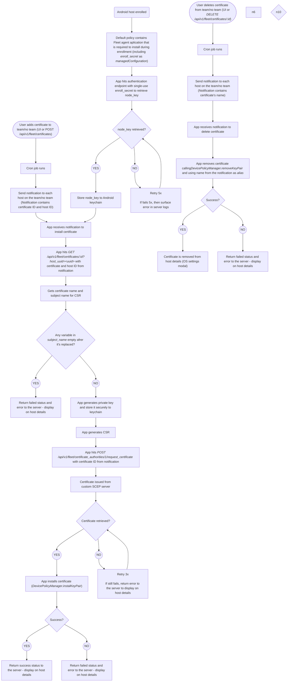

# Overview

```mermaid
flowchart TD
    n1(["User adds certificate to team/no team (UI or POST /api/v1/fleet/certificates)"]) --> n2["Cron job runs"]
    n2 --> n3["Send notification to each host on the team/no team (Notification contains certificate ID and host ID)"]
    n4["Android host enrolled"] --> n5["Default policy contains Fleet agent aplication that is required to install during enrollment (including <i>enroll_secret</i> as <i>managedConfiguration</i>)"]

    n5 --> n14["App hits authentication endpoint with single-use enroll_secret to retrieve node_key"]
    n14 --> n15["node_key retrieved?"]
    n15 --> n16(("YES")) & n17(("NO"))
    n16 --> n18["Store node_key to Android keychain"]
    n17 --> n19["Retry 5x<br><br>If fails 5x, then surface error in server logs"]
    n19 --> n15
    n18 --> n20["App receives notification to install certificate"]
    n20 --> n21["App hits <i>GET /api/v1/fleet/certificates/:id?host_uuid=&lt;uuid&gt;</i> with certificate and host ID from notification"]
    n21 --> n22["Gets certificate name and subject name for CSR"]
    n22 --> n47@{ label: "Any variable in <i>subject_name</i> empty afrer it's replaced?" }
    n23["App generates private key and store it securely to keychain"] --> n24["App generates CSR"]
    n24 --> n25@{ label: "<span style=\"color:\">App hits </span><i>POST /api/v1/fleet/certificate_authorities/1/request_certificate</i> with certificate ID from notification" }
    n25 --> n26["Certificate issued from custom SCEP server"]
    n26 --> n27["Certificate retrieved?"]
    n27 --> n28(("YES")) & n29(("NO"))
    n28 --> n30["App installs certificate (<i>DevicePolicyManager.instalKeyPair</i>)"]
    n29 --> n31["Retry 3x<br><br>If still fails, return error to the server to display on host details"]
    n31 --> n27
    n30 --> n32["Success?"]
    n32 --> n33(("YES")) & n34(("NO"))
    n33 --> n35["Return success status to the server - display on host details"]
    n34 --> n36["Return failed status and error to the server - display on host details"]
    n3 --> n20
    n37(["User deletes certificate from team/no team (UI or <i>DELETE /api/v1/fleet/certificates/:id</i>)"]) --> n38["Cron job runs"]
    n38 --> n39@{ label: "Send notification to each host on the team/no team (Notification contains certificate's name)" }
    n39 --> n40["App receives notification to delete certificate"]
    n40 --> n41["App removes certificate calling<i>DevicePolicyManager.removeKeyPair </i>and using name from the notification as <i>alias</i>"]
    n41 --> n42["Success?"]
    n42 --> n43(("YES")) & n44(("NO"))
    n43 --> n45["Certificate is removed from host details (OS settings modal)"]
    n44 --> n46["Return failed status and error to the server - display on host details"]
    n47 --> n48(("YES")) & n49(("NO"))
    n49 --> n23
    n48 --> n50["Return failed status and error to the server - display on host details"]
    n4@{ shape: rounded}
    n6@{ shape: rect}
    n10@{ shape: diam}
    n15@{ shape: diam}
    n47@{ shape: diam}
    n25@{ shape: rect}
    n27@{ shape: diam}
    n32@{ shape: diam}
    n38@{ shape: rect}
    n39@{ shape: rect}
    n40@{ shape: rect}
    n42@{ shape: diam}
    L_n42_n44_0@{ animation: none }
```
