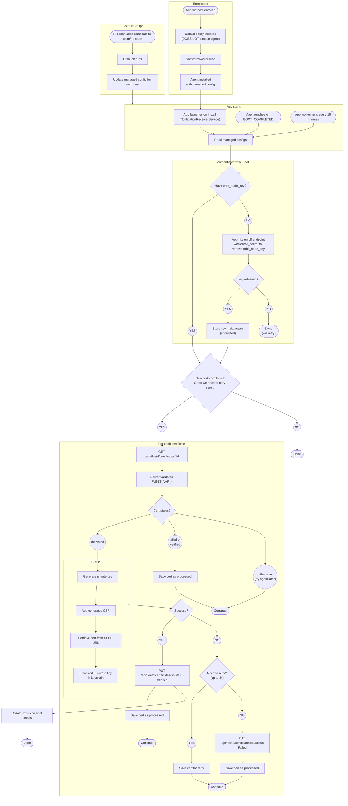

# Android certificates

```mermaid
flowchart TD
    subgraph Enrollment
        n4(["Android host enrolled"]) --> n5["Default policy installed<br/>(DOES NOT contain agent)"]
        n5 --> n5a["SoftwareWorker runs"]
        n5a --> n5b["Agent installed<br/>with managed config"]
    end

    subgraph Fleet UI/GitOps
        n1(["IT admin adds certificate to team/no team"]) --> n2["Cron job runs"]
        n2 --> n3["Update managed config for each host"]
    end
    n3 --> start

    subgraph start["App starts"]
        n5b --> l1["App launches on install<br/>(NotificationReceiverService)"]
        l2(["App launches on BOOT_COMPLETED"])
        l3(["App worker runs every 15 minutes"])
        l1 & l2 & l3 --> l4["Read managed configs"]
    end

    l4 --> auth1{"Have orbit_node_key?"}

    subgraph auth["Authenticate with Fleet"]
        auth1 --> auth2(("YES")) & auth3(("NO"))
        auth3 --> n14["App hits enroll endpoint<br/>with enroll_secret to retrieve orbit_node_key"]
        n14 --> n15{"key retrieved?"}
        n15 --> n16(("YES")) & n17(("NO"))
        n16 --> n18["Store key in datastore<br/>(encrypted)"]
        n17 --> n19(["Done<br/>(will retry)"])
    end

    auth2 --> cert1
    n18 --> cert1
    cert1{"New certs available?<br/>Or do we need to retry certs?"}
    cert1 --> certYes(("YES")) & certNo(("NO"))
    certNo --> certDone(["Done"])

    certYes --> certGet["GET /api/fleetd/certificates/:id"]
    subgraph cert["For each certificate"]
        certGet --> certServer["Server validates FLEET_VAR_*"]
        certServer --> certStatus{"Cert status?"}
        certStatus --> certStatusYes(("delivered")) & certStatusNo(("failed or<br/>verified")) & certStatusNull(("otherwise<br/>(try again later)"))
        certStatusNull --> certDone1
        certStatusNo --> certSave["Save cert as processed"]
        certSave --> certDone1(["Continue"])

        certStatusYes --> certPK["Generate private key"]
        subgraph SCEP
            certPK --> certCSR["App generates CSR"]
            certCSR --> certPost["Retrieve cert from SCEP URL"]
            certPost --> certInstall["Store cert + private key<br/>in keychain"]
        end
        SCEP --> certSuccess{"Success?"}
        certSuccess --> certSuccessYes(("YES")) & certSuccessNo(("NO"))
        certSuccessNo --> certRetry{"Need to retry?<br/>(up to 3x)"}
        certRetry --> certRetryYes(("YES")) & certRetryNo(("NO"))
        certRetryYes --> certRetrySave["Save cert for retry"]
        certRetrySave --> certDone2(["Continue"])
        certRetryNo --> certInstallStatusFail["PUT /api/fleetd/certificates/:id/status<br/>Failed"]
        certInstallStatusFail --> certSave3["Save cert as processed"]
        certSave3 --> certDone2(["Continue"])
        certSuccessYes --> certInstallStatus["PUT /api/fleetd/certificates/:id/status<br/>Verified"]
        certInstallStatus -->certSave2["Save cert as processed"]
        certSave2 --> certDone3(["Continue"])
    end

    certInstallStatus --> status["Update status on host details"]
    status --> done(["Done"])
```
