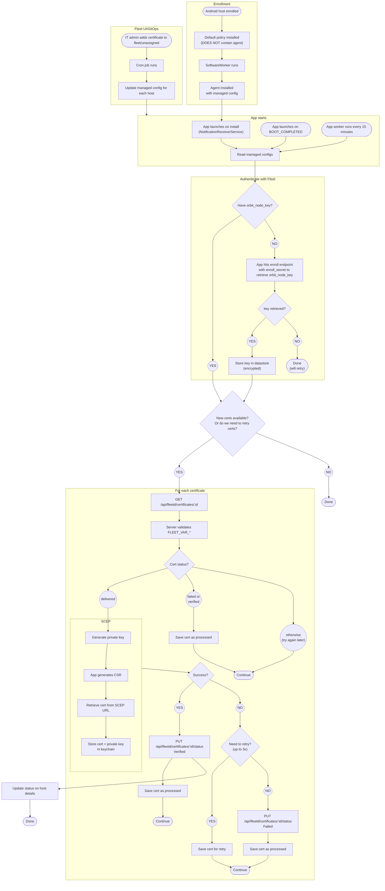

# Android certificates

## Retry behavior

Certificate installs have two layers of retry:

### Client-side retry (Android agent)

When SCEP enrollment fails on the device, the Android agent retries up to 3 times locally before
reporting the failure to the Fleet server via `PUT /api/fleetd/certificates/:id/status`.

### Server-side retry (Fleet server)

When the agent reports a certificate install failure, the Fleet server automatically retries up to
3 times by resetting the certificate status to `pending` so it gets re-delivered on the next cron
cycle. Each failure is logged as an `installed_certificate` activity with `status: "failed_install"`
so IT admins have visibility into retry attempts.

After all server-side retries are exhausted (`retry_count = MaxCertificateInstallRetries = 3`), the
certificate is marked as terminally `failed`.

### Manual resend

When an IT admin clicks "Resend" in the Fleet UI, the certificate is reset to `pending` with
`retry_count` set to `MaxCertificateInstallRetries`. This means the resend gets exactly one delivery
attempt with no automatic server-side retry on failure, matching Apple resend behavior.

### Certificate renewal

When a certificate approaches expiration and is automatically renewed, `retry_count` is reset to 0,
giving it a fresh retry budget.
