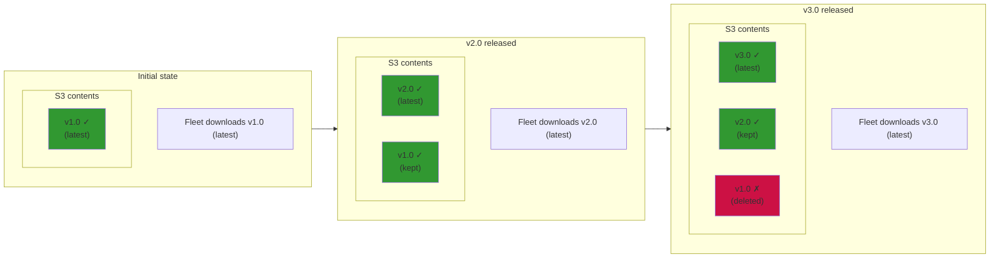
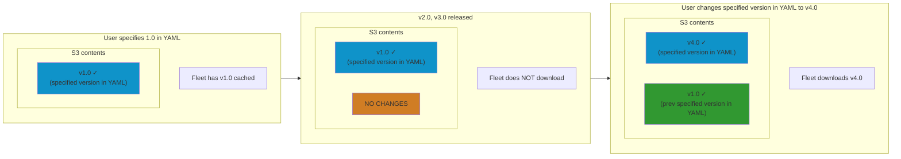
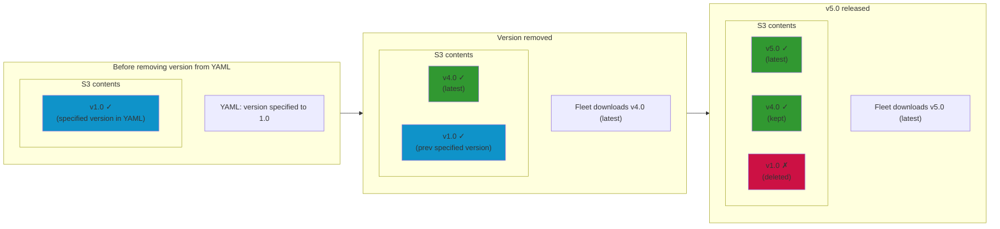
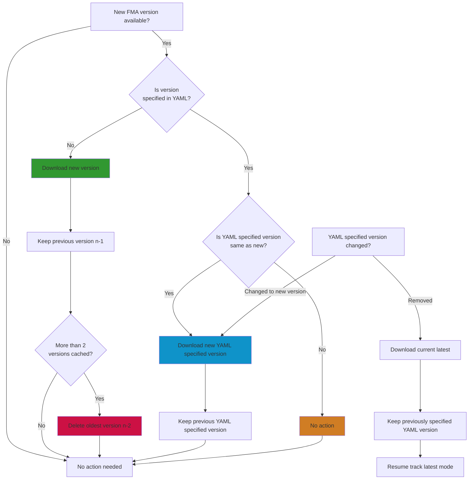

# Fleet-maintained version caching on Fleet server

Describes how Fleet manages version caching on each Fleet instance's S3 storage.

## Summary

User can define a `version` for `fleet_maintained_apps` in the [YAML file](https://fleetdm.com/docs/configuration/yaml-files). This is currently only supported in GitOps.

| Scenario | Action | S3 cache state |
|----------|--------|----------------|
| **No `version` specified** | New version released | Download latest, keep previous (n -1), delete older (n-2) |
| **`version` specified** | New versions released | No action - keep specified version only |
| **`version` specified** | User changes `version` | Download new specified version, keep previously specified version |
| **`version` removed** | Transition to "latest mode" | Download latest, keep previously specified version |
| **After `version` removal** | New version released | Resume normal latest tracking (download latest, keep n - 1, keep n - 2) |

## Diagrams

### Scenario 1: No `version` specified

### Scenario 2: `version` specified

### Scenario 3: `version` removed

### Version caching decision flowchart

