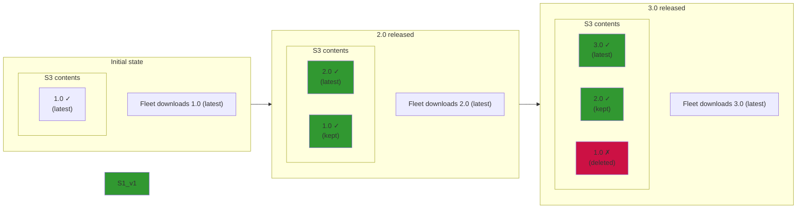
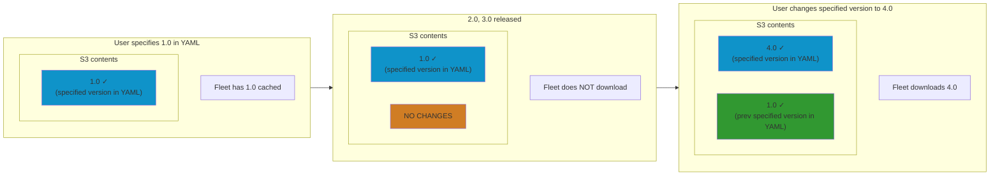
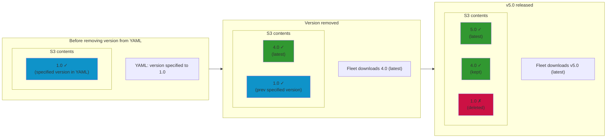
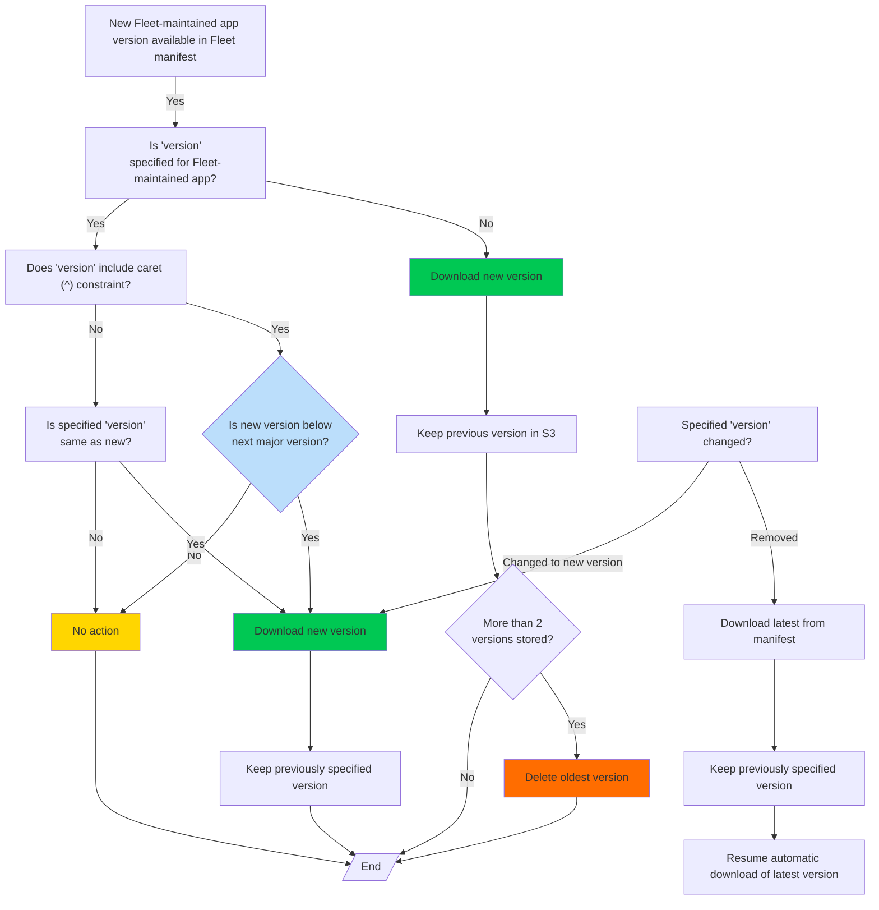

# Fleet-maintained version caching on Fleet server

Describes how Fleet manages version caching on each Fleet instance's S3 storage.

## Summary

User can define a `version` for `fleet_maintained_apps` in the [YAML file](https://fleetdm.com/docs/configuration/yaml-files). This is currently only supported in GitOps.

| Scenario | Action | S3 cache state |
|----------|--------|----------------|
| **No `version` specified** | New version released | Download latest, keep previous (n -1), delete older (n-2) |
| **`version` specified** | New versions released | No action - keep specified version only |
| **`version` specified** | User changes `version` | Download new specified version, keep previously specified version |
| **`version` removed** | Transition to "latest mode" | Download latest, keep previously specified version |
| **After `version` removal** | New version released | Resume normal latest tracking (download latest, keep n - 1, keep n - 2) |

## Diagrams

### Scenario 1: No `version` specified


```mermaid
flowchart LR
    subgraph T1["Initial state"]
        direction TB
        S1_title["Fleet downloads 1.0 (latest)"]
        subgraph S1["S3 contents"]
            S1_1["1.0 ✓<br/>(latest)"]
        end
    end

    subgraph T2["2.0 released"]
        direction TB
        S2_title["Fleet downloads 2.0 (latest)"]
        subgraph S2["S3 contents"]
            S2_v2["2.0 ✓<br/>(latest)"]
            S2_v1["1.0 ✓<br/>(kept)"]
        end
    end

    subgraph T3["3.0 released"]
        direction TB
        S3_title["Fleet downloads 3.0 (latest)"]
        subgraph S3["S3 contents"]
            S3_v3["3.0 ✓<br/>(latest)"]
            S3_v2["2.0 ✓<br/>(kept)"]
            S3_v1["1.0 ✗<br/>(deleted)"]
        end
    end

    T1 --> T2 --> T3

    style S1_v1 fill:#319831
    style S2_v2 fill:#319831
    style S2_v1 fill:#319831
    style S3_v3 fill:#319831
    style S3_v2 fill:#319831
    style S3_v1 fill:#CC1144
```

### Scenario 2: `version` specified


```mermaid
flowchart LR
    subgraph T1["User specifies 1.0 in YAML"]
        direction TB
        S1_title["Fleet has 1.0 cached"]
        subgraph S1["S3 contents"]
            S1_v1["1.0 ✓<br/>(specified version in YAML)"]
        end
    end

    subgraph T2["2.0, 3.0 released"]
        direction TB
        S2_title["Fleet does NOT download"]
        subgraph S2["S3 contents"]
            S2_v1["1.0 ✓<br/>(specified version in YAML)"]
            S2_note["NO CHANGES"]
        end
    end

    subgraph T3["User changes specified version to 4.0"]
        direction TB
        S3_title["Fleet downloads 4.0"]
        subgraph S3["S3 contents"]
            S3_v4["4.0 ✓<br/>(specified version in YAML)"]
            S3_v1["1.0 ✓<br/>(prev specified version in YAML)"]
        end
    end

    T1 --> T2 --> T3

    style S1_v1 fill:#0F93C9
    style S2_v1 fill:#0F93C9
    style S2_note fill:#D07D24
    style S3_v4 fill:#0F93C9
    style S3_v1 fill:#319831
```

### Scenario 3: `version` removed


```mermaid
flowchart LR
    subgraph T1["Before removing version from YAML"]
        direction TB
        S1_title["YAML: version specified to 1.0"]
        subgraph S1["S3 contents"]
            S1_v1["1.0 ✓<br/>(specified version in YAML)"]
        end
    end

    subgraph T2["Version removed"]
        direction TB
        S2_title["Fleet downloads 4.0 (latest)"]
        subgraph S2["S3 contents"]
            S2_v4["4.0 ✓<br/>(latest)"]
            S2_v1["1.0 ✓<br/>(prev specified version)"]
        end
    end

    subgraph T3["v5.0 released"]
        direction TB
        S3_title["Fleet downloads v5.0 (latest)"]
        subgraph S3["S3 contents"]
            S3_v5["5.0 ✓<br/>(latest)"]
            S3_v4["4.0 ✓<br/>(kept)"]
            S3_v1["1.0 ✗<br/>(deleted)"]
        end
    end

    T1 --> T2 --> T3

    style S1_v1 fill:#0F93C9
    style S2_v4 fill:#319831
    style S2_v1 fill:#0F93C9
    style S3_v5 fill:#319831
    style S3_v4 fill:#319831
    style S3_v1 fill:#CC1144
```

### Scenario 4: `version` with caret (`^`) constraint - pin major version


```mermaid
flowchart LR
    subgraph T1["Initial state"]
        direction TB
        S1_title["Fleet downloads 25.26.72 (latest)"]
        subgraph S1["S3 contents"]
            S1_v1["25.26.72 ✓<br/>(latest)"]
        end
    end

    subgraph T2["25.27.73 released"]
        direction TB
        S2_title["Fleet downloads 25.27.73 (latest)"]
        subgraph S2["S3 contents"]
            S2_v2["25.27.73 ✓<br/>(latest)"]
            S2_v1["25.26.72 ✓<br/>(kept)"]
        end
    end

    subgraph T3["User specifies ^25 in YAML"]
        direction TB
        S3_title["No download"]
        subgraph S3["S3 contents"]
            S3_v2["25.27.73 ✓<br/>(within ^25 constraint)"]
            S3_v1["25.26.72 ✓<br/>(within ^25 constraint)"]
            S3_note["NO CHANGES"]
        end
    end

    subgraph T4["25.36.31 released"]
        direction TB
        S4_title["Fleet downloads 25.36.31 (within ^25)"]
        subgraph S4["S3 contents"]
            S4_v3["25.36.31 ✓<br/>(latest, within ^25)"]
            S4_v2["25.27.73 ✓<br/>(within ^25 constraint)"]
            S4_v1["25.26.72 ✗<br/>(deleted)"]
        end
    end

    subgraph T5["26.1.58 released"]
        direction TB
        S5_title["Fleet does NOT download (outside ^25)"]
        subgraph S5["S3 contents"]
            S5_v3["25.36.31 ✓<br/>(within ^25 constraint)"]
            S5_v2["25.27.73 ✓<br/>(within ^25 constraint)"]
            S5_note["NO CHANGES"]
        end
    end

    T1 --> T2 --> T3 --> T4 --> T5

    style S1_v1 fill:#319831
    style S2_v2 fill:#319831
    style S2_v1 fill:#319831
    style S3_v2 fill:#0F93C9
    style S3_v1 fill:#0F93C9
    style S3_note fill:#D07D24
    style S4_v3 fill:#0F93C9
    style S4_v2 fill:#0F93C9
    style S4_v1 fill:#CC1144
    style S5_v3 fill:#0F93C9
    style S5_v2 fill:#0F93C9
    style S5_note fill:#D07D24
```

### Version caching decision flowchart


```mermaid
flowchart TB
    A["New Fleet-maintained app version available in Fleet manifest"] -- Yes --> B["Is 'version'<br>specified for Fleet-maintained app?"]
    B -- No --> C["Download new version"]
    C --> D["Keep previous version in S3"]
    D --> E{"More than 2<br>versions stored?"}
    E -- Yes --> F["Delete oldest version"]
    E -- No --> Z[/"End"/]
    F --> Z
    B -- Yes --> BC["Does 'version' include caret (^) constraint?"]
    BC -- Yes --> BCC{"Is new version below<br>next major version?"}
    BCC -- Yes --> H["Download new version"]
    BCC -- No --> J["No action"]
    BC -- No --> G["Is specified 'version'<br>same as new?"]
    G -- Yes --> H
    H --> I["Keep previously specified version"]
    I --> Z
    G -- No --> J
    J --> Z
    K["Specified 'version' changed?"] -- Removed --> L["Download latest from manifest"]
    L --> M["Keep previously specified version"]
    M --> N["Resume automatic download of latest version"]
    K -- Changed to new version --> H

    style C fill:#00C853
    style F fill:#FF6D00
    style BCC fill:#BBDEFB
    style H fill:#00C853
    style J fill:#FFD600
```

### Install and uninstall scripts

When Fleet downloads new version from the manifest, install and uninstall scripts are downloaded as well. If user use custom scripts defined through YAML, then server uses those for each new version. Let's say active scripts could be custom or ones from the manifest.
If user defines `version` for Fleet-maintained app:
- If custom scripts were active at a download time, store them together with a package and use them when user rollback to that version.
- If manifest scripts were active at a download time, store them together with a package.

### Examples


```yaml
software:
  fleet_maintained_apps:
    - slug: firefox/darwin
```

User adds Firefox Fleet-maintained app at some point, without specifying `version`. Each time GitOps runs, new version available in the manifest is downloaded (`147.0`) and stored to S3, while previous version (`146.0.1`) is kept as well.

↓
↓


```yaml
software:
  fleet_maintained_apps:
    - slug: firefox/darwin
      version: "146.0"  # Latest
```

Firefox is automatically updated to `147.0`, and the user found a bug, so they want to get back to the previous version. They specify `version` for `firefox`.

↓
↓

After a while, new version (`150.0.1`) is released and available in manifest. Fleet don't download this because it's not needed.

↓
↓


```yaml
software:
  fleet_maintained_apps:
    - slug: firefox/darwin
```

User now removes the `version` to get the latest. Fleet downloads latest version, and removes oldest version (`146.0`). So Fleet instance has 2 versions, latest (`150.0.1`) and another one that was cached before (`147.0`).

`version` is not specified so Fleet now always download the latest version of `firefox`. After next Firefox release, Fleet will download the latest, keep `n - 1` and remove `147.0`


