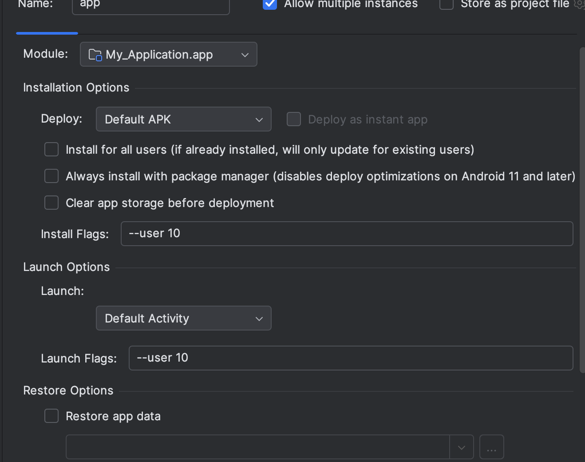

# Android app to install certificates

POC app: https://github.com/marko-lisica/android-certificate-installer

---

- [How Android app can install client certificate](#how-android-app-can-install-client-certificate)
- [Local testing in Android Studio](#local-testing-in-android-studio)

## How Android app can install client certificate

Android Management API don't support certificate installation through REST API, but they let the MDM assign `delegatedScope` to the app, so certificate installation is delegated to the native app (usually these are called companion apps).

1. MDM server must assign `CERT_INSTALL` delegated scope to the app via AMAPI policy
```json
{
    "applications": [
        {
        "packageName": "com.lisica.certinstaller",
        "installType": "FORCE_INSTALLED",
        "delegatedScopes": ["CERT_INSTALL"],
        "managedConfiguration": {
            "cert_download_url": "https://dominant-superb-amoeba.ngrok-free.app/download/certificate",
            "ca_cert_download_url": "https://dominant-superb-amoeba.ngrok-free.app/download/ca",
            "p12_password": "test12345"
        }
        }
    ]
}
```

2. App then checks if the `DELEGATION_CERT_INSTALL` is granted. See more here in [POC](https://github.com/marko-lisica/android-certificate-installer/blob/master/app/src/main/java/com/lisica/certinstaller/MainActivity.kt#L94)
    - Each installed certificate has an `alias` which is unique name that identifies certificate. This is needed for example to remove certificate using [removeKeyPair](https://developer.android.com/reference/android/app/admin/DevicePolicyManager#removeKeyPair(android.content.ComponentName,%20java.lang.String))

3. When delgated scope is granted, app can utulize [DevicePolicyManager.installKeyPair](https://developer.android.com/reference/android/app/admin/DevicePolicyManager#installKeyPair(android.content.ComponentName,%20java.security.PrivateKey,%20java.security.cert.Certificate[],%20java.lang.String,%20int)) to install certificate to Android host.

4. When certificate is installed using method above, by default it can't be used by another app. One option is to handle this in the app, using `DelegatedAdminReceiver.onChoosePrivateKeyAlias` which receives information whenever some app requests certificate, then with this method you can decide how to present certificates (either present default certificate list to show all available certs, or scope to specific cert for specific app/URL). I used other option, to handle this via AMAPI:
    - AMAPI in the policy offers the option to control whether you want to present certificates to the users.
    - `privateKeySelectionEnabled` must be enabled to present certificates to the users
    - With `choosePrivateKeyRules` you can define which certificate to present to the user. When I specified `privateKeyAlias` I wansn't even offered to choose certificate, Android selected for me automatically.
        - I wasn't able to figure out how to write this Java regex so it works only for specific URL.

```json
{
  "privateKeySelectionEnabled": true,
  "choosePrivateKeyRules": [
    {
      "urlPattern": "",
      "packageNames": ["com.android.chrome"],
      "privateKeyAlias": "cert5"
    }
  ]
}
```

### Managed cofniguration

I used `managedConfiguration` to specify download URLs and `.p12` password for sake of easier testing. I can change URL re-deploy policy and I can test different certificate easily. This will be helpful to understand how managed configuration (aka. [app restrictions](https://developer.android.com/work/managed-configurations#:~:text=previously%20known%20as%20application%20restrictions)) works, because we'll need to leverage this for authentication.

### Generating private key and CSR on the host

We'll need to generate private key and CSR on the host, to hit `POST /api/v1/fleet/certificate_authorities/:id/request_certificate` that should return `.pem`.

We could use this to install cert without having `.p12` to extract:

```kotlin
fun installWithSeparateKeyAndCert(
    context: Context,
    privateKey: PrivateKey,  // Generated on device
    pemCertUrl: String        // Download PEM from server
): Result<String> {
    val dpm = context.getSystemService(Context.DEVICE_POLICY_SERVICE) as DevicePolicyManager

    return runCatching {
        val certAlias = getNextCertAlias(context)

        // Download PEM certificate from server
        val pemBytes = downloadCertificate(pemCertUrl)

        // Parse PEM certificate
        val certFactory = CertificateFactory.getInstance("X.509")
        val certificate = certFactory.generateCertificate(
            ByteArrayInputStream(pemBytes)
        ) as X509Certificate

        // Install the key pair (device private key + server certificate)
        val flags = DevicePolicyManager.INSTALLKEY_REQUEST_CREDENTIALS_ACCESS or
                   DevicePolicyManager.INSTALLKEY_SET_USER_SELECTABLE

        val success = dpm.installKeyPair(
            null,
            privateKey,           // Your device-generated private key
            arrayOf(certificate), // Downloaded PEM certificate
            certAlias,
            flags
        )

        require(success) {
            "Failed to install key pair"
        }

        certAlias
    }
}
```

## Local testing in Android Studio

Testing is straightforward in Android Studio, you can run emulator or connect real device via USB cable, but if you want to test app in work profile it requires some configuration changes.

Also additional complexity is that you need to mock MDM (work profile), and additionally to delegate `CERT_INSTALL` scope and define managed configuration. This can be done with Google's [Test DPC](https://play.google.com/store/apps/details?id=com.afwsamples.testdpc) app.


### Use Test DPC to add work profile to your test device

1. Install [Test DPC](https://play.google.com/store/apps/details?id=com.afwsamples.testdpc) from Google Play.
2. You should see 2 apps installed **Test DPC** and **Set up Test DPC**.
3. Open **Set up Test DPC**, select **Set up managed profile** and select **Next**.
4. Select **Skip** on **Add account** page, and then select **Finish**.
5. You should have now **Work profile** added on your device.
6. Note that **Test DPC** app is available in both personal and work profile, but you should use one in work profile in order to change Work profile settings.

### Run the debug app in Android Studio within the work profile

1. First on your Android device, open **Test DPC** in work profile, and search for **Set user restrictions**, and select it.
2. Disable **Disallow debugging features** and **Disallow install unknown resources**.
3. In the bottom left corner, open **Terminal**, and run `adb shell pm list users`, which will return list of the users. Look for one that has "work profile" and remember ID (usually 10).
4. Now open **Android Studio**, and in the menu bar select **Run > Edit Configurations...**.
5. You probably have one configuration which is by default named **app**.
6. Make sure that **Install for all users (if already installed, will only update for existing users)** is checked.
7. In **Launch Flags** type `--user 10` or whatever ID you got from running command from step 3.
8. Now when you run your app on emulator or real device (connected via USB), it will run on both personal and work profile.



### Grant delegated scope to the app (CERT_INSTALL)

1. Open **Test DPC** in work profile, and search for **Delegated cert installer**, and select it.
2. Find your app in the list, select it and select **Set** button on the bottom.
3. Your app should have granted scope to install certificate and to utilize `DevicePolicyManager.installKeyPair`.