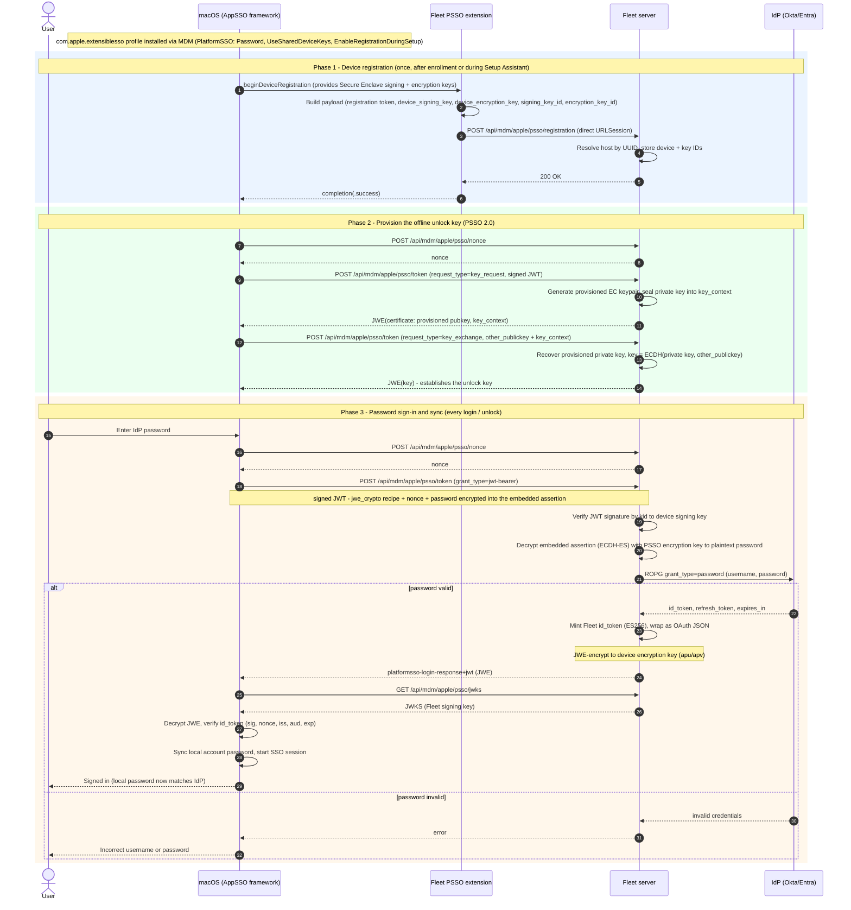

# Apple Platform Single Sign-On (PSSO) — design decisions

## Overview

Platform Single Sign-On (PSSO) is a macOS 13+ feature in which an identity provider participates in the local login window, screen-lock unlock, and keychain authentication flows by way of an Apple Single Sign-On extension and a matching configuration profile. Fleet is implementing PSSO to show that an end user's local macOS account password can be kept in sync with the same credential they use against the upstream IdP, satisfying the product/design requirement for local-account password sync, and additionally showing creating the user during Setup Assistant with  a password synced with the IDP. Ultimately it was determined that Fleet can implement an SSO plugin that can meet these requirements if a user is using an LDAP or OAUTH ROPG supporting IDP

### Known limitations:

The most pertinent known limitations to be aware of up front

* 4 hour sync window: a mac running Password SSO checks the password against the IDP if the existing token is missing, expired or over 4 hours old at the next unlock/login event. This means a user can go up to 4 hours plus however long it takes them to lock and unlock their mac before the mac detects that the password has changed. Even if they logout and login during this time in my testing macOS doesn't reach out to the IDP so there is a small window where their password can be out of sync if they don't start using the new password. If they enter the new password, macOS will immediately reach out to the IDP and upon confirmation trigger a password change. It is unclear if there is any mechanism to work around this even if a component on the system like Orbit knows a password change has occurred but initial research suggests there is not. 

* Some cases require both passwords. The most common case where a user returns to their locked machine after having changed their password in-IdP does not

* Requires enabling LDAP or ROPG within IDP and may be unacceptable from a security standpoint for some customers. Many IDPs suggest against using these as they result in plaintext passwords transiting third party apps but there is no other clear way to implement this feature

* Likely no easy way for an admin to update the logo shown on PSSO notifications/screens. This is possible but would require an admin to purchase an Apple developer account and go through a number of steps on the Apple side, along with additional config surface on the Fleet side, to allow updating the logo, because it is built into the binary and the binary requires special entitlements from Apple

## Flow diagrams

Actors: the **end user**, **macOS** (the AppSSO framework / `AppSSOAgent`, which holds the device's Secure Enclave keys and orchestrates the flow), the **Fleet PSSO extension** (our in-tree Swift extension), the **Fleet server** (the IdP-translator), and the upstream **IdP** (Okta/Entra). MDM profile delivery and the Secure Enclave appear as notes rather than separate lanes.

The diagram covers the whole lifecycle in three phases: device registration, unlock-key provisioning (both run once, during enrollment or Setup Assistant), and the password sign-in/sync that repeats at each login or unlock. The IdP is contacted only at sign-in; registration establishes no identity.

## Known limitations

- **OIDC ROPG has provider-specific limitations.** Okta: ROPG must be explicitly enabled on the application and the app must be Native or Service type. Entra: MFA-required users and federated (AD FS) users cannot authenticate via ROPG. These are upstream constraints, not Fleet bugs. Customers in those configurations need an alternative `PSSOIdPClient` backend (LDAP bind or a direct-trust flow).
- **AASA requires a public-CA TLS certificate.** Apple's framework silently rejects self-signed certificates when fetching `/.well-known/apple-app-site-association`. Local development requires a real DNS name with a Let's Encrypt cert, or a tunnel such as ngrok or cloudflared.
- **Global config only.** PSSO settings live on `AppConfig`; there is no per-team override.

### LDAP identity backend (Google Workspace Secure LDAP)

**Problem / motivation.** The POC validates passwords via OIDC ROPG, but **Google Workspace does not support the OAuth ROPG (`grant_type=password`) flow at all** — so there is no OIDC path to validate a Google user's password server-side. Google's supported mechanism for that is **Secure LDAP**. Adding an LDAP backend therefore isn't just an alternative to ROPG; it's what unlocks Google Workspace as an IdP. The same backend also covers classic LDAP/Active Directory for customers who prefer a directory bind over ROPG.

**Planned approach.** Add a second `PSSOIdPClient` implementation — nothing else moves. The interface (`ValidatePasswordAndGetClaims(ctx, username, password) (*PSSOClaims, error)`) already isolates the backend from the PSSO protocol, the JWE/JWT crypto, the endpoints, the Fleet-minted id_token, the key request/exchange, and the device side; all of that is unchanged. The new client dials LDAPS, locates the user (search by `mail`/`uid` under the base DN), binds as that user with the supplied password to verify it, and maps directory attributes to `PSSOClaims`.

**Implementation touch points.**
- `ee/server/service/apple_psso_idp_ldap.go` — new `PSSOLDAPClient` implementing the interface (search-then-bind; ~150–250 lines). Adds an LDAP library dependency (`github.com/go-ldap/ldap/v3` — confirm it isn't already vendored; Fleet does not appear to use LDAP today).
- `server/fleet/apple_psso.go` — add an `IdPType` discriminator (`oidc_ropg` | `ldap`) to `PSSOSettings` and an `LDAP *PSSOLDAPSettings` block (`ServerURL`, `BaseDN`, `UserSearchAttr`, attribute→claim map, and the directory-auth material — see below).
- `ee/server/service/apple_psso.go` — `pssoIdPClientFromSettings` switches on `IdPType` instead of always constructing `PSSOOIDCROPGClient`. (The client is already built per request from live settings here, so no `serve.go` wiring is involved.)
- Secret storage + masking — the Google client certificate/key (and any service bind password) are directory-wide credentials; encrypt at rest via the `mdm_config_assets` pattern and mask on the config API (same write-path work as the IdPClientSecret finding).
- Tests (integrate against glauth/OpenLDAP or a mocked connection) and a Google Admin console setup doc.

**Google Secure LDAP specifics.**
- LDAP support of any flavor has been deferred to a later release
- Endpoint `ldaps://ldap.google.com:636`, TLS only.
- **Directory authentication is mutual TLS, not a bind password.** An "LDAP client" is created in the Google Admin console, which issues a client certificate + private key that Fleet presents (`tls.Config.Certificates`). This is the main structural difference from classic LDAP/AD, which uses a service bind DN + password — so the LDAP settings should accommodate both directory-auth styles.
- The Admin console LDAP client must be granted access to the relevant OUs and permission to verify user credentials; the base DN derives from the domain (e.g. `dc=example,dc=com`).
- The exact bind/DN mechanics should be confirmed against Google's Secure LDAP documentation before implementing — that is the least-certain part of this plan.

**Open decisions.**
- *Directory-auth model:* support Google mTLS (client cert) and classic service-bind (DN + password) behind one config shape, or ship Google-only first.
- *Attribute mapping & stable subject:* which attribute maps to `sub` must be stable across logins, since the device keys identity on it (`uniqueIdentifierClaimName = "sub"`); `mail` or a directory GUID are candidates.
- *Connection handling:* per-request dial (simplest, fine at sign-in frequency) vs. a pooled connection.

**Limitations to document.**
- **MFA bypass.** A raw LDAP bind ignores MFA/conditional access, the same limitation class as the ROPG caveat above.

## Pointers

- Apple WWDC sessions: *Platform SSO for macOS* (WWDC 2022), and the *Discover authentication services* / *Shared device keys* material (WWDC 2023).
- Apple developer documentation for the `ASAuthorizationProviderExtension*` family of classes and protocols.
