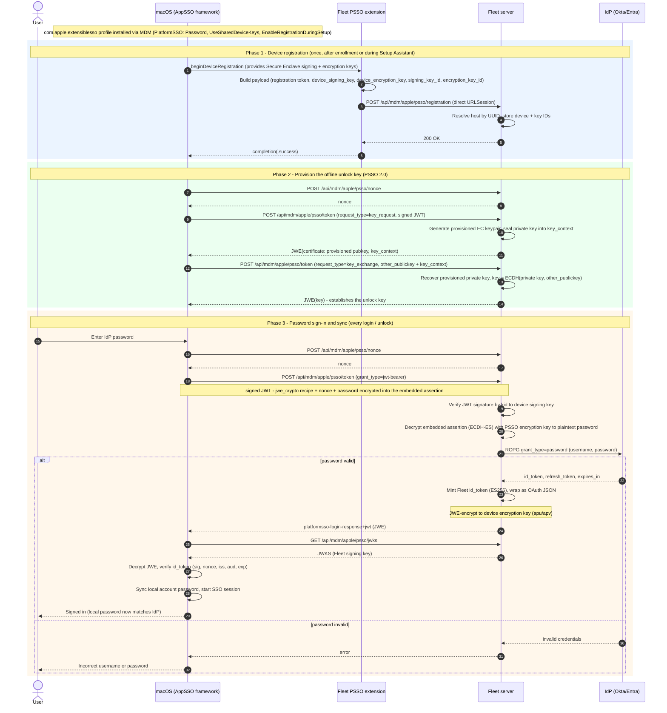

# Apple Platform Single Sign-On (PSSO) — design decisions

## Overview

Platform Single Sign-On (PSSO) is a macOS 13+ feature in which an identity provider participates in the local login window, screen-lock unlock, and keychain authentication flows by way of an Apple Single Sign-On extension and a matching configuration profile. Fleet is implementing PSSO to show that an end user's local macOS account password can be kept in sync with the same credential they use against the upstream IdP, satisfying the product/design requirement for local-account password sync, and additionally showing creating the user during Setup Assistant with  a password synced with the IDP. Ultimately it was determined that Fleet can implement an SSO plugin that can meet these requirements if a user is using an LDAP or OAUTH ROPG supporting IDP

### Known limitations:

The most pertinent known limitations to be aware of up front

* 4 hour sync window: a mac running Password SSO checks the password against the IDP if the existing token is missing, expired or over 4 hours old at the next unlock/login event. This means a user can go up to 4 hours plus however long it takes them to lock and unlock their mac before the mac detects that the password has changed. Even if they logout and login during this time in my testing macOS doesn't reach out to the IDP so there is a small window where their password can be out of sync if they don't start using the new password. If they enter the new password, macOS will immediately reach out to the IDP and upon confirmation trigger a password change. It is unclear if there is any mechanism to work around this even if a component on the system like Orbit knows a password change has occurred. 

* Some cases require both passwords: It wasn't directly encountered during the PSSO POC but Apple documentation suggests the user may occasionally be prompted for old and new passwords. I suspect this can happen at the filevault screen at times.

* No way to make SSO to apps in a browser work - ultimately we cannot integrate closely enough with an IDP for this to work and I don't see any way to get around it

* Requires enabling LDAP or ROPG within IDP and may be unacceptable from a security standpoint for some customers. Many IDPs suggest against using these as they result in plaintext passwords transiting third party apps but there is no other clear way to implement this feature

* Likely no easy way for an admin to update the logo shown on PSSO notifications/screens. This is possible but would require an admin to purchase an Apple developer account and go through a number of steps on the Apple side, along with additional config surface on the Fleet side, to allow updating the logo, because it is built into the binary and the binary requires special entitlements from Apple

## Flow diagrams

Actors: the **end user**, **macOS** (the AppSSO framework / `AppSSOAgent`, which holds the device's Secure Enclave keys and orchestrates the flow), the **Fleet PSSO extension** (our in-tree Swift extension), the **Fleet server** (the IdP-translator), and the upstream **IdP** (Okta/Entra). MDM profile delivery and the Secure Enclave appear as notes rather than separate lanes.

The diagram covers the whole lifecycle in three phases: device registration, unlock-key provisioning (both run once, during enrollment or Setup Assistant), and the password sign-in/sync that repeats at each login or unlock. The IdP is contacted only at sign-in; registration establishes no identity.

## Decision log

### PSSO v2 with Password mode

The extension is registered as `AuthenticationMethod = UserSecureEnclaveKey` v2 with `RegistrationToken`-style flows, configured for **Password** authentication (not `SecureEnclaveKey`, and not v1). Password mode is the only PSSO configuration that surfaces the user's plaintext password to the extension at sign-in, which is what the local-account sync requirement needs. v1 is not considered because it predates the current registration / token-exchange protocol Apple ships in the current `ASAuthorizationProviderExtension*` APIs.

### Identity backend: generic OIDC ROPG, pluggable (Okta-first)

The server defines a `PSSOIdPClient` interface; the first concrete implementation (`PSSOOIDCROPGClient`) speaks OAuth 2.0 Resource Owner Password Grant (`grant_type=password`) against any OIDC IdP. The token URL is taken from `AppConfig.PSSOSettings.idp_token_url`, so the same code path works against Okta, Entra ID, Auth0, Keycloak, or any other ROPG-capable IdP — only the configured URLs change.

The POC is exercised against Okta first because it's a faster path to a working integrator-tier sandbox than provisioning an Entra tenant or a paid G Workspace account. Okta-specific caveats are documented in `tools/psso/README.md`: ROPG must be explicitly enabled on the application, and the app type must be Native or Service.

Additional backends (LDAP bind, direct-trust flows for IdPs that reject ROPG) slot in behind the same `PSSOIdPClient` interface without changes to the PSSO endpoint handlers. The pluggable shape mirrors how the broader Fleet codebase isolates IdP-specific behavior behind an interface.

### Enterprise-gated with no-license core stubs

Route registration for `/api/mdm/apple/psso/*` and the AASA document lives in `server/service/handler.go` (core). The real implementation lives in `ee/server/service/`; the core build provides stubs that return `fleet.ErrMissingLicense`. This matches the pattern already used by `calendar.go` and the enterprise pieces of `apple_mdm.go`.

### Endpoint paths live under /api/mdm/apple/psso

The device-facing PSSO endpoints — `/api/mdm/apple/psso/nonce`, `/api/mdm/apple/psso/registration`, `/api/mdm/apple/psso/token`, and `/api/mdm/apple/psso/jwks` — follow the unversioned device-protocol convention of `/api/mdm/apple/enroll` and are registered on the unauthenticated endpointer (which also caps request body sizes). The JWKS deliberately does not live at `/.well-known/jwks.json`: Apple's framework takes the JWKS URL from the extension's login configuration, so a PSSO-specific path avoids advertising (or colliding with) a server-wide JWKS. Only `/.well-known/apple-app-site-association` remains at root, because Apple's CDN fetches it at a spec-defined absolute path; it stays a raw handler on the root `*http.ServeMux`. (The POC originally served everything at root, SCEP-style — `/mdm/apple/psso/*` — this was revised in #46942.)

### Nonces in Redis, not MySQL

The nonce store mirrors `server/mdm/acme/internal/redis_nonces_store/` and exposes the same minimal surface: `Store(ctx, nonce, ttl)` and `Consume(ctx, nonce) (bool, error)`. Nonces are short-lived and single-use; MySQL would add round-trip cost and migration overhead with no benefit.

### Two MySQL tables

- `mdm_apple_psso_devices` — primary key `host_id`, stores the device's signing and encryption public keys (PEM), the negotiated KeyExchangeKey, and registration/update timestamps.
- `mdm_apple_psso_key_ids` — primary key `kid`, foreign key `host_id`, plus `key_type` and `pem`. The extension references keys by SHA-256 hash of the public key, so the server needs an index keyed by that hash to resolve incoming requests back to a device.

### JWKS signing key bootstrap

The signing key(`MDMAssetPSSOSigningKey`) and the self-signed PSSO CA (`MDMAssetPSSOCACert`, backed by the same private key) are created once, the first time the feature is configured, via `bootstrapPSSOAssets` in `ModifyAppConfig` (covering the config API and GitOps). The bootstrap is idempotent and never regenerates existing assets, so the JWKS key and CA stay stable across reconfiguration and disable/re-enable.

### Encrypt the password on the wire

The password is the one raw credential PSSO handles, so it is encrypted end-to-end to Fleet rather than relying on TLS alone — a MITM proxy that terminates TLS  must not be able to read it else we risk inadvertent plaintext exposure.

- **Separate encryption key.** A second EC P-256 key (`MDMAssetPSSOEncryptionKey`) is minted alongside the signing key in `bootstrapPSSOAssets` and published in the JWKS as a second JWK with `"use":"enc","alg":"ECDH-ES"`. It is deliberately *not* the signing key: NIST SP 800-57 §5.2 forbids using one key for both signing and encryption. The bootstrap mints each asset independently, so enabling the feature on a deployment that predates this key mints just the encryption key.
- **Extension wiring.** When building the login configuration the extension fetches the JWKS, and if an `enc` key is present sets it as `ASAuthorizationProviderExtensionLoginConfiguration.loginRequestEncryptionPublicKey`. With that set, macOS encrypts the password into the login request instead of sending it in the clear.
- **Wire format (per Apple's "Creating and validating a login request").** The outer login request stays a JWS signed by the device signing key, so device authentication, the single-use `request_nonce`, the `jwe_crypto` response recipe, and `username`/`sub` are unchanged and still verified as before. Only the password moves: `grant_type` becomes `urn:ietf:params:oauth:grant-type:jwt-bearer`, the plaintext `password` claim is dropped, and an `assertion` claim carries a compact JWE (`typ` `platformsso-encrypted-login-assertion+jwt`, `alg` `ECDH-ES`, `enc` `A256GCM`, with `epk`/`apu`/`apv`) encrypted to the published encryption key. Its `+jwt` plaintext is a JWT whose claims include the password.
- **Server decryption.** `handlePSSOPasswordLogin` reads the plaintext `password` claim when present; otherwise it decrypts the `assertion` with the stored encryption key (`decryptPSSOInboundJWE`, go-jose ECDH-ES, pinning `typ`/`alg`/`enc`) and extracts the password from the recovered claims. The embedded assertion is encrypted-only — its integrity is covered by the outer JWS signature and the JWE GCM tag, so no inner signature is verified. IdP validation then proceeds unchanged.

### In-tree Swift extension (shipped with Fleet Desktop)

The Swift sources for the SSO extension live in this repo at `apps/fleet-desktop-macos/FleetPSSOExtension/`. The extension is built as an `.appex` embedded in the Fleet Desktop app and shipped in the same `.pkg`; CI signs and notarizes it with Fleet's Developer ID certificates and Developer ID provisioning profiles (team `8VBZ3948LU`). The associated domain is **not** baked into the binary — the entitlement ships as an empty array with `com.apple.developer.associated-domains.mdm-managed` set, and the actual `authsrv:` hostname is delivered at runtime by an MDM AssociatedDomains payload. That hostname must match the host served at `/.well-known/apple-app-site-association`.

**Device registration must POST directly (no WKWebView).** `beginDeviceRegistration` submits the device's signing/encryption public keys to `/api/mdm/apple/psso/registration` via a direct `URLSession` POST, and reports `.success` only after Fleet returns 2xx. An earlier implementation routed the POST through a WKWebView navigation-delegate intercept (a holdover from an OAuth-code registration model). That web view isn't functional during Setup Assistant, so with `EnableRegistrationDuringSetup` the POST silently never fired, yet `completion(.success)` was still called unconditionally — the framework then went straight to nonce → token with an unregistered key and the token endpoint 404'd ("PSSOKeyID … not found", surfaced on-device as "Incorrect username or password"). Password-mode registration has no browser step, so the web view was never needed; awaiting the direct POST also guarantees the keys are persisted before the framework proceeds to authentication.

### Account short name / full name via `account`-prefixed claim passthrough

The local macOS account's short name and full name are driven by the profile's `TokenToUserMapping` dictionary (`AccountName`, `FullName`), which references claims by name in the login id_token. Because the device verifies that id_token against Fleet's JWKS, Fleet mints its own id_token and cannot pass the IdP's through verbatim — so only the claims Fleet copies into the minted token are mappable.

The minted token always carries the standard `name`, `email`, and `preferred_username` claims. For Okta, `preferred_username` is the full login (`fleetie@example.com`), so there is no claim carrying just the short name — that's why early testing could only map the full name (via `name`). To make the short name (and any other attribute) mappable without a Fleet code change for every claim, `buildPSSOIDTokenClaims` additionally forwards any IdP id_token claim whose name begins with `account` (case-insensitive). Admins add an `account`-prefixed custom claim on the IdP (e.g. `accountUsername`) and reference it from `TokenToUserMapping`.

- **Namespaced allowlist over full passthrough.** Only `account`-prefixed claims cross the IdP→Fleet-signed-token boundary, so a misconfigured IdP can't bloat the token or smuggle unexpected claims. The prefix can't collide with reserved claims — no registered OIDC/JWT claim starts with `account`.
- **Fleet's claims win.** `parseOIDCIDTokenClaims` collects all non-reserved IdP claims into `PSSOClaims.Extra`; the mint copies the `account`-prefixed subset and then sets `iss`/`sub`/`aud`/`nonce`/`iat`/`exp` last, so the IdP can never override the claims the device validates.

## Known limitations

- **OIDC ROPG has provider-specific limitations.** Okta: ROPG must be explicitly enabled on the application and the app must be Native or Service type. Entra: MFA-required users and federated (AD FS) users cannot authenticate via ROPG. These are upstream constraints, not Fleet bugs. Customers in those configurations need an alternative `PSSOIdPClient` backend (LDAP bind or a direct-trust flow).
- **AASA requires a public-CA TLS certificate.** Apple's framework silently rejects self-signed certificates when fetching `/.well-known/apple-app-site-association`. Local development requires a real DNS name with a Let's Encrypt cert, or a tunnel such as ngrok or cloudflared.
- **Global config only.** PSSO settings live on `AppConfig`; there is no per-team override.
- **Device registration requires a Fleet-signed registration token.** `POST /api/mdm/apple/psso/registration` now requires the `RegistrationToken` JWT minted by Fleet and delivered in the configuration profile; the host identity is taken from the token's subject, not from the device-supplied UUID. See "Authenticate registration with a per-device token" below for the implemented design. The token has a long (5-year) lifetime and is not revocable on its own, but registration also requires the host to still be enrolled, which bounds the exposure.

### LDAP identity backend (Google Workspace Secure LDAP)

**Problem / motivation.** The POC validates passwords via OIDC ROPG, but **Google Workspace does not support the OAuth ROPG (`grant_type=password`) flow at all** — so there is no OIDC path to validate a Google user's password server-side. Google's supported mechanism for that is **Secure LDAP**. Adding an LDAP backend therefore isn't just an alternative to ROPG; it's what unlocks Google Workspace as an IdP. The same backend also covers classic LDAP/Active Directory for customers who prefer a directory bind over ROPG.

**Planned approach.** Add a second `PSSOIdPClient` implementation — nothing else moves. The interface (`ValidatePasswordAndGetClaims(ctx, username, password) (*PSSOClaims, error)`) already isolates the backend from the PSSO protocol, the JWE/JWT crypto, the endpoints, the Fleet-minted id_token, the key request/exchange, and the device side; all of that is unchanged. The new client dials LDAPS, locates the user (search by `mail`/`uid` under the base DN), binds as that user with the supplied password to verify it, and maps directory attributes to `PSSOClaims`.

**Implementation touch points.**
- `ee/server/service/apple_psso_idp_ldap.go` — new `PSSOLDAPClient` implementing the interface (search-then-bind; ~150–250 lines). Adds an LDAP library dependency (`github.com/go-ldap/ldap/v3` — confirm it isn't already vendored; Fleet does not appear to use LDAP today).
- `server/fleet/apple_psso.go` — add an `IdPType` discriminator (`oidc_ropg` | `ldap`) to `PSSOSettings` and an `LDAP *PSSOLDAPSettings` block (`ServerURL`, `BaseDN`, `UserSearchAttr`, attribute→claim map, and the directory-auth material — see below).
- `ee/server/service/apple_psso.go` — `pssoIdPClientFromSettings` switches on `IdPType` instead of always constructing `PSSOOIDCROPGClient`. (The client is already built per request from live settings here, so no `serve.go` wiring is involved.)
- Secret storage + masking — the Google client certificate/key (and any service bind password) are directory-wide credentials; encrypt at rest via the `mdm_config_assets` pattern and mask on the config API (same write-path work as the IdPClientSecret finding).
- Tests (integrate against glauth/OpenLDAP or a mocked connection) and a Google Admin console setup doc.

**Google Secure LDAP specifics.**
- LDAP support of any flavor has been deferred to a later release
- Endpoint `ldaps://ldap.google.com:636`, TLS only.
- **Directory authentication is mutual TLS, not a bind password.** An "LDAP client" is created in the Google Admin console, which issues a client certificate + private key that Fleet presents (`tls.Config.Certificates`). This is the main structural difference from classic LDAP/AD, which uses a service bind DN + password — so the LDAP settings should accommodate both directory-auth styles.
- The Admin console LDAP client must be granted access to the relevant OUs and permission to verify user credentials; the base DN derives from the domain (e.g. `dc=example,dc=com`).
- The exact bind/DN mechanics should be confirmed against Google's Secure LDAP documentation before implementing — that is the least-certain part of this plan.

**Open decisions.**
- *Directory-auth model:* support Google mTLS (client cert) and classic service-bind (DN + password) behind one config shape, or ship Google-only first.
- *Attribute mapping & stable subject:* which attribute maps to `sub` must be stable across logins, since the device keys identity on it (`uniqueIdentifierClaimName = "sub"`); `mail` or a directory GUID are candidates.
- *Connection handling:* per-request dial (simplest, fine at sign-in frequency) vs. a pooled connection.

**Limitations to document.**
- **No refresh token / silent renewal.** LDAP has no `refresh_token`/`expires_in`; `PSSOClaims` already treats those as optional and `handlePSSOPasswordLogin` degrades gracefully (mints an opaque token, default TTL), but silent SSO renewal can't happen without the password — renewal requires a re-prompt. Acceptable (PSSO re-authenticates periodically) but degraded vs. OIDC.
- **MFA bypass.** A raw LDAP bind ignores MFA/conditional access, the same limitation class as the ROPG caveat above.

## Pointers

- Apple WWDC sessions: *Platform SSO for macOS* (WWDC 2022), and the *Discover authentication services* / *Shared device keys* material (WWDC 2023).
- Apple developer documentation for the `ASAuthorizationProviderExtension*` family of classes and protocols.
