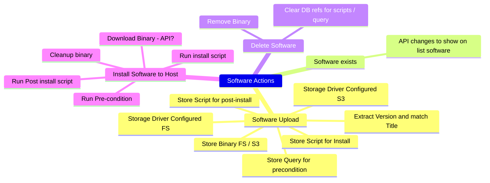
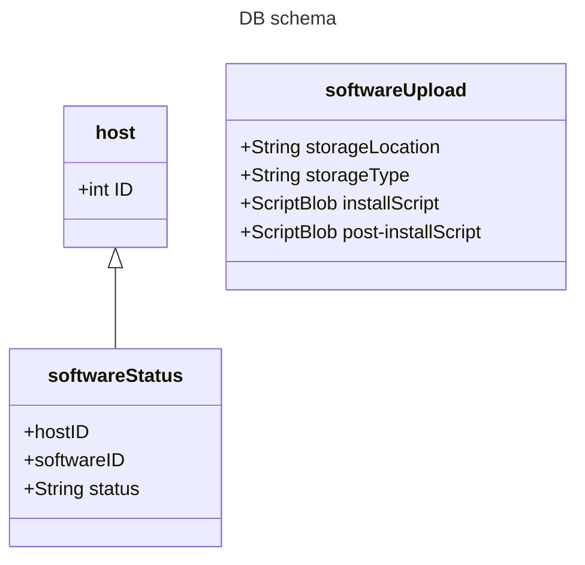

# Software Manage Lifecycle

## Add Software to empty db

```mermaid
mindmap
  Software Actions
    Software Upload
      Extract Version and match Title
      Store Query for precondition
      Store Script for Install
      Store Script for post-install
      Store Binary FS / S3
      Storage Driver Configured FS
      Storage Driver Configured S3
    Software exists
      API changes to show on list software
    Delete Software
      Remove Binary
      Clear DB refs for scripts / query
    Install Software to Host
      Run Pre-condition
      Download Binary - API?
      Run install script
      Run Post install script
      Cleanup binary
```

## DB thoughts

```mermaid
---
title: DB schema
---
classDiagram
  host <|-- softwareStatus
  class host{
    +int ID
  }
  class softwareUpload{
    +String storageLocation
    +String storageType
    +ScriptBlob installScript
    +ScriptBlob post-installScript
  }
  class softwareStatus{
    +hostID
    +softwareID
    +String status
  }
  
```