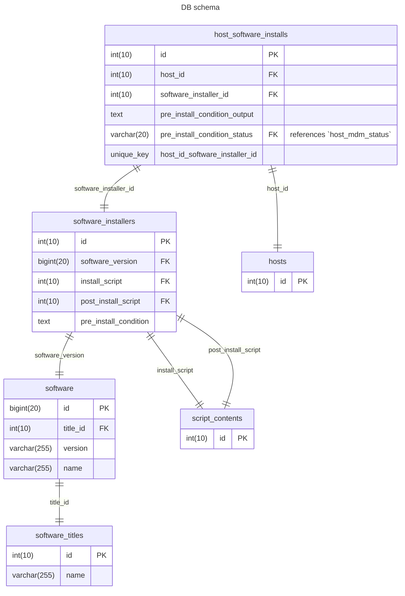

# Software Manage Lifecycle

## Add Software to empty db

## DB

Notes:

- The diagram below intends to cover everything except the orchestration part.
- Idea:
  - We don't need to report/filter, etc based on orchestration steps, so we don't need to track anything other than failed/success status in the db.
  - As such, all the pre/post/rollback logic can be handled entirely by orbit

