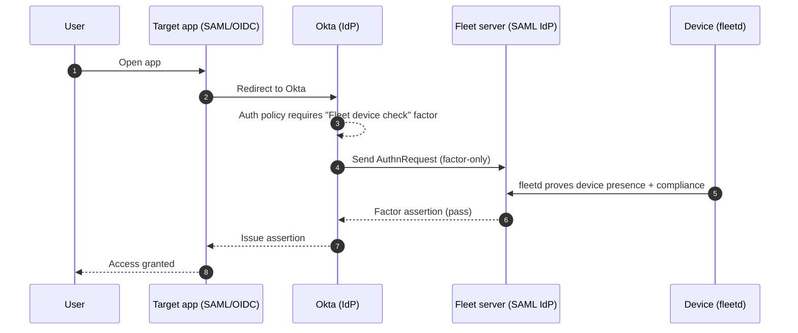
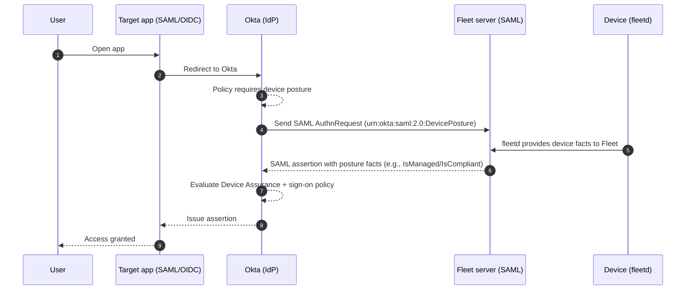

# Okta conditional access research

## OIN (Okta integration network) / partnership not required

We can integrate with Okta conditional access without being in OIN. Okta provides public APIs and admin-console configuration for SAML, OIDC, SCIM, and device trust. No formal partner agreement or OIN listing is necessary to make the integration work technically. It takes weeks to get an OIN app reviewed.

Once we do an OIN app, we can use a configurable `tenant_url` or “base URL” parameter for each customer. This allows customers with different on-prem URLs to still use our integration without a single global SaaS endpoint.

Currently, we can also use any Okta test or developer account to develop and QA our conditional access integration before rolling it out to production customers.

## Why OIN / partnership still matters

Being in OIN gives our customers one-click install and preconfigured endpoints. It also increases our visibility to Okta admins and signals enterprise readiness, which helps shorten sales cycles. Jamf has an official Okta partnership and device trust integration, and Kandji has an OIN app listed. Having Fleet server in OIN positions us alongside these and other competitors. Kandji's OIN app simply bundles SAML+SCIM, so the app itself does not provide conditional access. Thus, OIN is largely a separate discussion from this feature.

---

## Okta Verify

**What it is.** Okta Verify is Okta’s endpoint agent that enables FastPass (passwordless), device registration, and device posture collection for policy evaluation. Device assurance policies and posture checks are designed to work natively with Okta Verify and are evaluated at app sign-in.

**osquery support.** On macOS and Windows, Okta Verify bundles an osquery component to run **advanced posture checks** defined by admins (SQL-style checks that return pass/fail). This is conceptually similar to how fleetd leverages osquery, but here it’s packaged and invoked by Okta Verify for policy use.

**EDR integrations.** Okta Verify can ingest trust signals from supported EDR sources (for example, CrowdStrike and Windows Security Center) and expose them to policies via device assurance/custom expressions.

**Ecosystem support.** Other MDMs (e.g., Kandji, Jamf) document Okta Device Trust/Verify–based integrations as the standard way to gate access to Okta-protected apps.

**Recommendation.** If we want **Fleet** to control the device-gate experience or be the source of truth for posture, we should pursue a different path than using Okta Verify -- e.g., a **possession factor** (factor-only IdP) or Okta’s **Device Posture Provider** (EA) to feed Fleet’s signals into policies without relying on Okta Verify. ([Integrate Okta with Device Posture Provider](https://help.okta.com/oie/en-us/content/topics/identity-engine/devices/device-assurance-device-posture-idp.htm))

---

## Using a possession factor instead of Okta Verify

**Overview.** Instead of relying on Okta Verify for device trust, we can make **Fleet** act as a **possession factor** (Okta IdP authenticator with *factor-only* usage). Okta will require this factor during login; Fleet validates the device (via **fleetd**) and returns pass/fail.

**How it works (happy path).**

**Fleet requirements.**

* Expose a **factor-only SAML endpoint** that validates Okta’s AuthnRequest and returns a signed SAML response (pass/fail).
* On factor evaluation, query required device policies and return pass/fail.
* Provide a user-facing remediation URL when the factor denies.

**Links.**

* [1Password Extended Access Management's Okta integration](https://blog.1password.com/extended-access-management-okta-guide)
* [Connect Kolide to Okta](https://www.kolide.com/docs/admins/setting-up-kolide/connect-kolide-to-okta)

Got it — here’s a parallel section for **Device Posture Provider** you can paste into the doc. If you want me to insert it into the canvas, just say “insert it” and where.

---

## Using a device posture provider instead of Okta Verify (Early Access)

**Overview.** Instead of adding a visible factor step, we can make **Fleet** act as an **Okta Device Posture Provider**. During sign-in, Okta silently calls Fleet (as a special **SAML IdP**), Fleet returns posture **facts** (for example `IsManaged`, `IsCompliant`, OS/OSVersion), and Okta enforces them via **Device Assurance + app sign-on policies**. *(Feature is **Early Access** in Okta.)* ([Integrate Okta with Device Posture Provider](https://help.okta.com/oie/en-us/content/topics/identity-engine/devices/device-assurance-device-posture-idp.htm))

**How it works (happy path).**

**Fleet requirements.**

* Expose a **SAML IdP endpoint** that accepts Okta’s AuthnRequest with `urn:okta:saml:2.0:DevicePosture` and returns a **SAML assertion** containing posture facts per Okta’s schema. At minimum include `<Fact Name="IsManaged" Value="true|false" />`; `<Fact Name="IsCompliant" ...>` and other facts are optional.
* On device posture evaluation, query required device policies and return pass/fail.
* Provide signing cert/metadata; handle error states (for example, return **AuthnFailed** when device isn't managed/known).

**Pros.**

* **No extra factor UI**; posture is evaluated invisibly in Okta's policy engine.
* Posture becomes **first-class** across apps wherever the policy applies.

**Tradeoffs.**

* **Early Access** feature: some customers may not be willing to use it.
* You must implement and operate the **SAML posture IdP** and its assertions.
