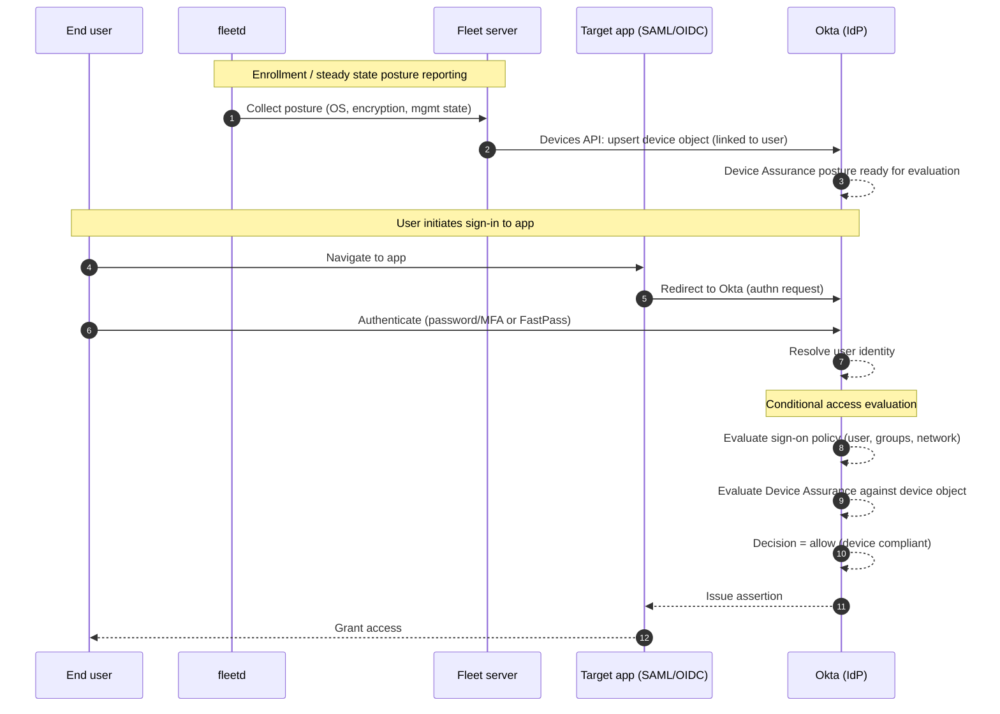

# Okta conditional access research

## OIN (Okta integration network) / partnership not required

We can integrate with Okta conditional access without being in OIN. Okta provides public APIs and admin-console configuration for SAML, OIDC, SCIM, and device trust. No formal partner agreement or OIN listing is necessary to make the integration work technically. It takes weeks to get an OIN app reviewed.

Once we do an OIN app, we can use a configurable `tenant_url` or “base URL” parameter for each customer. This allows customers with different on-prem URLs to still use our integration without a single global SaaS endpoint.

Currently, we can also use any Okta test or developer account to develop and QA our conditional access integration before rolling it out to production customers.

## Why OIN / partnership still matters

Being in OIN gives our customers one-click install and preconfigured endpoints. It also increases our visibility to Okta admins and signals enterprise readiness, which helps shorten sales cycles. Jamf has an official Okta partnership and device trust integration, and Kandji has an OIN app listed. Having Fleet server in OIN positions us alongside these and other competitors. Kandji's OIN app simply bundles SAML+SCIM, so the app itself does not provide conditional access. Thus, OIN is largely a separate discussion from this feature.

---

## Incremental development plan: with or without Okta Verify

### Is it faster to ship without Okta Verify?

Yes. We can ship an initial integration without deploying Okta Verify, which reduces scope and accelerates delivery. However, this first cut will provide weaker device-level guarantees and fewer policy options. Adding Okta Verify later enables stronger device attestation and the full device assurance feature set.

### Tradeoffs at a glance

| Area                             | Without Okta Verify (phase 1)                                                                                                                                                             | With Okta Verify (phase 2)                                                         |
| -------------------------------- | ----------------------------------------------------------------------------------------------------------------------------------------------------------------------------------------- | ---------------------------------------------------------------------------------- |
| Time to ship                     | Faster (smaller surface)                                                                                                                                                                  | Slower (agent deployment, UX flows)                                                |
| Device posture & policy richness | Using fleetd agent we can send nearly all device posture data (OS version, disk encryption, management state, etc.) to Okta via Devices API; no cryptographic binding to user or FastPass | Full device assurance with cryptographic binding plus FastPass and step‑up factors |
| User experience                  | Standard MFA prompts; no passwordless                                                                                                                                                     | Option for FastPass/passwordless; fewer prompts when compliant                     |
| Coverage                         | Works for any customer immediately                                                                                                                                                        | Requires Fleet server deployment of Okta Verify on devices                         |
| Supportability                   | More exceptions and edge cases                                                                                                                                                            | Clearer, vendor‑supported path aligned with Okta guidance                          |

### Recommended phased approach

**Phase 1 – minimum viable conditional access (fast):**

* Implement SAML app integration and admin‑side policies using groups, network zones, and sign‑on rules.
* Sync  device/compliance attributes via Device API to gate access for managed devices.
* (Optional) Need to use device certificates if we want device-specific conditional access (when user has multiple devices).
* Document remediation paths.

**Phase 2 – device assurance + stronger posture (add later):**

* Deploy Okta Verify via Fleet server with managed app configuration.
* Enable device assurance policies (per‑OS posture rules) and, if desired, FastPass.
* Align Fleet server posture signals with what Okta device assurance evaluates and update our documentation and support playbooks.

**Bottom line:** Shipping without Okta Verify is the fastest path to an initial integration, but we should plan to add Okta Verify to reach parity with leading vendors and unlock stronger conditional access and better UX.

---

## Device API and authentication

The device API is the latest recommended standard way to send device compliance and posture information to Okta. We can use the Okta Devices REST API to create and update device objects tied to users, with fields like OS version, disk encryption, and management status. Admin‑side policies then reference these device objects in device assurance rules.

For full API reference see [Devices API](https://developer.okta.com/docs/api/openapi/okta-management/management/tag/Device/).

To authenticate Fleet server with Okta, we register an OAuth 2.0 service application or use an API token in the customer’s Okta tenant. The usual approach is:

* The customer creates an API integration (OAuth 2.0 service app or API token) in their Okta admin console.
* We configure Fleet server with the provided credentials (client ID/secret or token) and the tenant‑specific base URL.
* Fleet server uses those credentials to call the Devices API endpoints under that tenant, ensuring we only write to the correct customer’s Okta environment.

This pattern matches how other MDM vendors integrate with Okta: each customer’s instance of Fleet server uses credentials from their own Okta tenant, and we send posture data to the Devices API securely over HTTPS using OAuth scopes designed for device management.

We can keep things simple and send similar data to Okta as we do to Entra (`compliant: true/false`). We could also send more device details to allow IT admins to create more complex policies in Okta.

---

## Setup steps for on‑prem customers

Each on‑prem customer needs to configure the following in their Okta tenant before Fleet server can send data:

1. **Set up SAML/OIDC**: The customer creates an authentication app. This app could be the same app used with Fleet for end user SSO, or a separate app to get access to company resources.

2. **Set up SCIM**: The customer creates a SCIM integration in Okta to push user and group provisioning into Fleet server. We host the SCIM endpoint in our on‑prem server and supply the SCIM base URL and token to Okta. This helps us link the device to the Okta user.

3. **Set up Devices API**: The customer registers an OAuth 2.0 service application (or creates an API token) in their Okta tenant with the scopes `okta.devices.manage` and `okta.devices.read`. This grants Fleet server permission to create and update device objects via the Devices API.

---

