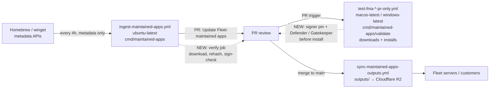

# FMA supply-chain integrity: installer verification and malware scanning

- **Status:** Draft / proposal
- **Date:** 2026-07-17
- **Author:** Allen Houchins
- **Scope:** Fleet-maintained apps (FMA) pipeline — ingest, validation, and publish

## Problem statement

Fleet-maintained apps ship third-party installers to customer devices. Fleet doesn't host these
installers — manifests point at vendor URLs — but Fleet *curates* them: the catalog (~1,100 apps)
tells customers "this URL, this hash, this install script" and updates every 4 hours. That makes
the FMA pipeline a supply-chain trust point: if an upstream source (vendor CDN, Homebrew cask
metadata, winget manifest) is compromised, Fleet would currently republish the compromised
installer metadata automatically, and customers would install it.

Today the pipeline has no independent verification of installer integrity, publisher identity, or
malware status:

| Gap | Where |
| --- | --- |
| Ingester never downloads installer bytes; it copies upstream's *claimed* SHA256 into the manifest | `ee/maintained-apps/ingesters/homebrew/ingester.go` (`out.SHA256 = cask.SHA256`), `ee/maintained-apps/ingesters/winget/ingester.go` (`InstallerSha256` from the winget YAML) |
| ~138 of ~1,100 manifests carry `"sha256": "no_check"` (winget `ignore_hash` apps with unversioned URLs), which skips hash verification everywhere | `ee/maintained-apps/outputs/**` |
| Hash is enforced only in the validator, and only when not `no_check` | `cmd/maintained-apps/validate/main.go` (hash check before install) |
| No code-signature or notarization verification anywhere | — |
| The macOS validator runs `spctl` but only **logs** the result, then removes quarantine and adds a Gatekeeper exception — actively bypassing Apple's supply-chain check | `cmd/maintained-apps/validate/darwin.go` (`removeAppQuarantine`) |
| No malware scanning anywhere | — |

Upstream coverage is uneven: winget submissions get Microsoft's Defender/SmartScreen scanning;
Homebrew casks get essentially no security review. The macOS side therefore leans entirely on
Apple notarization — which the pipeline currently doesn't check.

## Goals

1. Independently verify that installer bytes match what upstream claims (hash provenance).
2. Pin and verify the publisher's signing identity per app (Authenticode subject on Windows;
   Developer ID Team ID + notarization on macOS), failing loudly when it changes.
3. Scan installer bytes with the OS-native malware engines (Microsoft Defender on Windows,
   Gatekeeper/XProtect via notarization enforcement on macOS) at the validation stage, where the
   pipeline already holds the bytes on the target OS.
4. Surface results in the automated FMA update PRs so the human reviewer sees a verification
   report, and gate merge (and therefore the R2 publish sync) on it.
5. $0 recurring cost. Fleet is a public repo, so GitHub-hosted runner minutes are free; every
   tool below is free for commercial use.

## Non-goals

- **CVE scanning of published versions** (Grype/OSV/Trivy): FMAs track latest — i.e., the patched
  version — and Fleet's own vulnerability management already covers installed software. The threat
  here is *trojanized installers*, not known-vulnerable versions.
- **Paid multi-engine scanning** (VirusTotal Premium, OPSWAT MetaDefender commercial,
  ReversingLabs): deferred; see [Alternatives considered](#alternatives-considered). Notably, the
  *free* tiers of VirusTotal and MetaDefender explicitly prohibit commercial-workflow use, so they
  are not options at all.
- **Server-side verification at customer install time**: the hooks proposed here (shared download
  path, signer identity in manifests) enable it later, but it's out of scope for v1.
- **Behavioral/dynamic sandbox analysis**: no free option permits commercial use.

## Threat model

Attacks this design addresses, roughly in order of real-world likelihood:

1. **Compromised vendor download URL** — attacker replaces the installer on the vendor's CDN, or
   the (often unversioned) URL starts serving different bytes. Caught by: hash provenance
   (versioned URLs), signer pinning + malware scan (unversioned/`no_check` URLs).
2. **Compromised upstream metadata** — a malicious Homebrew cask edit or winget manifest PR points
   the URL and hash at an attacker-controlled installer. Hash provenance does *not* catch this
   (the claimed hash matches the malicious bytes). Caught by: signer pinning (attacker can't sign
   as the vendor), notarization enforcement, malware scan.
3. **Trojanized-but-vendor-signed installer** (3CX-style, attacker inside the vendor's build
   system) — the hardest case. Signer pinning passes. Partially caught by: malware scanning and
   Defender/XProtect reputation once the campaign is known. No free control fully addresses this;
   honesty about that belongs in any customer-facing claim.
4. **Compromise of the manifest publish channel** (R2 bucket) — out of scope here, but noted under
   [Future work](#future-work) (manifest signing/attestation).

## Current pipeline and insertion points



Two properties drive the design:

- The **ingest job** (Linux) is the earliest gate — before a PR even opens — but today holds no
  bytes. Adding a download step there is cheap because an update PR typically touches a handful of
  apps, not the whole catalog.
- The **validator** (real macOS/Windows runners) already downloads the installer to disk
  (`INSTALLER_PATH`, set in `cmd/maintained-apps/validate/main.go` `DownloadMaintainedApp`) and is
  the only place OS-native verification (Gatekeeper, Authenticode chain to the OS trust store,
  Defender) can run.
- Merge to `main` is what triggers the R2 publish, so a **required PR status check** is the
  enforcement point protecting the publish channel.

## Design

Three layers, all free. Layer 2 is the highest-value control and should land first.

### Layer 1 — Hash provenance at ingest

A new Go tool, `cmd/maintained-apps/verify`, runs in the ingest workflow (and as a PR check) after
the ingester writes outputs:

1. Diff `ee/maintained-apps/outputs/**` against the base ref to find changed `(slug, version)`
   entries.
2. For each changed entry, download the installer (reusing
   `server/mdm/maintainedapps.DownloadInstaller`, the same path the validator and production use)
   and recompute SHA256.
3. **Versioned URLs:** hard-fail if the recomputed hash ≠ the upstream-claimed hash now in the
   manifest. This closes the "URL serves bytes that don't match the advertised hash" gap that
   currently isn't checked until (and only in) the validator.
4. **`no_check` apps:** record the observed hash in the verification report (it can't be pinned —
   these URLs are re-released in place; that's why `ignore_hash` exists). For these apps, Layer 2
   is the primary integrity control.

Results are written as a JSON report and a GitHub Actions job summary, and posted into the
`Update Fleet-maintained apps` PR body/comment so the reviewer sees a per-app verification table.

### Layer 2 — Signing-identity pinning

**Schema.** Each input JSON gains a `signature` block, pinned once and diffed forever:

```jsonc
// ee/maintained-apps/inputs/homebrew/box-drive.json
{
  "name": "Box Drive",
  "slug": "box-drive/darwin",
  // ...
  "signature": {
    "apple_team_id": "M683GB7CPW",   // Developer ID team
    "notarized": true                 // expect a notarization ticket
  }
}

// ee/maintained-apps/inputs/winget/box-drive.json
{
  "name": "Box Drive",
  "slug": "box-drive/windows",
  // ...
  "signature": {
    "subject_cns": ["Box, Inc."]     // Authenticode leaf subject CN(s); array because
                                      // vendors sometimes ship multiple certs
  }
}
```

Escape hatch: `"signature": {"unsigned": true, "justification": "..."}` for the (hopefully rare)
unsigned apps the backfill surfaces. Unsigned + `no_check` together means the app has *no*
integrity control — those should be candidates for removal from the catalog.

**Pin the subject identity, not the leaf thumbprint.** Certificates rotate every 1–3 years;
subject CN / Team ID survives renewal. An identity *change* (vendor rebrand, cert transfer — see
the VC++ redist and bundle-id rebrand precedents in this catalog's history) hard-fails ingest and
requires a human to update the pin in a reviewed PR. That human-in-the-loop moment is the point of
the control.

**Verification, by stage:**

| Stage | Windows | macOS |
| --- | --- | --- |
| Ingest (`ubuntu-latest`) | Authenticode parse + subject-CN check via `osslsigncode verify` (supports EXE and MSI) or a pure-Go verifier (e.g. `sassoftware/relic`'s authenticode package) — avoids waiting for the validator | Deferred to validator by default; `rcodesign` (apple-codesign) may allow shift-left verification of Mach-O/pkg signatures on Linux — flagged as an open question |
| Validator (real OS, before install) | `Get-AuthenticodeSignature`: require `Status -eq 'Valid'` (full chain + revocation against the Windows trust store) and `SignerCertificate.Subject` matching the pinned CN | `pkgutil --check-signature` (pkg) / `codesign --verify --deep --strict` + `codesign -dvv` (app in dmg/zip) → require pinned Team ID; `spctl --assess` (type `install` or `execute`) → require `source=Notarized Developer ID` when `notarized: true` |

The validator change slots into `cmd/maintained-apps/validate/main.go` immediately after the
existing SHA256 check and before the install script runs. On macOS this **replaces** today's
behavior of logging `spctl` and then stripping quarantine: verification becomes a gate; the
quarantine removal that follows is then only easing installation of an already-verified binary.

**Bootstrap.** A one-time backfill job runs the verify tool with `--all --record-pins` across the
catalog on both platforms, writing observed Team IDs / subject CNs into the input JSONs as a large
reviewed PR. High-download apps (browsers, VPN clients, remote-access tools) get manual spot-checks
against vendor documentation. After backfill, the model is trust-on-first-use with drift detection:
`/new-fma` records the pin when an app is added; any later change fails ingest.

### Layer 3 — Malware scanning at validation

Scanning runs where the pipeline already holds the bytes on the target OS — the validator — using
the OS-native engines only. (Ingest-time scanning with ClamAV and abuse.ch reputation lookups was
considered and dropped; see [Alternatives considered](#alternatives-considered).)

- **Windows:** Microsoft Defender on-demand scan. GitHub's `windows-latest` images set Defender to
  *passive mode* (real-time protection off), but the engine and `MpCmdRun.exe` are present:

  ```powershell
  & "$env:ProgramFiles\Windows Defender\MpCmdRun.exe" -SignatureUpdate
  & "$env:ProgramFiles\Windows Defender\MpCmdRun.exe" -Scan -ScanType 3 `
      -File $env:INSTALLER_PATH -DisableRemediation
  if ($LASTEXITCODE -eq 2) { throw "Defender detected a threat in $env:INSTALLER_PATH" }
  ```

  Signature update reliability on runner images is an open question (see below); until proven
  reliable, treat a failed signature update as a warning (scan best-effort with shipped
  definitions) rather than a hard fail.
- **macOS:** the enforced Gatekeeper assessment from Layer 2 *is* the malware layer — notarization
  means Apple's automated malware analysis ran on these exact bytes, and `spctl` consults XProtect
  and Apple's revocation service at assessment time. No extra scanner needed.

### Failure policy

| Check | Stage | Initial (report-only phase) | Enforced |
| --- | --- | --- | --- |
| Recomputed SHA256 ≠ claimed (versioned URL) | Ingest | Warn in PR report | **Hard fail** — app excluded from PR / check fails |
| Signer identity ≠ pin | Ingest + validator | Warn | **Hard fail** (human re-pins via PR if legitimate) |
| Not notarized where `notarized: true` | Validator | Warn | **Hard fail** |
| Unsigned app without `unsigned: true` pin | Both | Warn | **Hard fail** |
| Defender detection | Validator | Warn | **Hard fail** |
| Defender signature update fails | Validator | Warn | Warn (scan runs best-effort with shipped definitions) |

A hard fail at ingest excludes that app's update from the generated PR (with an annotation), so
one bad app doesn't block the other ~1,099. The verify PR check is added to branch protection as
required, which is what actually gates the R2 publish.

## Implementation sketch

New/changed components:

1. **`cmd/maintained-apps/verify`** (new Go tool, shares manifest types with the ingester):
   - `--changed-from <ref>` (default) or `--all`; `--record-pins` for backfill.
   - Downloads via `server/mdm/maintainedapps.DownloadInstaller`; caches by SHA256 so re-runs and
     multi-arch duplicates don't re-download.
   - Emits `verify-report.json` + `$GITHUB_STEP_SUMMARY` markdown.
2. **`.github/workflows/ingest-maintained-apps.yml`**: add a verify step between ingestion and
   `peter-evans/create-pull-request`; inject the report into the PR body; drop hard-failed apps
   from the commit.
3. **New `verify-fma-installers.yml`** PR workflow triggered on `ee/maintained-apps/outputs/**`:
   the *required* status check. This also covers hand-edited outputs (frozen apps) that never pass
   through the ingest workflow.
4. **`cmd/maintained-apps/validate`**: signer + notarization gate after the hash check in
   `main.go`; darwin `spctl` flipped from log-to-bypass into enforce; Defender scan step in
   `test-fma-windows-validate.yml`.
5. **Input schema** (`ee/maintained-apps/maintained_apps.go` input types + both ingesters): parse
   and carry the `signature` block; optionally surface verified signer identity in output
   manifests for future server-side verification.
6. **Backfill PR** recording pins for the existing catalog.

## Rollout

- **Phase 0 — observe (1–2 releases):** land the verify tool and workflows in report-only mode;
  run the pin backfill; measure false-positive rate (cert oddities, unsigned apps, Defender
  signature-update flakes).
- **Phase 1 — enforce structure:** hash provenance + signer pinning + notarization become hard
  fails; verify check becomes required in branch protection.
- **Phase 2 — enforce scanning:** Defender detections become hard fails.
- **Phase 3 — customer-facing:** document the guarantees ("every FMA release is independently
  hash-verified and checked against the vendor's pinned signing identity and Apple notarization;
  Windows installers are scanned with Microsoft Defender") in docs/marketing, with honest scoping
  around the vendor-compromise case.

## Cost

$0 recurring. Fleet is a public repository, so GitHub-hosted runner minutes (including macOS and
Windows) are free. Incremental load is bounded: a typical update PR touches a handful of apps, and
only changed `(slug, version)` entries are downloaded. The only heavy run is the one-time backfill
(~1,100 apps × up to 2 platforms of downloads), which can be sharded across matrix jobs.

## Alternatives considered

- **VirusTotal free API** — explicitly prohibited: "must not be used in commercial products or
  services… business workflows"; violation is a permanent ban. Not an option in any form. VT
  *Premium* is the industry-standard "scanned by 70 engines" badge and remains the obvious paid
  upgrade later if a recognizable customer-facing claim justifies the (significant) cost.
- **OPSWAT MetaDefender Cloud free tier** — community terms prohibit commercial use of the data;
  the free Prevention API is also only 40 files/day. Paid only.
- **ClamAV at ingest** — free and license-clean, but dropped: its detection rate on fresh,
  targeted installer trojans is poor, so it adds pipeline complexity (freshclam infrastructure, a
  second scan verdict to police) for little assurance beyond what Defender and notarization
  already provide at validation.
- **abuse.ch reputation lookups (MalwareBazaar hash / URLhaus URL) at ingest** — dropped alongside
  ClamAV: commercial-use terms are ambiguous ("may require" a paid subscription), and the hash of
  a fresh supply-chain payload is unlikely to be in MalwareBazaar during the window that matters.
  Could be revisited later as a cheap enrichment if ingest-time coverage is ever wanted.
- **Hybrid Analysis / other free sandboxes** — non-commercial terms; no free dynamic-analysis
  option exists for commercial use.
- **CVE scanners (Grype/OSV-Scanner/Trivy)** — wrong threat (see Non-goals).
- **Scanning at customer install time (Fleet server)** — highest assurance placement but heavier
  lift (server-side scanning infra, per-customer bandwidth); the shared `DownloadInstaller` path
  and signer identity in manifests keep this door open.

## Future work

- **Manifest provenance attestation:** sign/attest the R2-synced manifests (e.g. GitHub artifact
  attestations / Sigstore, both free) so Fleet servers can verify manifests came from Fleet CI —
  closes the publish-channel threat.
- **Server-side signer verification at install time**, consuming the signer identity from
  manifests.
- **VirusTotal Premium** if/when a paid multi-engine badge is wanted.

## Open questions

1. **Apple signature verification on Linux:** can `rcodesign` reliably verify pkg/dmg signatures
   and notarization at ingest, or does macOS verification stay validator-only? (Validator-only is
   acceptable for v1 — it still gates the PR.)
2. **Defender signature updates on `windows-latest`:** images ship with Defender in passive mode
   and stale/removed definitions; need to confirm `MpCmdRun -SignatureUpdate` works reliably and
   how long it takes. Fallback: run the scan best-effort with shipped definitions and warn.
3. **Multi-arch entries:** confirm how per-arch installers (darwin arm64/x86_64, windows
   x64/arm64) appear in outputs so the verify tool covers every URL actually published.
4. **Unsigned-app count:** the backfill will reveal how many catalog apps are unsigned and/or
   non-notarized; decide the policy for them (allow with justification vs. remove). The appendix
   test run already surfaced one: 7-Zip ships an unsigned MSI.

## Appendix: proof-of-concept test run (2026-07-17)

The full check sequence was run by hand against three darwin and three windows FMAs from the
current catalog, using only the tooling proposed above: `curl` + `shasum` (Layer 1),
`pkgutil --check-signature` / `codesign --verify --deep --strict` / `spctl --assess` for macOS and
`osslsigncode verify` for Windows Authenticode (Layer 2). Environment: macOS dev machine; the only
tool installed for the run was `osslsigncode` (one Homebrew formula). Total cost: ~107 MB of
downloads, ~2 minutes.

### macOS results

| App | Version | Hash vs. manifest | Signer identity | Gatekeeper / notarization | Verdict |
| --- | --- | --- | --- | --- | --- |
| rectangle/darwin | 0.98 | ✅ match (`ce2613d4…`) | Developer ID Application: Ryan Hanson (`XSYZ3E4B7D`); `codesign --deep --strict` OK | ✅ accepted; `source=Notarized Developer ID` | PASS |
| stats/darwin | 3.0.8 | ✅ match (`b42a3dfe…`) | Developer ID Application: Serhiy Mytrovtsiy (`RP2S87B72W`); `codesign --deep --strict` OK | ✅ accepted; `source=Notarized Developer ID` | PASS |
| box-drive/darwin | 2.52.312 | ✅ match (`395b7e97…`) | Developer ID Installer: Box, Inc. (`M683GB7CPW`); trusted timestamp; full chain to Apple Root CA | ✅ accepted; trusted by the Apple notary service | PASS |

### Windows results (ingest-stage checks, run off-Windows)

| App | Version | Hash vs. manifest | Signer identity (`osslsigncode verify`) | Verdict |
| --- | --- | --- | --- | --- |
| putty/windows | 0.84.0.0 | ✅ match (`190d0015…`) | CN=Simon Tatham (Sectigo chain, timestamped); "Signature verification: ok" | PASS |
| bandiview/windows | 7.28 | ⚠️ `no_check` — unverifiable; observed hash `2d6e8db0…` recorded | CN=Bandisoft International Inc. (DigiCert chain, timestamped); "Signature verification: ok" | PASS — signature is the *sole* integrity control |
| 7-zip/windows | 26.02 | ✅ match (`db407a4f…`) | ❌ "MSI file has no signature" | WARN — would hard-fail without an `unsigned: true` pin |

### What the run demonstrated

- **The stack works end-to-end with stock tooling.** In particular, `osslsigncode` verified both
  MSI and EXE Authenticode signatures off-Windows, confirming that Windows signer checks can run
  at ingest on a Linux runner rather than waiting for the validator.
- **Real findings even at n=6.** 7-Zip — one of the most-installed utilities in the catalog —
  ships a completely unsigned MSI, so hash pinning is its only integrity control (open question 4
  in action).
- **The `no_check` + signer-pin interplay behaves as designed.** BandiView can't be hash-pinned
  (unversioned URL), but its Bandisoft signing identity verified cleanly — the signer pin carries
  the integrity guarantee exactly as intended.
- **`spctl` verdicts are machine-parseable gates.** All three macOS apps returned crisp
  `accepted` / `source=Notarized Developer ID` results — the same check the validator currently
  logs and bypasses, shown here working as a gate. Box's observed Team ID also confirms the
  schema example used earlier in this doc.
- **Caveat:** `osslsigncode` validates signature integrity and the embedded chain but does not
  check revocation against the Windows trust store; the validator's `Get-AuthenticodeSignature`
  remains the authoritative Windows check, as designed.
