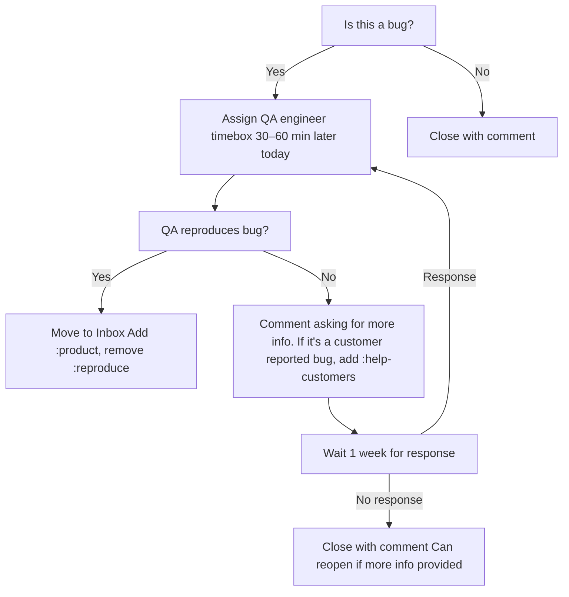

## Daily standup

Purpose: Provide a fast daily synchronization point for the product group and a quick triage of freshly reported bugs awaiting reproduction.

Cadence: Daily, 15 minutes, same time every working day during the sprint.

Participants: Full product group.

Ritual DRI: EM or assigned team member.

### Format
1. Share screen and open the team's GitHub Projects board.
2. Call on each participant and filter the project board to that assignee.
3. Participant answers the questions in the agenda below. If there are blockers, they are added to the parking lot and the standup continues.
4. Call on the next participant until everyone, including the ritual DRI, has provided an update. 
5. Complete incoming bug review.
6. End the Daily Standup for everyone except those with parking lot issues. 
7. Go through each parking lot item with the relevant participants and define and assign TODOs to resolve the blocker.

> To determine order of standup, some ideas are alphabetical order, [wheel of names](https://wheelofnames.com/), or random. Ritual DRI should call on participants and not wait for volunteers.

### Agenda
- What did you work on yesterday?
- What are you working on today?
- Do you have any blockers?

> Blockers are parked for later discussion to keep the standup short and focused. If a blocker is reported, the name of the team member and the issue are added to the parking lot agenda at the bottom of the ritual document.

### Notes
- See [daily standup definition](https://fleetdm.com/handbook/company/product-groups#sprint-ceremonies) in the handbook.

## Incoming bug review
Each bug review should take less than one minute. The intent is not to debug, but to acknowledge, assign, and share any immediate context as comments on the issue.

1. Open the [Fleet GitHub issue list filtered to the labels](https://github.com/fleetdm/fleet/issues?q=is%3Aissue%20state%3Aopen%20label%3Abug%20label%3A%3Areproduce) `bug` and `:reproduce`.
2. Make sure there are no new bugs without a product group label. If there are, add the appropriate product group label.
3. Filter the list by `bug`, `:reproduce`, and your product group label.
4. For each item, quickly move through the decision flow chart below.

