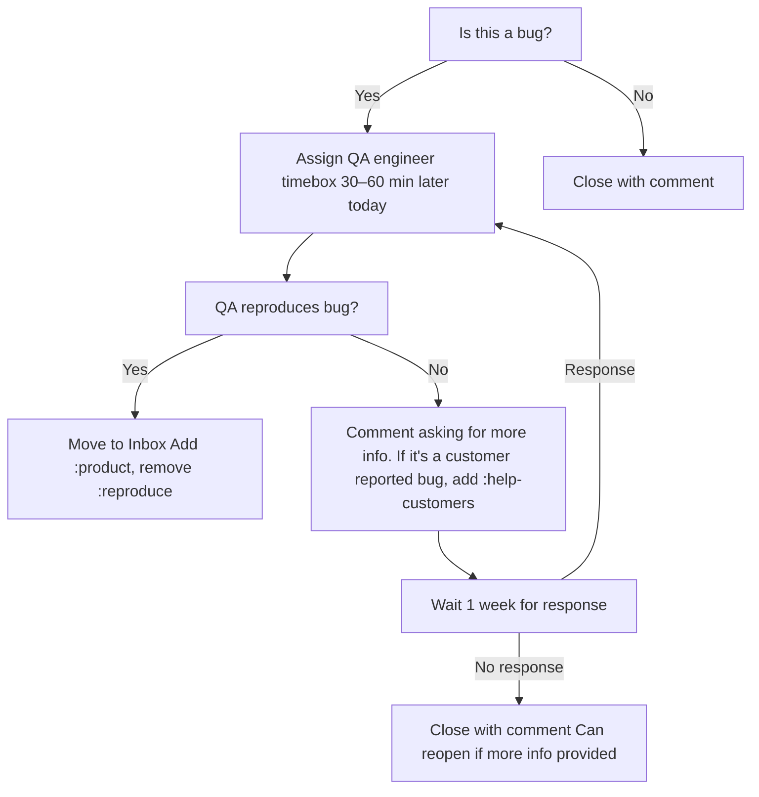

## [Daily Standup](https://fleetdm.com/handbook/company/product-groups#sprint-ceremonies) 

Purpose: Provide a fast daily synchronization point for the product group and a quick triage of freshly reported bugs awaiting reproduction.

Cadence: Daily, 15 minutes, same time every working day during the sprint.

Participants: Entire product group (engineers, EM, PD, QA).

### Format
1. The EM shares their screen and opens the team's GitHub Projects board. 
2. The EM calls on each participant one at a time, and filters the project board to that assignee. 
3. The participant answers the questions in the agenda below. 
4. The EM calls on the next participant until everyone, including the EM, has provided their update. 
5. The EM completes incoming bug review.
6. The EM ends the Daily Standup for everyone except those with parking lot issues. 
7. The EM goes through each parking lot item with the relevant participants and defined and assigned TODOs to resolve the blocker.

> In absence of the EM, any team member may serve as ritual facilitator. 

### Agenda
- What did you work on yesterday?
- What are you working on today? 
- Do you have any blockers? 

### Notes
Topics outside the agenda are parked for later discussion to keep the standup short and focused. If a blocker is reported, or there is need for further discussion, the name of the team member and the issue are added to the parking lot agenda at the bottom of the ritual document.

Handbook reference (process and definitions): https://fleetdm.com/handbook/company/product-groups#scrum-at-fleet

## Incoming bug review
Each bug review should take less than 1 minute. The intent is not to debug, but to acknowledge, assign, and share any immediate context. 

1. Open the [Fleet GitHub issue list filtered to the labels](https://github.com/fleetdm/fleet/issues?q=is%3Aissue%20state%3Aopen%20label%3Abug%20label%3A%3Areproduce) `bug` and `:reprodce`.
2. Make sure there are no new bugs without a product group label. If there are, add the appropriate product group label.
3. Filter the list by `bug`, `:reproduce`, and your product group label.
4. For each item, quickly move through the decision flow chart below.

