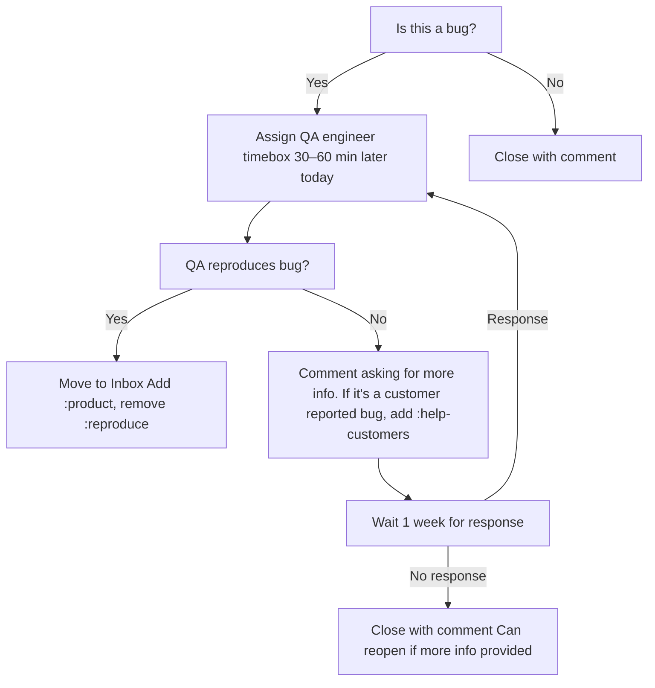

## [Daily Standup](https://fleetdm.com/handbook/company/product-groups#sprint-ceremonies) 

Purpose: Provide a fast daily synchronization point for the product group and a quick triage of freshly reported bugs awaiting reproduction.

Cadence: Daily on all working days of the sprint (3‑week sprint cadence aligned with Fleet release cycle).

Participants: Entire product group (engineers, EM, PD as needed). QA engineer (or whoever is wearing the QA hat) explicitly called out during the incoming bug review step.

Agenda:
* What changed since yesterday / what will change before tomorrow
* Review incoming bugs for your team.
* Blockers (surface, not solve in-room)

Out of scope: Deep design debates, estimation, and retro topics (park these and spin off after the ritual with only needed folks).

Handbook reference (authoritative process + item definitions): https://fleetdm.com/handbook/company/product-groups#scrum-at-fleet

## Incoming bug review

Here is a simple decision chart to make reviewing new incoming bugs with the team quick during scrum.

