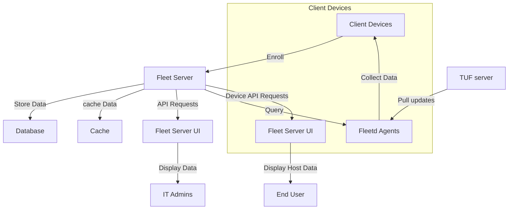
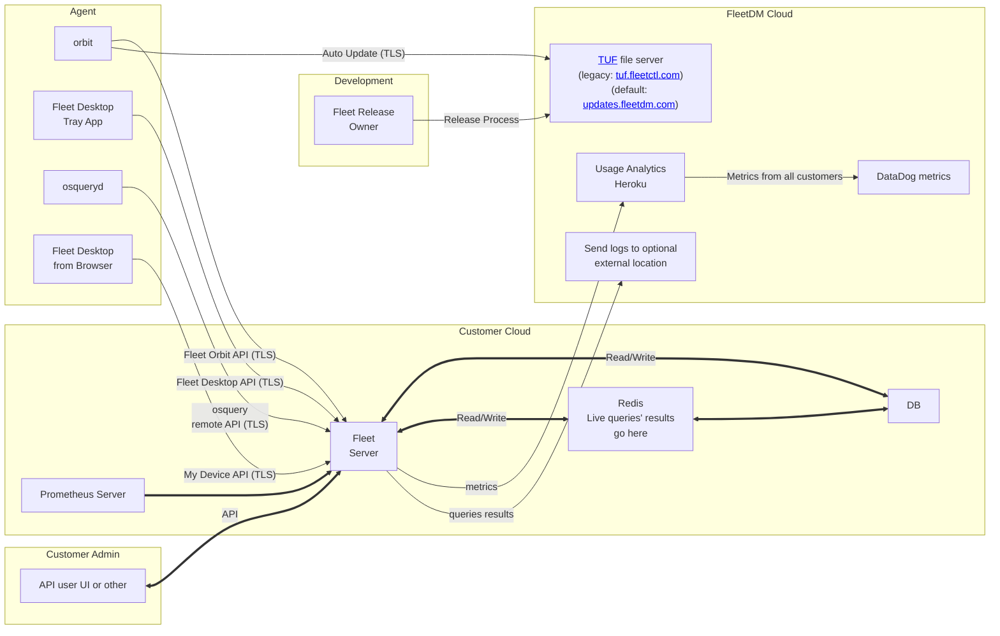

# Fleet DM System Architecture

## Static running Architecture

1. [Server](./server.md)
2. [Database](./database.md)
3. [Cache](./cache.md)
4. [Fleetd](./fleetd.md)
5. [Mobile Hosts](./mobile-host.md)
6. [TUF](./TUF.md)
7. [UI](./UI.md)

In more detail

## Main System Components

## Workflows

### Configuring the server
#### UI / Env var
#### Gitops

### Enrolling hosts
#### Osquery only
#### Fleetd package
#### Automatic enrollment
#### BYOD MDM

## Features

### MDM
### Orchestration
### Software