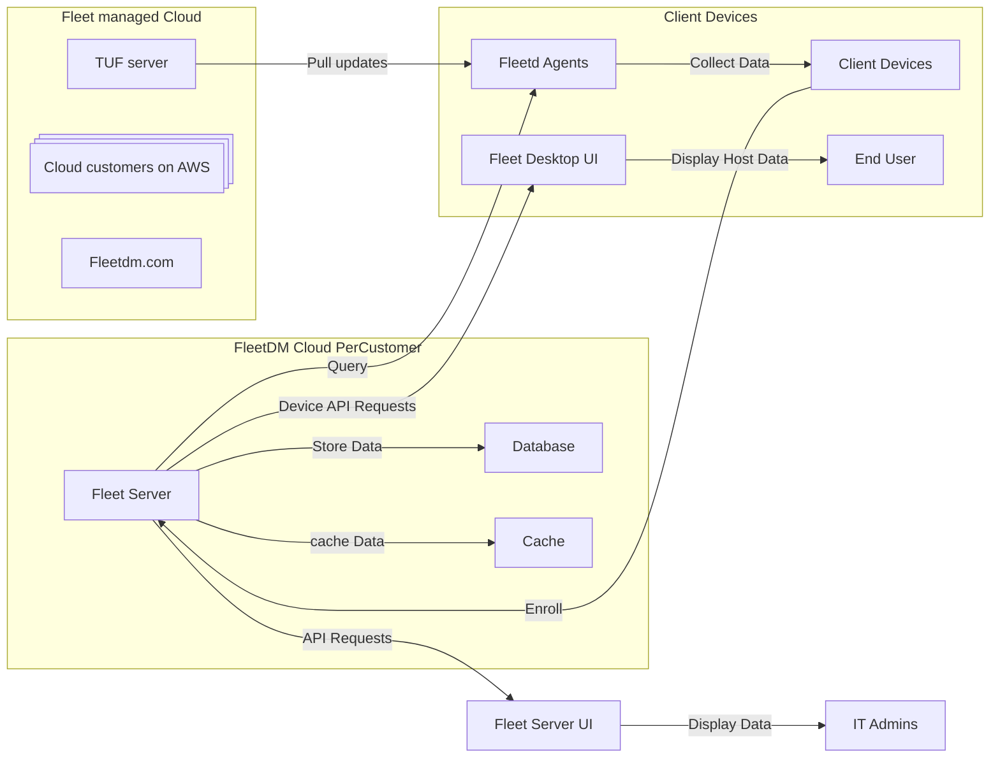

# Fleet DM System Architecture

## Static running Architecture

1. [Server](./server.md)
2. [Database](./database.md)
3. [Cache](./cache.md)
4. [Fleetd](./fleetd.md)
5. [Mobile Hosts](./mobile-host.md)
6. [TUF](./TUF.md)
7. [UI](./UI.md)
7. [Fleetctl](./fleetctl.md)

## Workflows

### [Configuring the server](workflows/configuring-the-server.md)
#### UI / Env var
- Example: Configure the server's hostname and port using environment variables (`SERVER_HOSTNAME`, `SERVER_PORT`) or through the Fleet Server UI.

#### GitOps
- Example: Use a GitOps pipeline to manage server configurations by committing changes to a repository, which automatically deploys updates to the server.

### Enrolling hosts
#### Osquery only
- Example: Deploy the osquery agent to hosts and configure it to communicate with the Fleet server using the provided enrollment key.

#### Fleetd package
- Example: Install the Fleetd package on hosts, which includes pre-configured settings for seamless enrollment with the Fleet server.

#### [Automatic enrollment](workflows/automatic-enrollment.md)
- Example: Use an MDM solution to automatically enroll devices into the Fleet server during the provisioning process.

#### BYOD MDM
- Example: Allow employees to enroll their personal devices into the Fleet server using a secure MDM enrollment link.

## Features

### MDM
- **Device Enrollment**: Seamlessly enroll devices into the management system using automated workflows or manual processes.
- **Remote Wipe / Lock**: Securely erase data from lost or stolen devices to protect sensitive information.
- [**Configuration Management**](features/mdm-configuration-management.md): Push configuration profiles to devices for settings like Wi-Fi, VPN, and email accounts.
- **BYOD Support**: Manage both corporate-owned and personal devices while maintaining user privacy.
### Orchestration
- **Device Inventory**: Maintain a real-time inventory of all enrolled devices, including hardware
  and software details.
- **Osquery Queries**: TODO
- **Policy Enforcement**: Define and enforce security policies, such as password requirements, encryption, and screen lock settings.
- **Compliance Monitoring**: Monitor devices for compliance with organizational policies and generate reports.
### Software
- **Application Management**: Deploy, update, and manage applications on enrolled devices remotely.
- **Patch Management**: Automate the deployment of application updates to keep devices secure.