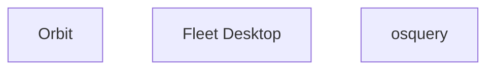

# Fleetd

Previously held many different names



## Components
### Orbit
#### Responsibilities
### Osquery
#### Responsibilities
### Fleet Desktop
#### Responsibilities

## Workflows

### Package install

#### Package build

##### macOS
```mermaid
sequenceDiagram
```

##### windows
```mermaid
sequenceDiagram
```

##### linux
```mermaid
sequenceDiagram
```

#### Package Install

##### macOS
```mermaid
sequenceDiagram
```

##### windows
```mermaid
sequenceDiagram
```

##### linux
```mermaid
sequenceDiagram
```

#### Automatic Enrollment

##### macOS
```mermaid
sequenceDiagram
```

##### windows
```mermaid
sequenceDiagram
```

Linux is not supported

#### BYOD Enrollment

##### macOS
```mermaid
sequenceDiagram
```

##### windows
```mermaid
sequenceDiagram
```

Linux is not supported