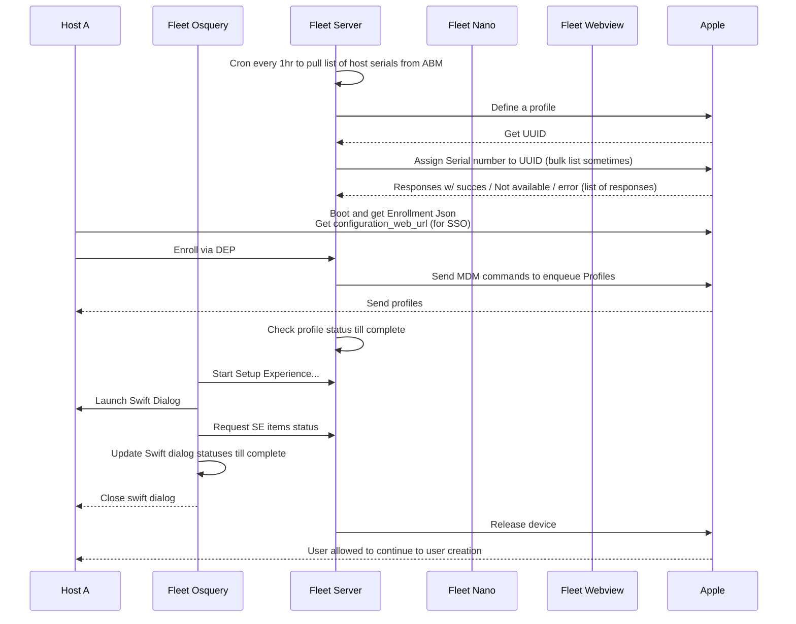

[Back to top](../README.md)

# Automatic Enrollment

## MacOS

### MacOS enrolled in ABM and assigned to MDM server

This example will follow a macOS host with serial AAAA assigned to the MDM server in ABM that matches the fleet
server with the corresponding ABM token uploaded.



In the diagram above the step 'define a profile' sends json like this to apple

```
{
  "org_magic": "1",
  "url": "https://<mdmserver>/mdm/sso",
  "configuration_web_url": "https://<mdmserver>/mdm/sso",
  "is_supervised": false,
  "allow_pairing": true,
  "is_mandatory": false,
  "is_mdm_removable": true,
  "await_device_configured": true,
  "is_multi_user": false,
  "is_return_to_service": false,
  "do_not_use_profile_from_backup": false,
  "auto_advance_setup": false,
  "skip_setup_items": [
    "Accessibility",
    "Appearance",
    "AppleID",
    "AppStore",
    "Biometric",
    "Diagnostics",
    "FileVault",
    "iCloudDiagnostics",
    "iCloudStorage",
    "Location",
    "Payment",
    "Privacy",
    "Restore",
    "ScreenTime",
    "Siri",
    "TermsOfAddress",
    "TOS",
    "UnlockWithWatch"
  ],
  "language": "en",
  "region": "US",
  "profile_uuid": "C3B588...",
  "profile_name": "Fleet default enrollment profile"
}
```

Following the profile assignment to Serials you can use [this tool](TODO) to check the status with
ABM

```
{
  "serial_number": "H9V...",
  "model": "MacBook Pro (16-inch, Nov 2023)",
  "description": "MBP 16 SB/12C/18C GPU/36G/512G-USA",
  "color": "SPACE BLACK",
  "profile_status": "pushed",
  "profile_uuid": "C3B588...",
  "profile_assign_time": "2025-04-10T22:18:15Z",
  "profile_push_time": "2025-04-10T22:28:27Z",
  "device_assigned_date": "2024-08-14T19:29:59Z",
  "device_assigned_by": "abm_user@example.com",
  "os": "OSX",
  "device_family": "Mac",
  "op_date": "0001-01-01T00:00:00Z"
}
```