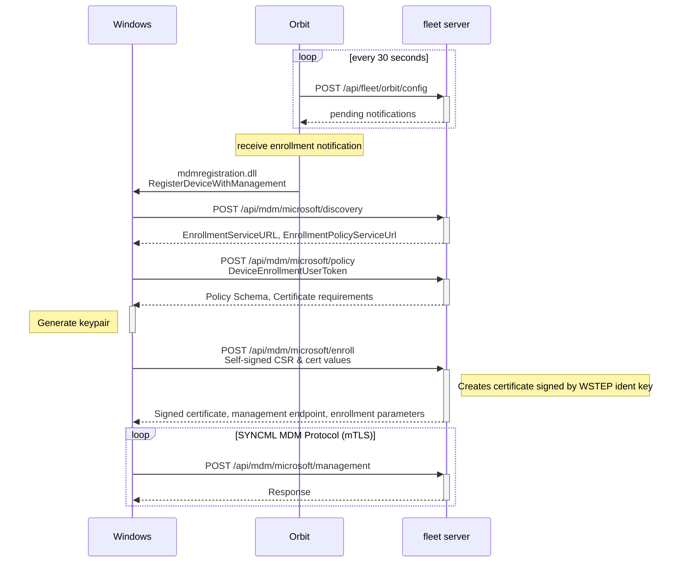

# Protocol

This sequence diagram outlines the MDM enrollment process.

# Glossary

## WSTEP

[WSTEP](https://learn.microsoft.com/en-us/openspecs/windows_protocols/ms-wstep/ac55b8cc-9ade-4982-b135-991d574ade74) is the protocol Microsoft uses to automate certificate requesting and singing. It is similar to the SCEP process used by macOS.

The certificate created through the WSTEP process is used to authenticate mTLS between the host and management endpoint.

## SyncML

[SyncML](https://learn.microsoft.com/en-us/openspecs/windows_protocols/ms-wstep/ac55b8cc-9ade-4982-b135-991d574ade74) is an XML dialect used by Microsoft for Device Management.

## mTLS

[Mutual Transport Layer Security](https://www.cloudflare.com/learning/access-management/what-is-mutual-tls/) is a method for securing communications between two parties, in which both parties present signed certificates. This is different from standard TLS, where only the most provides a certificate. This allows both parties to authenticate the other's identity.

## MDM Protocol Summary

https://learn.microsoft.com/en-us/openspecs/windows_protocols/ms-mdm/33769a92-ac31-47ef-ae7b-dc8501f7104f
