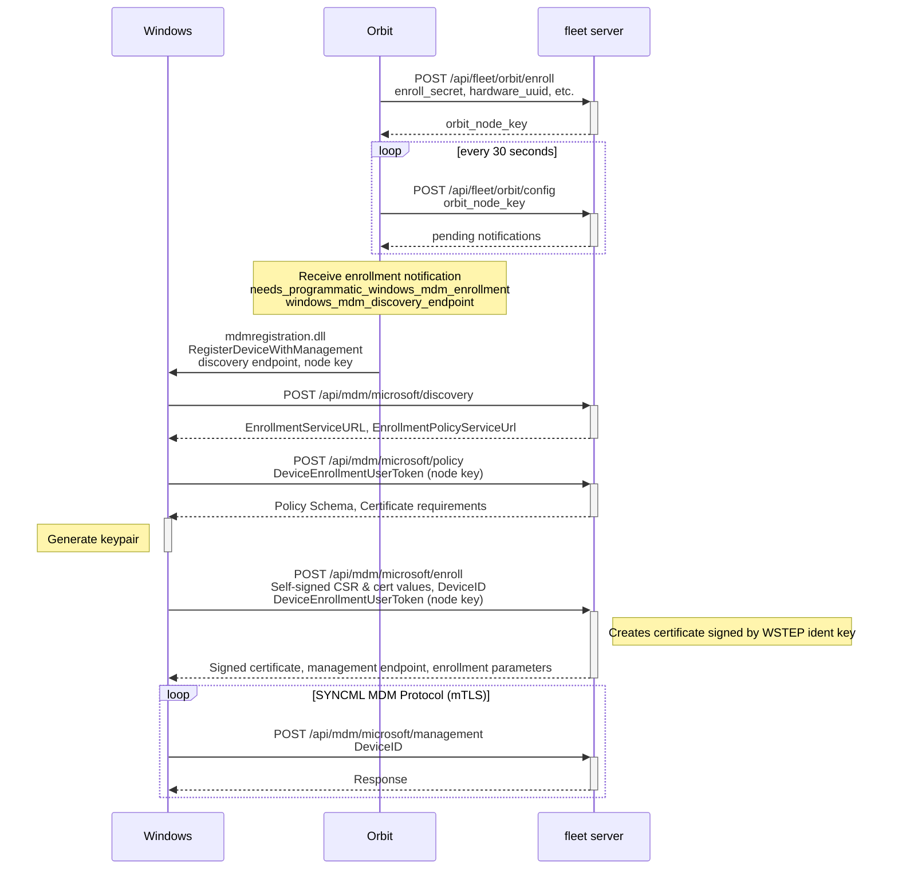

# Protocol

This sequence diagram outlines the manual MDM enrollment process.

# Glossary

## WSTEP

[WSTEP](https://learn.microsoft.com/en-us/openspecs/windows_protocols/ms-wstep/ac55b8cc-9ade-4982-b135-991d574ade74) is the protocol Microsoft uses to automate certificate requesting and singing. It is similar to the SCEP process used by macOS.

The certificate created through the WSTEP process is used to authenticate mTLS between the host and management endpoint.

## SyncML

[SyncML](https://learn.microsoft.com/en-us/openspecs/windows_protocols/ms-wstep/ac55b8cc-9ade-4982-b135-991d574ade74) is an XML dialect used by Microsoft for Device Management.

## mTLS

[Mutual Transport Layer Security](https://www.cloudflare.com/learning/access-management/what-is-mutual-tls/) is a method for securing communications between two parties, in which both parties present signed certificates. This is different from standard TLS, where only the most provides a certificate. This allows both parties to authenticate the other's identity.

## MDM Protocol Summary

https://learn.microsoft.com/en-us/openspecs/windows_protocols/ms-mdm/33769a92-ac31-47ef-ae7b-dc8501f7104f

## MDM Device Registration Summary

https://learn.microsoft.com/en-us/openspecs/windows_protocols/ms-dvrd/296ebf70-bd4b-489e-a531-460d8ef7519b

# Registry

- `HKEY_LOCAL_MACHINE\SOFTWARE\Microsoft\Enrollments\`
  Each enrollment gets its own subdirectory with a UUID as a key,
  inside each directory is a set of keys associated with that enrollment
  - `CurCryptoProvider`
     Often `Microsoft Software Key Storage Provider`
     Cryptographic Key storage provider
  - `CurKeyContainer`
    Key within key provider
  - `DiscoveryServiceFullURL`
    MDM Discovery service URL
  - `DMPCertThumbPrint`
    According to [this blog post](https://call4cloud.nl/2022/10/fullmetal-certificate-the-revenge-of-renewal/), this is the thumbprint of your MDM device certificate
  - `EnrollmentFlags`
    See [this link](https://learn.microsoft.com/en-us/openspecs/windows_protocols/ms-xcep/cd22d3a0-f469-4a44-95ed-d10ce4dc2063) for details

    | Integer value | Meaning                                                                                                                                                                                                                                                                                        |
    |---------------|------------------------------------------------------------------------------------------------------------------------------------------------------------------------------------------------------------------------------------------------------------------------------------------------|
    | 0x00000001    | Instructs the client and CA to include an S/MIME extension, as specified in [RFC4262].                                                                                                                                                                                                         |
    | 0x00000008    | Instructs the CA to append the issued certificate to the userCertificate attribute, on the user object in Active Directory.                                                                                                                                                                    |
    | 0x00000010    | Instructs the CA to check the user's userCertificate attribute in Active Directory, as specified in [RFC4523], for valid certificates that match the template enrolled for.                                                                                                                    |
    | 0x00000040    | This flag instructs clients to sign the renewal request using the private key of the existing certificate. For more information, see [MS-WCCE] section 3.2.2.6.2.1.4.5.6. This flag also instructs the CA to process the renewal requests as specified in [MS-WCCE] section 3.2.2.6.2.1.4.5.6. |
    | 0x00000100    | Instructs the client to get a user's consent before attempting to enroll for a certificate based on the specified template.                                                                                                                                                                    |
    | 0x00000400    | Instructs the client to delete any expired, revoked, or renewed certificate from the user's certificate stores.                                                                                                                                                                                |
    | 0x00002000    | This flag instructs the client to reuse the private key for a smart card–based certificate renewal if it is unable to create a new private key on the card.                                                                                                                                    |
  - `EnrollmentState`
    The best documentation we can find is [here](https://learn.microsoft.com/en-us/graph/api/resources/intune-shared-enrollmentstate?view=graph-rest-beta)

    | Member       | Value | Description                                                                                                        |
    |--------------|-------|--------------------------------------------------------------------------------------------------------------------|
    | unknown      | 0     | Device enrollment state is unknown                                                                                 |
    | enrolled     | 1     | Device is Enrolled.                                                                                                |
    | pendingReset | 2     | Enrolled but it's enrolled via enrollment profile and the enrolled profile is different from the assigned profile. |
    | failed       | 3     | Not enrolled and there is enrollment failure record.                                                               |
    | notContacted | 4     | Device is imported but not enrolled.                                                                               |
    | blocked      | 5     | Device is enrolled as userless, but is blocked from moving to user enrollment because the app failed to install.   |

  - `EnrollmentType`
    According to [this PDF](https://winprotocoldoc.blob.core.windows.net/productionwindowsarchives/MS-MDE2/%5BMS-MDE2%5D.pdf) it can have three different values.

    Device, Full, and AppManaged

    From what I've seen, value 6 on AAD, 1 on manual
  - `isFederated`
    According to [this web page](https://learn.microsoft.com/en-us/windows/client-management/federated-authentication-device-enrollment), being federated means that the MDM
    endpoints and details were fetched from a Discovery endpoint,
    instead of being manually installed. The page does not make mention
    of the specific registry key, but we are making an assumption that
    it means the same thing.
  - `ProviderID`
    Set during enrollment. In our case it's the word "Fleet".
  - `RenewalPeriod`
    Set during enrollment. Period to renew WSTEP certificate.
  - `RenewErrorCode`
    Presumably set if there is an error renewing WSTEP certificate.
  - `RenewROBOSupport`
    According to [this post](https://call4cloud.nl/2022/10/fullmetal-certificate-the-revenge-of-renewal/) this means "Request On Behalf Of". 
    It seems to have to do with automatic certificate renewal
  - `RenewStatus`
    Status of the renewal
  - `RenewTimestamp`
    Presumably the timestamp of the last renewal
  - `RootCertThumbPrint`
    The thumbprint of the WSTEP root certificate
  - `SID`
    Security Identifier
  - `UPN`
    User Principal Name of the user that enrolled the device
  - `AADResourceID`
    Appears to be the domain of the server managing the enrollment,
    always appears to be present on machines enrolled through Microsoft
    Entra (Azure Active Directory)
  - `AADTenantID`
    Also related to Azure Active Directory, and also appears to be
    present at the same time as AADResourceID.
- `HKEY_LOCAL_MACHINE\SOFTWARE\Microsoft\Provisioning\Diagnostics\AutoPilot`
  Autopilot provisioning diagnostic data

<meta name="pageOrderInSection" value="2900">
